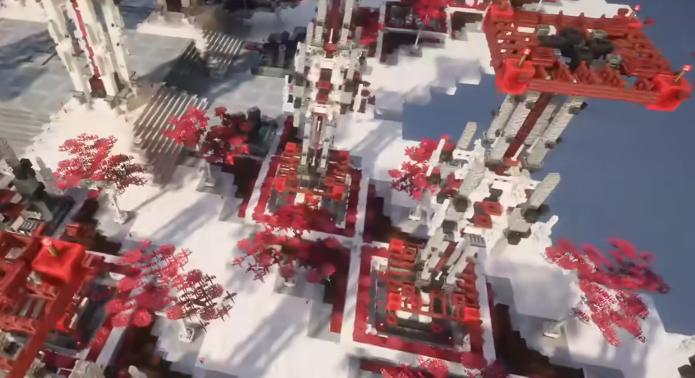
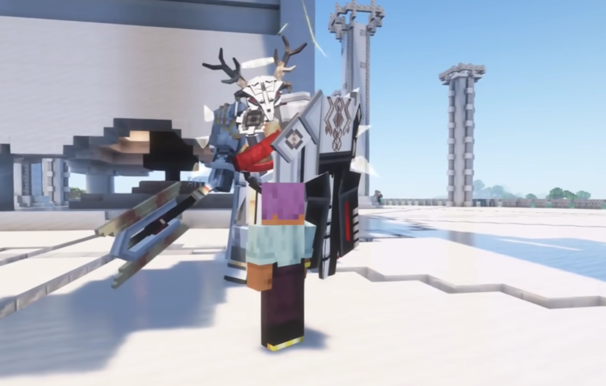

# 开发计划

这里是`Zinecraft`模组开发计划。

## 1. 模组加载器

- forge

由于`forge`社区的管理问题，主要开发成员已迁移至`neoforge`，
且机械动力(`create`)模组在`26.1`版本也放弃了对于`forge`的支持，
因此本模组对于`forge`不做优先考虑。

- neoforge

`neoforge`从`forge`仓库fork而来，是现在最主流的mod加载器，
也会是未来一段时间的主流；但是，`forge`由于开发时间久远，
项目部分结构和组织混乱，历史包袱重，`Mixin`的注入不规范，
且对于`Kotlin`无官方支持，这对高质量的模组代码开发造成影响。
综上，本模组计划支持`neoforge`，但对于性能不做要求。

- fabric

`fabric`是新兴的模组加载器，致力于简化API的设计，没有复杂的中间层，
对于`Mixin`和`Kotlin`也有官方支持，文档较为完善。
目前，`fabric`缺少部分`forge`热门模组的移植，但却催生了`Sodium`，
`Distant Horizon`，`Vulkan Mod`等大量性能优化模组，
这证明`fabric`的API设计是合理高效的。
因此，本模组优先支持`fabric`适配。

- quilt

`quilt`是`fabric`的实验性分支，但由于维护者意愿下降，兼容性较差，
本模组不做考虑。

## 2. 子模块划分

`Zinecraft`模组的开发不只是为了内容服务，同时也力求达到代码规范与极致性能。
为此，可能会包含若干子模组，大致划分如下：

- api: 公共接口，注解与API封装类
- core: 物品，实体等具体内容类
- render(待实现): 使用`DirectX 12`或`Vulkan`重写`OpenGL`渲染
- main: 主线故事及任务，整合包

## 3. 添加的物品和方块

- 明日方舟的物品，配方
- 明日方舟: 终末地的物品，配方
- 明日方舟: 终末地的方块实体
- 明日方舟部分干员特色武器
- 明日方舟: 终末地部分干员特色武器

## 4. 材质与贴图

`Zinecraft`模组致力于将明日方舟融入原版`Minecraft`风格，力求消除违和感，
培养玩家的探险兴趣与建设产线的孤独感。对于贴图，应统一采用`16x16`像素，
避免外观突兀。推荐采用`Workbench`辅助开发。

本模组使用的明日方舟系列贴图资源，原始版权归鹰角网络所有。

## 5. 群系与建筑

本模组计划为泰拉大陆各区域建立完整的群系，每种群系会生成该地区的特色建筑，
以及特定生物。建筑群应该体现城市的概念，区别于原版的结构布局。

建筑示例(源自网络):

- 萨米冰原

群系：替换原版寒带群系
建筑：星门，星门残骸，小型村落，邪魔遗迹

- 拉特兰圣城

群系：只会在出生点1000格内生成，且只会生成一次。
建筑：主机，甜品店，铳械店，教堂

对于部分场景，加大视距会有更好的沉浸感，或许需要相关优化。

## 6. 生物

明日方舟的敌人。

生物示例(源自网络):

## 7. 饰品

明日方舟: 集成战略的藏品。

## 8. 技能

明日方舟部分干员技能。

## 9. UI

学习`ldlib2`的处理

## 10. 音效

制作AI音乐

## 11. 开发规范

- `Kotlin`主导
- 2格缩进
- `javadoc`

## 12. 贡献者

- `z8z6`
- `YeXingChenAWA`

