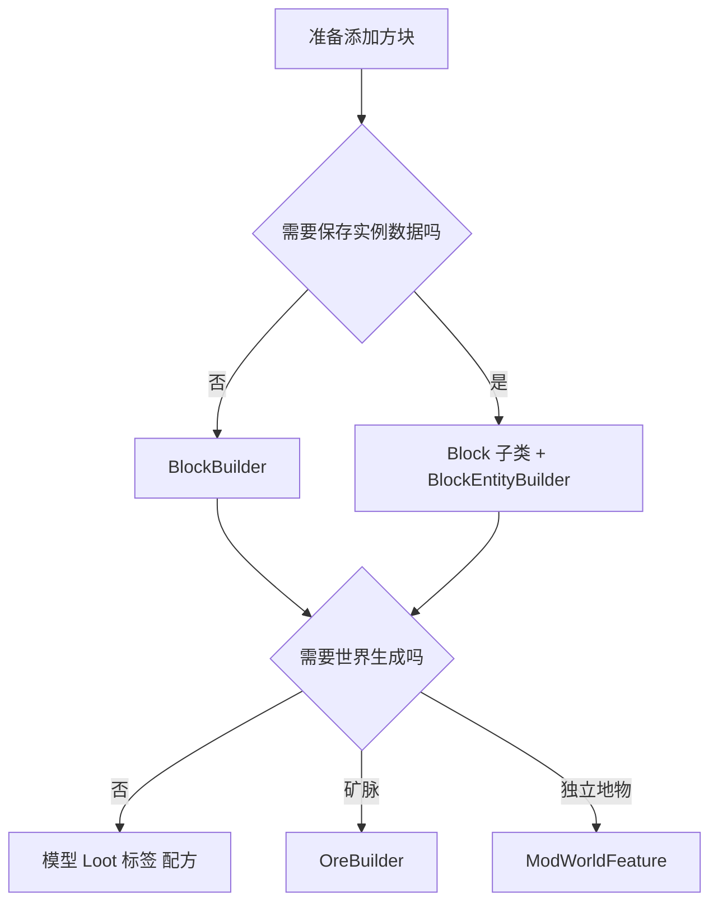

# 添加方块、方块实体与矿石

普通方块通过 `BlockCatalog + BlockBuilder` 同时接入方块、方块物品、翻译、模型和默认掉落。需要持久数据时再增加方块实体；需要自然生成时还要注册 Feature 并选择目标群系。

## 1. 先选择方块路径



大型建筑和城市地块不属于方块注册，分别使用[结构](../world/add-structure.md)和[城市 Region](../world/add-nation-city-region.md)教程。

## 2. 添加普通立方体

在 [ModBlock.java](../../src/main/java/com/cxxcxx/zinecraft/core/registry/ModBlock.java) 中参考同类声明：

```java
public static final BlockBuilder<Block> EXAMPLE_STONE = block(
    "example_stone",
    "示例石材",
    Blocks.STONE
);
```

第三个参数通过 `Properties.ofFullCopy(...)` 复制参考方块的硬度、爆炸抗性、声音和摩擦等物理属性，不会复制纹理或模型。

默认 Builder 会：

1. 注册方块；
2. 注册同 ID 的 `BlockItem`；
3. 生成方块与物品翻译；
4. 生成 cube-all blockstate 和模型；
5. 生成掉落自身的 loot table；
6. 加入相应创造栏。

## 3. 理解可选开关

| 方法 | 中文含义 | 你还要做什么 |
| --- | --- | --- |
| `.enUs(name)` | 覆盖自动英文名 | 无 |
| `.drop(item)` | 改为掉落指定物品 | 确认丝触、时运等需求是否另有规则 |
| `.noLoot()` | 不自动生成 loot table | 手工提供掉落，或确认确实无掉落 |
| `.noCubeModel()` | 不生成 cube-all 模型 | 手工提供 blockstate、方块模型和物品模型 |
| `.noBlockItem()` | 不注册 `BlockItem` | 确认玩家不需要正常持有该方块 |
| `.itemProperties(...)` | 自定义方块物品属性 | 检查稀有度、堆叠等行为 |

这些开关只关闭自动生成，不会替你补上另一套资源。

## 4. 添加状态方块或方块实体

简单朝向、碰撞或交互放在专用 `Block` 子类。只有每个方块实例确实需要保存数据时才增加方块实体，入口见 [ModBlockEntity.java](../../src/main/java/com/cxxcxx/zinecraft/core/registry/ModBlockEntity.java)。

按实际功能选择实现：

| 能力 | 需要处理的内容 |
| --- | --- |
| 持久字段 | `loadAdditional`、`saveAdditional`、字段变化后 `setChanged()` |
| 客户端同步 | 更新数据包或菜单数据槽 |
| 每 tick 逻辑 | 服务端/客户端 ticker 分离 |
| GUI | menu、screen 和网络授权 |
| 特殊渲染 | 只在客户端注册 renderer |

不要为空方块实体无条件实现所有接口，也不要让专用服务端加载客户端 renderer。

## 5. 添加矿石世界生成

注册矿石方块不等于它会出现在世界中。`OreBuilder` 还要配置矿脉、Y 范围、暴露丢弃率和群系选择：

```java
BlockBuilder<Block> block = new BlockBuilder<>(
    Zinecraft.BLOCKS,
    "example_ore",
    "示例矿石",
    () -> new Block(BlockBehaviour.Properties.ofFullCopy(Blocks.DEEPSLATE))
).build();

public static final OreBuilder<Block> EXAMPLE_ORE = new OreBuilder<>(
    Zinecraft.FEATURES,
    "example_ore",
    block.block()
).vein(6, 5)
 .maxY(32)
 .discardChanceOnAirExposure(0.2F)
 .biomes(BiomeSelection.terra())
 .build();
```

请以 `ModBlock.ore(...)` 或 `ModWorldFeature.EXAMPLE_BLOCK_ORE` 的当前签名为准。关键字段：

| 字段 | 中文含义 | 约束 |
| --- | --- | --- |
| `veinSize` | 单矿脉尝试放置的方块数 | 正整数 |
| `veinsPerChunk` | 每 Chunk 的放置尝试数 | 正整数 |
| `maxY` | 三角分布的最高 Y 参考 | 与目标维度高度匹配 |
| `discardChanceOnAirExposure` | 暴露空气时丢弃概率 | 0 到 1 |
| `biomes` | 目标群系选择器 | 必须显式选择 |

## 6. 资源、掉落与采掘标签

默认纹理：

```text
src/main/resources/assets/zinecraft/textures/block/example_stone.png
```

采掘标签当前不会由 Catalog 自动生成，需要手工维护：

```text
src/main/resources/data/minecraft/tags/block/mineable/pickaxe.json
src/main/resources/data/minecraft/tags/block/needs_iron_tool.json
```

同时检查配方、熔炼、掉落、经验和创造栏。`OreBuilder.cooking(...)` 只在配置后提供对应烹饪数据来源，不能假定所有矿石都会自动熔炼。

## 7. 常见失败

| 现象 | 原因 | 修正 |
| --- | --- | --- |
| 方块可放置但挖掘不掉落 | loot 被关闭或工具条件错误 | 检查 Builder 和生成 loot |
| 徒手也能快速采掘 | mineable/工具等级标签缺失 | 补手工标签 |
| 模型紫黑 | 关闭自动模型后未补资源 | 检查 blockstate 与两类模型 |
| 矿石从不生成 | 只有 Block，没有 Feature 或群系选择 | 补 `OreBuilder` 与 biome modifier |
| 方块实体重进丢数据 | 未保存或未 `setChanged()` | 补持久化链 |

## 8. 验证

```powershell
.\gradlew.bat runData
.\gradlew.bat test
.\gradlew.bat build
```

审查 blockstate、方块/物品模型、纹理、翻译、loot、配方、采掘标签、创造栏、configured/placed feature 和目标群系。交互方块还要测试保存、同步和专用服务端；矿石要在尚未生成的 Chunk 中用固定种子抽样。完整矿脉流程见[添加矿石与矿脉](./add-ore.md)。
