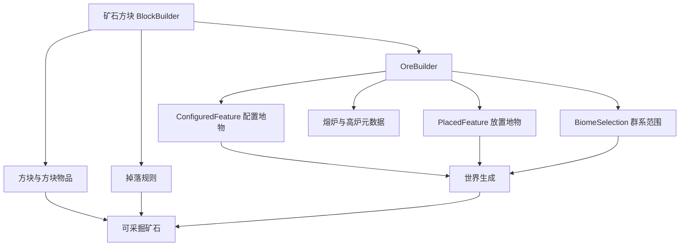

# 添加矿石与矿脉

Zinecraft 的矿石不是单独一个方块。完整条目同时包含矿石方块、掉落物、配置地物、放置地物、生成群系与可选烧炼配方。项目通过 `BlockBuilder + OreBuilder` 把这些声明收在一起。

## 1. 先看完整链路



`ConfiguredFeature`（配置地物）描述矿脉由哪些方块、以什么规则组成；`PlacedFeature`（放置地物）描述它在区块中的次数和高度分布。注册方块并不会自动让矿石进入世界。

## 2. 准备掉落物

矿石掉落物应先在 `ModItem` 中注册。若挖掘后掉落原矿物品，可直接引用现有 `ItemBuilder`：

```java
public static final ItemBuilder<Item> ORIROCK =
    item("orirock", "固源岩");
```

矿石方块 ID、地物 ID 和掉落物 ID 可以不同，但命名应能看出关联。例如轻锰矿脉使用：

| 用途 | 当前 ID |
| --- | --- |
| 方块 | `manganese_ore_block` |
| 地物 | `manganese_ore` |
| 掉落物 | `manganese_ore` |

已经发布的 ID 不要为了统一外观随意改名，否则会影响存档与数据包引用。

## 3. 使用项目的 `ore` 辅助方法

现有源岩矿声明如下：

```java
public static final OreBuilder<Block> ORIROCK_ORE = ore(
    "orirock_ore",
    "orirock_ore",
    "源岩矿",
    ModItem.ORIROCK,
    "orirock",
    10,
    12,
    64,
    0.0F
);
```

### 3.1 参数含义

| 参数 | 中文含义 | 当前约束 |
| --- | --- | --- |
| `blockPath` | 矿石方块及方块物品 ID | 稳定的 snake_case |
| `featurePath` | 放置地物 ID | 配置地物自动使用 `<id>_vein` |
| `zhCn` | 方块中文名 | 不为空 |
| `drop` | 挖掘掉落物 | 已注册的 `ItemLike` |
| `cookingGroup` | 熔炉与高炉配方分组 | 不为空 |
| `veinSize` | 单条矿脉最多方块数 | 正整数 |
| `veinsPerChunk` | 每个 Chunk 的放置尝试次数 | 正整数 |
| `maxY` | 偏向底部高度分布的最高端点 | 当前目录未校验；应与目标维度高度匹配 |
| `discardChance` | 暴露于空气时丢弃矿石的概率 | $[0,1]$ |

`Chunk`（区块）是 Minecraft 的 16×16 水平生成单元。“每区块 12 次”表示 12 次放置尝试，不保证最终出现 12 条完整矿脉。

## 4. 理解辅助方法实际做了什么

```java
BlockBuilder<Block> block = new BlockBuilder<>(
    Zinecraft.BLOCKS,
    blockPath,
    zhCn,
    () -> new Block(
        Properties.ofFullCopy(Blocks.DEEPSLATE)
            .requiresCorrectToolForDrops()
            .strength(4.0F, 6.0F)
            .sound(SoundType.DEEPSLATE)
    )
).drop(drop).build();

return new OreBuilder<>(Zinecraft.FEATURES, featurePath, block)
    .vein(veinSize, veinsPerChunk)
    .maxY(maxY)
    .discardChanceOnAirExposure(discardChance)
    .biomes(BiomeSelection.union(
        BiomeSelection.overworld(),
        BiomeSelection.of(ModBiome.ALL_TERRA_BIOMES)
    ))
    .cooking(drop, cookingGroup)
    .build();
```

当前辅助方法让矿石同时进入原版主世界和全部泰拉群系。若只允许在某些地点生成，应直接配置 `BiomeSelection`。`.place(TerraPlace)` 当前属于预留元数据：本次审计未找到读取 `OreBuilder.place()` 的放置消费者，因此它现在不会改变矿脉生成结果。

## 5. 调整生成密度

单个 Chunk 的理论尝试方块上限可用于比较配置强弱：

$$
B_{attempt}=S_{vein}\times N_{chunk}
$$

- $B_{attempt}$：一个区块内所有尝试的理论方块上限，不是实际生成量；
- $S_{vein}$：单条矿脉最多方块数；
- $N_{chunk}$：每区块尝试次数。

源岩矿的理论上限为 $10\times12=120$。实际数量会因矿脉形状、方块替换条件、空气暴露丢弃、区块边界和随机结果降低。

空气暴露保留概率为：

$$
P_{keep}=1-P_{discard}
$$

- $P_{keep}$：矿石暴露于空气时保留的概率；
- $P_{discard}$：`discardChanceOnAirExposure`，取值范围 $[0,1]$。

例如 `0.25F` 表示暴露矿石有 25% 概率被丢弃，保留概率为 75%。

## 6. 添加资源、采掘标签与配方

至少准备：

```text
assets/zinecraft/textures/block/<block_id>.png
data/minecraft/tags/block/mineable/pickaxe.json
data/minecraft/tags/block/needs_<tier>_tool.json
```

`BlockCatalog` 会生成常规 blockstate、方块模型、方块物品模型与掉落表，但采掘标签目前需要手工维护。`runData` 会根据 `OreBuilder.cooking(...)` 生成对应烧炼数据；修改 Builder 后重新生成，不要直接维护生成产物。

## 7. 处理特殊情况

### 7.1 矿石注册成功但世界中找不到

依次检查 `OreBuilder.build()`、目标 `BiomeSelection`、配置与放置地物键、数据生成结果，以及测试区块是否早已生成。世界生成修改只影响新 Chunk。

### 7.2 徒手也能掉落

方块属性中的 `requiresCorrectToolForDrops()` 只声明需要正确工具；还要把方块加入 `mineable/pickaxe` 和合适的 `needs_*_tool` 标签。

### 7.3 矿石过密或几乎没有

使用固定种子，在多个新 Chunk 中统计实际方块数。不要只看一个矿脉，也不要把 `veinsPerChunk` 当作保证数量。

### 7.4 只生成在泰拉某国或城市

先用目标群系缩小范围；若使用 `.place(...)`，继续核对 FeatureCatalog、生成导出和运行时消费者是否读取地点字段。未被消费的元数据不能代替群系或放置条件。

## 8. 验证清单

- [ ] 方块、地物和掉落物 ID 稳定且没有冲突。
- [ ] 正确工具、采掘等级、掉落物与经验行为符合设计。
- [ ] 配置地物和放置地物均由数据生成器产出。
- [ ] 目标群系能生成，非目标群系不能生成。
- [ ] 固定种子下抽样多个新 Chunk，密度和高度分布合理。
- [ ] 熔炉与高炉配方的输入、输出和分组正确。

```powershell
.\gradlew.bat test
.\gradlew.bat runData
.\gradlew.bat build
Set-Location docs
npm run guides:check
```

主要源码：[ModBlock.java](../../src/main/java/com/cxxcxx/zinecraft/core/registry/ModBlock.java)、[OreBuilder.java](../../src/main/java/com/cxxcxx/zinecraft/api/registry/builder/OreBuilder.java)、[FeatureCatalog.java](../../src/main/java/com/cxxcxx/zinecraft/api/registry/catalog/FeatureCatalog.java)。普通方块流程见[添加方块](./add-block.md)。
