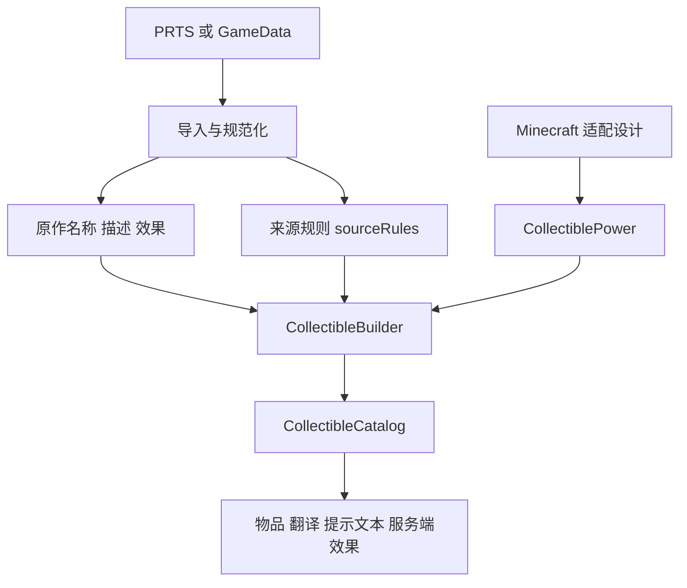
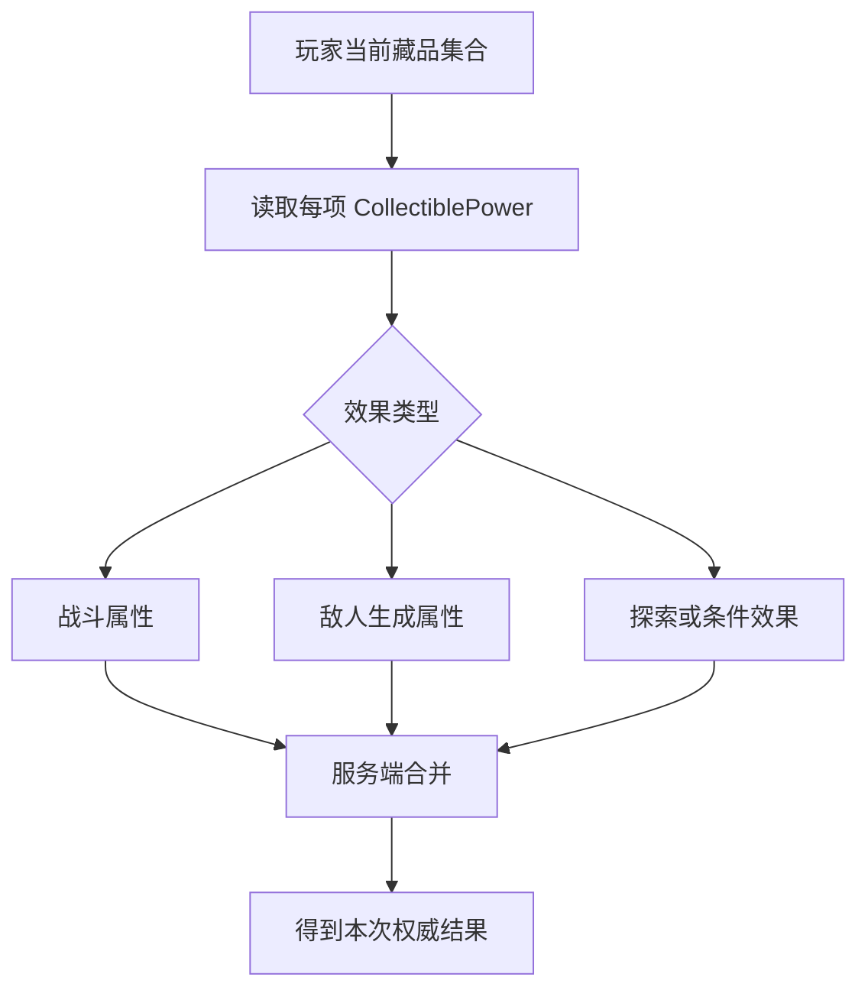

# 添加集成战略藏品

藏品不是普通物品的换皮。每个条目同时保存原作名称与文本、资料来源、Minecraft 适配说明和服务端实际效果。当前目录包含 742 项，应优先通过导入脚本批量维护，手工修改只适合修正单个条目。

## 1. 遵守资料边界

原作名称、描述、效果与图片应来自仓库现有资料、PRTS Wiki 或 `ArknightsGameData`，并保留来源。找不到资料时先留下可审计的缺口，不要自行补写成“原作设定”。Minecraft 适配属于本模组设计，必须与原作文本分栏呈现。



## 2. 选择维护方式

| 情况 | 推荐入口 |
| --- | --- |
| 批量同步 PRTS 全部藏品 | `script/import_prts_all_collectibles.py` |
| 同步 IS2 范围资料 | `script/import_prts_is2_collectibles.py` |
| 修正一个已存在条目的文字或映射 | `ModCollectible.java` 中对应声明 |
| 新增一种可复用效果 | `CollectiblePower` 与运行时服务 |
| 生成任务章节 | `script/generate_collectible_quest_chapter.py` |

运行导入前先阅读脚本参数并检查 diff。导入是资料同步，不代表自动生成的 Minecraft 效果一定符合设计。

## 3. 使用 `CollectibleBuilder`

项目的统一辅助方法如下：

```java
private static CollectibleBuilder collectible(
    String path,
    String zhCn,
    String originalEffectZhCn,
    String originalEffectEnUs,
    String descriptionZhCn,
    String descriptionEnUs,
    PowerDefinition effect,
    Rarity rarity
) {
  return new CollectibleBuilder(Zinecraft.COLLECTIBLES, path, zhCn)
      .originalEffect(originalEffectZhCn, originalEffectEnUs)
      .description(descriptionZhCn, descriptionEnUs)
      .minecraftEffect(effect.zhCn(), effect.enUs(), effect.power())
      .sourceRules(effect.sourceRules())
      .rarity(rarity)
      .build();
}
```

### 3.1 字段职责

| 字段 | 中文含义 | 是否可自行改写 |
| --- | --- | --- |
| `path` | Minecraft 注册 ID 路径 | 可规范化，但要保持稳定 |
| `zhCn` / `enUs` | 藏品名称 | 应忠于来源 |
| `originalEffect` | 原作效果文本 | 不自行推断 |
| `description` | 原作描述文本 | 不自行推断 |
| `minecraftEffect` 文本 | 模组内实际适配说明 | 可设计，但必须与实现一致 |
| `CollectiblePower` | 服务端可组合效果 | 必须有测试 |
| `sourceRules` | 暂未被运行时消费的原作规则 | 必须保留，不能静默丢弃 |
| `rarity` | Minecraft 物品稀有度 | 按映射规则统一转换 |

`build()` 之后 Builder 不可再修改，也不能重复 `build()`。

## 4. 编写可组合效果

藏品效果通过 `CollectiblePower` 组合。简单数值应使用统一的百分比或固定值辅助方法；需要监听战斗事件、改变敌人生成属性或探索结算时，再进入对应的运行时服务。



若同类百分比效果按加法合并，可写成：

$$
v_{result} = v_{base}\left(1 + \sum_{i=1}^{n} p_i\right) + \sum_{j=1}^{m} a_j
$$

- $v_{result}$：所有藏品结算后的属性值；
- $v_{base}$：未应用藏品前的基础值；
- $p_i$：第 $i$ 个百分比修正，`0.15` 表示增加 15%；
- $a_j$：第 $j$ 个固定数值修正；
- $n$：百分比修正数量；
- $m$：固定修正数量。

如果某类效果采用乘法、最大值或唯一生效规则，必须在对应运行时明确实现，不能套用上式。

## 5. 保持说明与实现一致

`minecraftEffect` 的文字是玩家契约。修改数值时应在同一个提交里更新：

1. `CollectiblePower` 参数；
2. 中文与英文适配说明；
3. 对应测试；
4. 若来自规则转换，更新转换规则或来源备注。

不要把尚未实现的原作条件写成已生效。应保留在 `sourceRules`，并在适配说明中准确说明当前行为。

## 6. 图片与本地化

图片必须优先使用有出处的原作资源。统一目标路径与 ID：

```text
assets/zinecraft/textures/item/<collectible_id>.png
```

若来源图需要裁切或透明化，保留原文件或来源记录，并使用可重复的处理脚本。中文、英文文本都应检查换行；提示文本过长时应按语义断行，不按固定字符数硬切。

## 7. 处理特殊情况

### 7.1 原作条件无法映射到 Minecraft

保留原作文字与 `sourceRules`，实现最接近且可解释的适配，并在 `minecraftEffect` 明说差异。不要伪装成一比一还原。

### 7.2 多件藏品修改同一属性

统一在聚合服务中决定加法、乘法、覆盖或上限。遍历顺序不应改变结果，除非设计明确要求顺序，并且有测试固定该顺序。

### 7.3 装备变化、死亡或重新登录

运行时应从玩家当前藏品集合重建效果，先移除旧快照再应用新快照，避免永久残留或重复叠加。

### 7.4 条目有资料但没有可执行效果

不得传入空效果。可以实现明确的无数值效果并在文本中说明，或将条目标记为待适配，但不能让目录声称已经生效。

## 8. 验证与审计

- [ ] 原作名称、描述、效果和图片都有可追溯来源。
- [ ] `path` 唯一且与图片文件名一致。
- [ ] 中文、英文原作文本没有被适配文本覆盖。
- [ ] `minecraftEffect` 与服务端实际数值一致。
- [ ] 多藏品合并与卸下重算结果稳定。
- [ ] 未实现规则完整保存在 `sourceRules`。
- [ ] 目录页面能从藏品卡片进入本教程。

```bash
python script/import_prts_all_collectibles.py --help
./gradlew test
./gradlew runData
cd docs && npm run guides:check
```

主要源码：[ModCollectible.java](../../src/main/java/com/cxxcxx/zinecraft/core/registry/ModCollectible.java)、[CollectibleBuilder.java](../../src/main/java/com/cxxcxx/zinecraft/api/registry/builder/CollectibleBuilder.java)、[CollectibleEffectRuntime.java](../../src/main/java/com/cxxcxx/zinecraft/core/collection/CollectibleEffectRuntime.java)。
