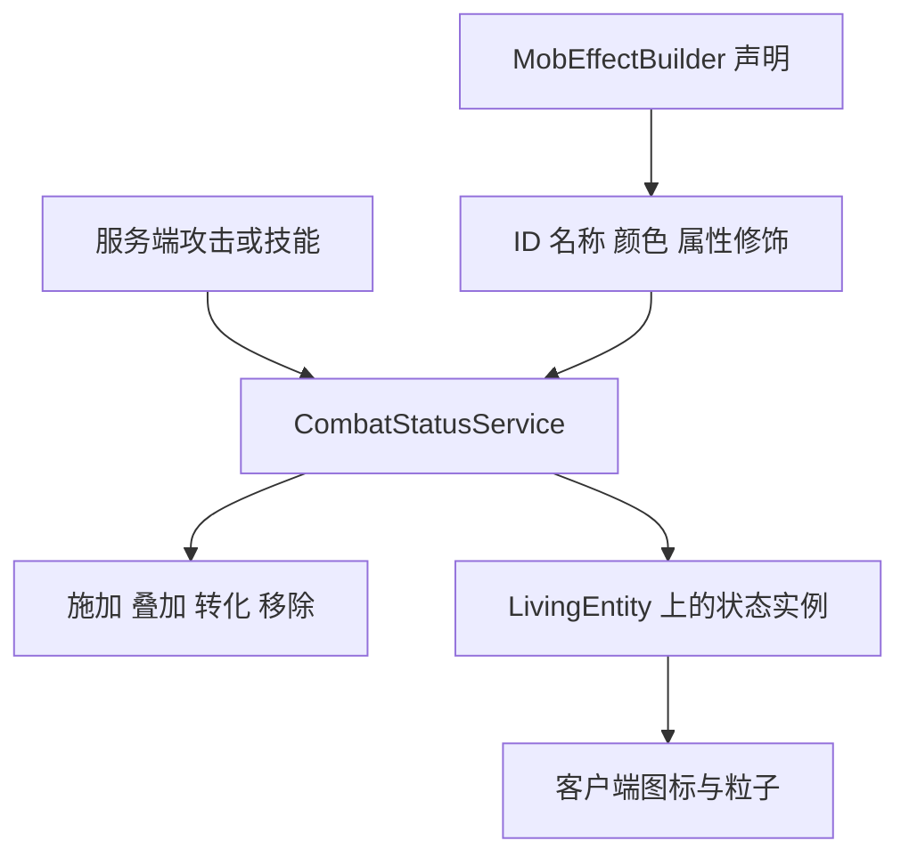
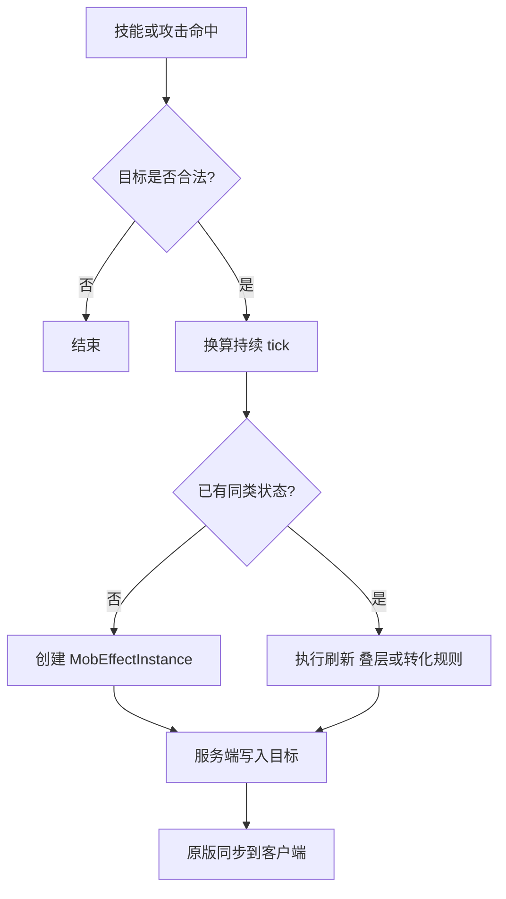
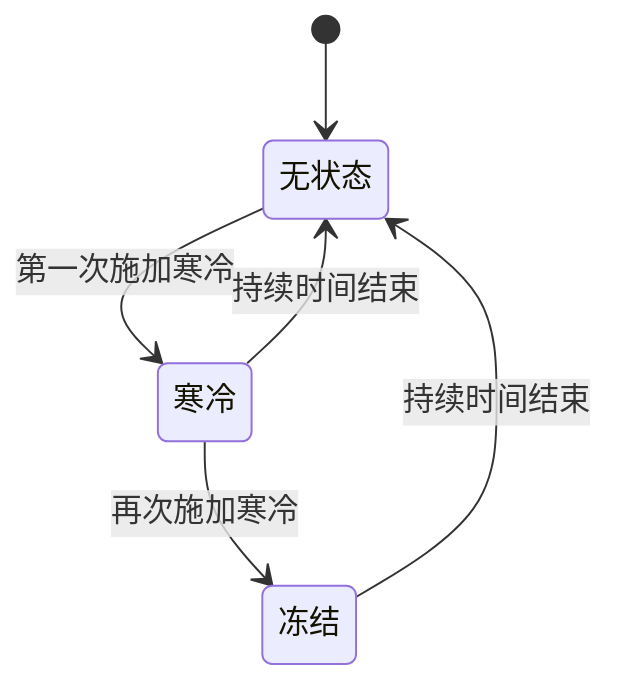
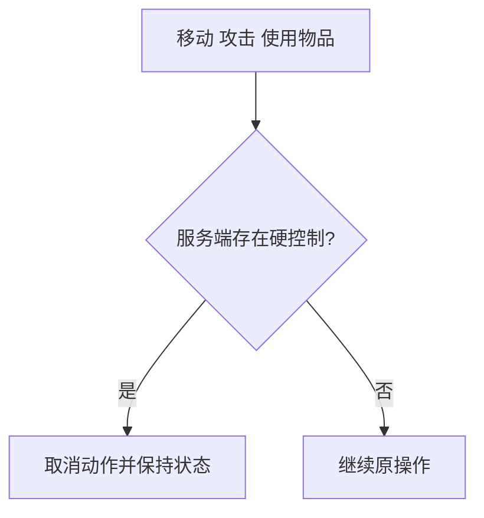

# 添加战斗状态

Zinecraft 的异常状态由 `MobEffectBuilder` 注册，但真正的战斗规则由服务端状态服务执行。图标和粒子只负责展示，不能决定控制、伤害或叠加结果。

## 1. 区分声明与规则



属性修饰适合“持续期间固定改变数值”；寒冷再次施加后转为冻结、禁止攻击等条件逻辑，应放在状态服务或事件中。

## 2. 注册基础状态

项目中的状态统一通过辅助方法设置为有害效果：

```java
private static MobEffectBuilder effect(
    String path,
    String zhCn,
    String enUs,
    int color
) {
  return new MobEffectBuilder(
      Zinecraft.MOB_EFFECTS,
      path,
      zhCn,
      enUs,
      MobEffectCategory.HARMFUL,
      color
  );
}
```

例如，寒冷使攻击速度降低 30%：

```java
public static final MobEffectBuilder COLD =
    effect("cold", "寒冷", "Cold", 0x6DD5FA)
        .attributeModifier(
            Attributes.ATTACK_SPEED,
            "attack_speed",
            -0.30,
            AttributeModifier.Operation.ADD_MULTIPLIED_TOTAL
        )
        .build();
```

`path` 会成为 `zinecraft:cold`；颜色使用 `0xRRGGBB`；修饰器名称应在同一状态内唯一且能说明用途。

## 3. 正确计算属性变化

`ADD_MULTIPLIED_TOTAL` 的单个修饰可理解为：

$$
v_{result} = v_{base}(1 + m)
$$

- $v_{result}$：状态生效后的最终属性值；
- $v_{base}$：实体进入该计算阶段前的基础属性值；
- $m$：乘算修饰量，例如 `-0.30` 表示降低 30%。

`ADD_VALUE` 则直接加减固定数值：

$$
v_{result} = v_{base} + a
$$

- $a$：固定加算值，例如 `-15.0` 表示减少 15 点。

不要仅凭界面显示判断伤害或抗性结果；最终战斗公式仍要在服务端测试。

## 4. 从统一入口施加状态



Minecraft 以 tick 计时，标准服务器每秒 20 tick：

$$
t_{tick} = 20t_{second}
$$

- $t_{tick}$：传入状态实例的持续 tick 数；
- $t_{second}$：设计表中的持续秒数；
- `20`：标准每秒 tick 数。

推荐由统一服务接收秒数或 tick 数，并在方法名中明确单位，避免把 5 秒误写成 5 tick。

## 5. 实现叠加与转化

寒冷的项目契约是“重复施加时由 `CombatStatusService` 转为冻结”。逻辑应是原子化的服务端操作：



转化时要明确：

1. 是否移除旧状态；
2. 新状态持续时间取固定值、剩余时间还是二者最大值；
3. 强度等级是否继承；
4. 免疫目标是否保持旧状态。

这些规则必须只有一个服务端实现，不能由多个武器和技能分别复制。

## 6. 实现硬控制

冻结、麻痹、晕眩不仅把移动与攻击速度降到 `-1.0`，还需要在服务端操作入口阻止不应执行的动作。否则其他模组或特殊实体可能绕过属性限制。



客户端可以提前禁用动画以改善手感，但服务端取消才是权威结果。

## 7. 处理特殊情况

### 7.1 重复施加同一普通状态

明确选择刷新持续时间、取更长时间或提升 amplifier。不要依赖 `MobEffectInstance` 的默认合并行为来代替设计决定。

### 7.2 Boss 或特殊实体免疫

免疫判定放在统一施加入口。若只在某个技能中判断，其他来源仍可能施加成功。

### 7.3 玩家死亡、切换维度或断线

决定状态应由原版保存、主动清除还是重新计算。涉及藏品或装备提供的效果时，重新登录后应从当前装备重建，而不是永久写入残留状态。

### 7.4 属性降到非法范围

为移动、攻速、抗性等属性验证上下界。若设计需要“完全不能行动”，使用硬控制判定表达，不要继续堆叠极端负数。

## 8. 资源与验证

状态图标路径通常为：

```text
assets/zinecraft/textures/mob_effect/<effect_id>.png
```

验证清单：

- [ ] ID、中文名、英文名、颜色和图标一致。
- [ ] 20 tick、1 秒和完整设计时长三个时间点均正确。
- [ ] 重复施加、转化、免疫和移除路径有测试。
- [ ] 控制效果在服务端阻止动作，客户端只负责表现。
- [ ] 属性恢复后没有永久残留修饰器。
- [ ] 多人游戏中观察者看到的状态一致。

```bash
./gradlew test
./gradlew runGameTestServer
cd docs && npm run guides:check
```

主要源码：[ModMobEffect.java](../../src/main/java/com/cxxcxx/zinecraft/core/registry/ModMobEffect.java)、[MobEffectBuilder.java](../../src/main/java/com/cxxcxx/zinecraft/api/registry/builder/MobEffectBuilder.java)。
