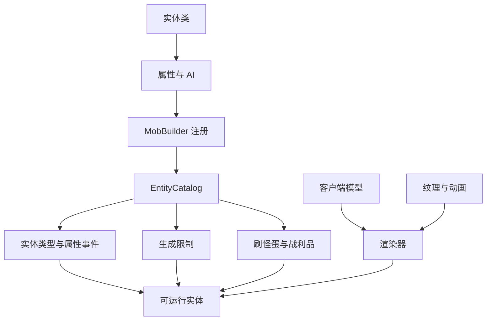
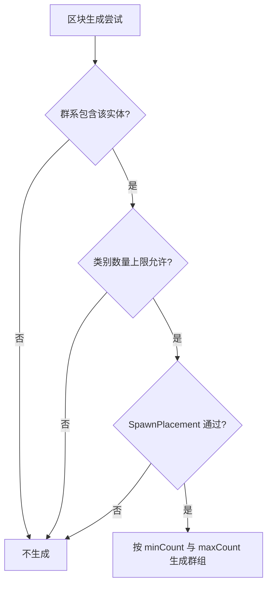
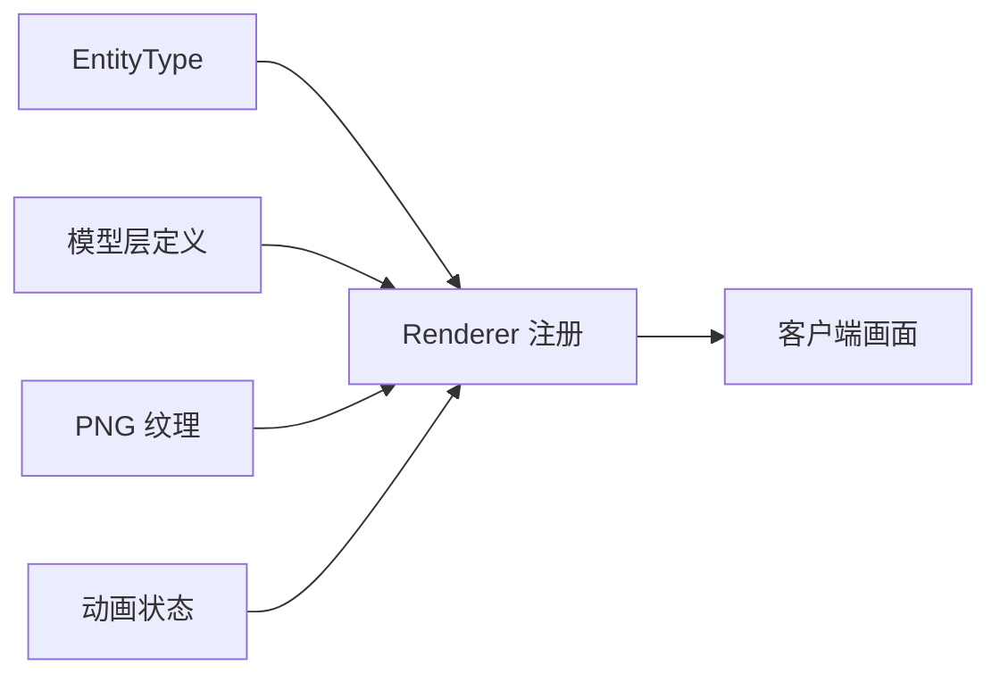

# 添加生物实体

Zinecraft 的生物由 `MobBuilder` 统一登记，但“能注册”不等于“会自然生成，也不等于客户端能正确渲染”。完整实现要同时闭合服务端行为、生成规则和客户端资源三条链路。

## 1. 先理解完整链路



这里的“生成限制”指 `SpawnPlacement`：它判断某个方块位置是否允许出生；群系中的生成条目则决定系统是否会尝试生成以及生成频率。两者必须同时成立。

## 2. 编写服务端实体类

实体类负责属性、目标选择和行为。以项目中的 `TerraBeastEntity` 为例，建议把属性工厂和环境判定写成静态方法，方便注册表直接引用。

```java
public final class ExampleBeastEntity extends PathfinderMob {
  public ExampleBeastEntity(EntityType<? extends PathfinderMob> type, Level level) {
    super(type, level);
  }

  public static AttributeSupplier.Builder attributes() {
    return Mob.createMobAttributes()
        .add(Attributes.MAX_HEALTH, 24.0)
        .add(Attributes.MOVEMENT_SPEED, 0.28)
        .add(Attributes.ATTACK_DAMAGE, 5.0);
  }

  public static boolean canSpawn(
      EntityType<ExampleBeastEntity> type,
      ServerLevelAccessor level,
      MobSpawnType reason,
      BlockPos pos,
      RandomSource random
  ) {
    return level.getBlockState(pos.below()).is(BlockTags.ANIMALS_SPAWNABLE_ON)
        && level.getRawBrightness(pos, 0) > 8;
  }
}
```

只同步客户端确实需要渲染的自定义状态。生命值、位置等原版字段已有同步机制，不要重复发包。

## 3. 使用 `MobBuilder` 注册

项目现有居民采用下面的实际写法：

```java
public static final MobBuilder<SanktaFormalResidentEntity> SANKTA_FORMAL_RESIDENT =
    new MobBuilder<>(
        Zinecraft.ENTITIES,
        "sankta_formal_resident",
        "萨科塔礼服居民",
        SanktaFormalResidentEntity::new,
        MobCategory.CREATURE,
        SanktaFormalResidentEntity::attributes,
        new MobSpawnRestriction<>(
            SpawnPlacementTypes.ON_GROUND,
            Heightmap.Types.MOTION_BLOCKING_NO_LEAVES,
            SanktaFormalResidentEntity::canSpawn
        ),
        builder -> builder.sized(0.6F, 1.8F).clientTrackingRange(8)
    )
    .spawnEgg(0x8F2A34, 0xF5E7A3,
        "萨科塔礼服居民刷怪蛋", "Sankta Formal Resident Spawn Egg")
    .noDrops()
    .build();
```

### 3.1 构造参数含义

| 参数 | 中文含义 |
| --- | --- |
| `path` | 注册 ID 的路径部分，只用小写字母、数字和下划线 |
| `MobCategory` | 生物类别，影响数量上限与生成循环 |
| `attributes` | 服务端属性工厂 |
| `MobSpawnRestriction` | 落点类型、高度图和位置谓词 |
| `sized(width, height)` | 碰撞箱宽度与高度，单位为方块 |
| `clientTrackingRange` | 客户端开始跟踪实体的区块距离 |

刷怪蛋的两个十六进制颜色分别是底色与斑点色。若有战利品表，使用 Builder 对应的掉落配置；只有明确不掉落时才调用 `noDrops()`。

## 4. 接入自然生成



在群系 Builder 中加入：

```java
builder.featuredSpawn(
    MobCategory.CREATURE,
    ModEntity.CLAMPBEAST.get(),
    6,
    1,
    2
);
```

其中 `6` 是相对权重，`1` 和 `2` 是每群最少与最多数量。权重不是百分比；同一类别中概率近似为：

$$
P_i = \frac{w_i}{\sum_{j=1}^{n} w_j}
$$

- $P_i$：第 $i$ 种生物在一次候选选择中被选中的概率；
- $w_i$：第 $i$ 种生物的生成权重；
- $n$：同一群系、同一生物类别中的候选种数。

泰拉维度还受 `TerraMobSpawnPolicy` 约束。若普通主世界可以生成而泰拉不能生成，先检查维度策略，再检查亮度和脚下方块。

## 5. 接入客户端渲染

客户端注册必须放在 client 侧入口，避免专用服务器加载模型类。



建议统一资源路径：

```text
assets/zinecraft/textures/entity/<entity_id>.png
```

碰撞箱、模型缩放和纹理轮廓要一起校验。模型看起来贴地但碰撞箱悬空，通常是模型根节点偏移或渲染缩放问题，不要用服务端位置补偿掩盖。

## 6. 处理特殊情况

### 6.1 只允许刷怪蛋或命令生成

不把实体加入任何群系生成表，并让生成限制只覆盖手动生成需要的安全条件。刷怪蛋仍可保留。

### 6.2 需要水中、洞穴或空中生成

同时调整三处：`MobCategory`、`SpawnPlacementTypes` 与群系生成类别。只改其中一处通常会导致候选永远无法通过。

### 6.3 自定义状态需要保存

短暂动画状态用同步实体数据；跨存档状态必须写入 NBT；改变伤害、掉落或 AI 的判定必须由服务端执行。

### 6.4 实体能召唤但不可见

按顺序检查渲染器是否注册、纹理路径大小写、模型层是否烘焙，以及 client-only 类是否被错误放到公共初始化路径。

## 7. 验证清单

- [ ] `/summon zinecraft:<id>` 能创建实体，且专用服务器不崩溃。
- [ ] 属性、AI、碰撞箱和寻路符合设计。
- [ ] 刷怪蛋名称、颜色和创造栏位置正确。
- [ ] 战利品表存在，或明确使用 `noDrops()`。
- [ ] 目标群系中能自然生成，错误环境中不能生成。
- [ ] 纹理、模型、动画与阴影尺寸一致。
- [ ] [注册内容总索引](../overview/registered-content-guide-index.md) 能定位该条目。

运行基础验证：

```bash
./gradlew test
./gradlew runData
cd docs && npm run guides:check
```

主要源码：[ModEntity.java](../../src/main/java/com/cxxcxx/zinecraft/core/registry/ModEntity.java)、[MobBuilder.java](../../src/main/java/com/cxxcxx/zinecraft/api/registry/builder/MobBuilder.java)。
