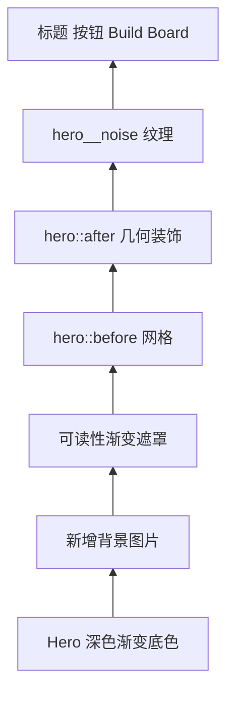

# 添加文档站主页背景

当前主页 Hero（首屏主视觉）使用深色渐变、网格、噪声和几何装饰，没有位图背景。添加背景时应把图片作为最底层视觉素材，保留现有遮罩和文字对比度，并优先使用仓库规范允许的官方、PRTS 或游戏数据素材。

## 1. 理解当前视觉层级



CSS 多重背景从前往后绘制，因此渐变要写在图片前面。背景只承担氛围，不应让标题、导航或操作按钮失去可读性。

## 2. 选择并记录素材

按项目资料顺序选择：

1. 明日方舟官网与官方发布素材；
2. PRTS Wiki 已记录的 CG 或背景；
3. `ArknightsGameData` 中可追溯资源；
4. 仓库已有图片；
5. 确实找不到合适资源时再制作符合现有风格的替代图。

不要从搜索结果缩略图或无来源转载站直接保存。建议把主页背景放在：

```text
docs/public/backgrounds/terra-home.webp
docs/public/backgrounds/SOURCE.md
```

`SOURCE.md` 至少记录：

```markdown
# Background sources

- 文件：`terra-home.webp`

- 作品：明日方舟
- 原始页面：<来源页面地址>
- 原始文件：<原图文件名或资源 ID>
- 处理：裁切、缩放并转为 WebP；未生成或补绘画面内容
- 用途：Zinecraft 文档站主页 Hero 装饰背景
```

素材许可和署名要求高于视觉设计；来源不清时先不要提交图片。

## 3. 准备响应式图片

主页背景需要兼顾宽屏和移动端裁切。建议先保留无损原图，再导出两个网页版本：

```text
terra-home-1280.webp
terra-home-2560.webp
```

推荐而非硬性限制：

| 项目 | 建议 |
| --- | --- |
| 色彩空间 | sRGB |
| 桌面宽度 | 1920–2560 px |
| 移动端宽度 | 960–1280 px |
| 格式 | WebP；需要兼容回退时保留 JPEG/PNG |
| 文件体积 | 在不出现明显色带和文字伪影前尽量压缩 |

若画面有关键人物或建筑，先确定 focal point（视觉焦点），再决定 `background-position`。不要假设桌面居中裁切在手机上仍能保留主体。

## 4. 在 Hero 中加入背景

当前 `.hero` 位于 `docs/src/styles.css`。可改为：

```css
.hero {
  min-height: 750px;
  position: relative;
  overflow: hidden;
  color: white;
  background:
    linear-gradient(
      90deg,
      rgba(18, 20, 17, .96) 0%,
      rgba(18, 20, 17, .82) 48%,
      rgba(18, 20, 17, .44) 100%
    ),
    image-set(
      url("../backgrounds/terra-home-1280.webp") 1x,
      url("../backgrounds/terra-home-2560.webp") 2x
    ) center / cover no-repeat;
}
```

这里的 `../backgrounds` 从构建后的 CSS 资源目录指向 `docs/public/backgrounds` 被复制出的站点根目录。完成构建后仍要在预览页面确认 URL，没有图片不代表 Vite 一定会报构建错误。

### 4.1 计算遮罩后的颜色

单层黑色遮罩后的通道值可近似为：

$$
C_{result}=(1-\alpha)C_{image}+\alpha C_{mask}
$$

- $C_{result}$：遮罩合成后的颜色通道值；
- $C_{image}$：背景图片原始通道值；
- $C_{mask}$：遮罩颜色通道值，黑色为 `0`；
- $\alpha$：遮罩不透明度，取值范围 $[0,1]$。

遮罩越深，白色标题通常越易读，但背景细节也越少。实际结果应以浏览器中的对比度检查为准，而不是只凭公式调色。

## 5. 调整移动端裁切

```css
@media (max-width: 700px) {
  .hero {
    background:
      linear-gradient(
        180deg,
        rgba(18, 20, 17, .90),
        rgba(18, 20, 17, .98)
      ),
      url("../backgrounds/terra-home-1280.webp")
        62% center / cover no-repeat;
  }
}
```

`62% center` 只是示例，应按真实素材焦点调整。测试宽度至少覆盖 320、768、1280 和 1920 px，并观察标题换行后是否遮住主体。

## 6. 保持现有装饰层

当前主页还使用：

- `.hero::before`：48 px 网格；
- `.hero::after`：右上角半透明几何框；
- `.hero__noise`：右侧斜纹噪声板；
- `body::before`：全站细噪声；
- `.artifact-strip`：首屏底部藏品条。

加入图片后逐层检查，不要一次删除全部装饰。若画面已经很复杂，可以降低网格或几何装饰透明度；必须保留明确的前景/背景层级和统一的绿、黑、石色视觉语义。

## 7. 处理特殊情况

### 7.1 图片在开发环境显示、发布后 404

确认文件位于 `docs/public/backgrounds`，CSS 使用与最终 `assets/*.css` 相匹配的相对路径，并检查 `docs/dist/backgrounds`。不要写本机绝对路径。

### 7.2 搜索栏和标题与背景混在一起

优先增强局部渐变、文字阴影或内容板背景，不要全局降低所有图片亮度。顶部搜索栏由 `.topbar` 独立承载，背景图不应延伸到它的层叠上下文之上。

### 7.3 移动端只看到无意义边缘

使用媒体查询改变 `background-position`，或提供专门的移动端裁切。不要用拉伸破坏原图比例。

### 7.4 想使用视频或循环动画

先确认静态图确实不足。动态背景必须静音、可暂停、支持 `prefers-reduced-motion`，并提供静态 poster；装饰性动画不得增加理解负担或显著拖慢首屏。

### 7.5 背景包含重要文字

背景图中的文字可能被裁切、缩放或无法被辅助技术读取。重要信息必须用真实 HTML 文本呈现，图片文字只可作为装饰。

## 8. 验证清单

- [ ] 图片来源、原文件和处理方式已记录。
- [ ] 背景位于 `docs/public/backgrounds`，构建后进入 `docs/dist/backgrounds`。
- [ ] 白色标题、说明、按钮和 Build Board 在明暗区域都清晰。
- [ ] 320–1920 px 范围内焦点与裁切合理，没有横向滚动。
- [ ] 图片加载失败时仍有深色渐变背景和可读内容。
- [ ] 不依赖图片承载重要文字或操作。
- [ ] 若有动画，减少动态模式能获得静态等价画面。

```powershell
Set-Location docs
npm run build -- --logLevel error
npm run preview -- --host 127.0.0.1
```

直接检查 `#/`，并使用浏览器网络面板确认背景返回 `200`、尺寸合理且没有重复下载。主要实现：`docs/src/App.jsx`、`docs/src/styles.css`。
