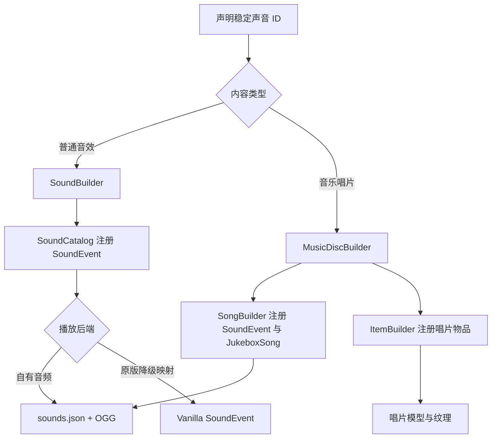

# 添加声音与音乐唱片

Zinecraft 的声音有两条不同路径：普通声音事件负责武器 cue 等短音效；音乐唱片会同时注册 `SoundEvent`、`JukeboxSong` 和唱片物品。两者都需要稳定 ID，但“注册了声音事件”不等于“已经有可播放音频”。

## 1. 先看完整链路



关键对象的中文含义如下：

| 名称 | 中文含义 | 当前职责 |
| --- | --- | --- |
| `SoundEvent` | 声音事件 | 游戏代码播放的注册表地址，本身不包含音频数据 |
| `sounds.json` | 声音映射表 | 把声音事件映射到一个或多个 OGG 文件 |
| OGG | 音频资源 | 实际声音文件，位于 `assets/zinecraft/sounds` |
| `JukeboxSong` | 点唱机歌曲 | 保存声音事件、时长、描述和比较器信号 |
| cue | 时间线提示点 | 在指定 tick 触发声音，不负责伤害或状态逻辑 |

## 2. 添加普通声音事件

### 2.1 声明声音

武器表现声音集中在 [ModWeaponPresentation.java](../../src/main/java/com/cxxcxx/zinecraft/core/registry/ModWeaponPresentation.java)：

```java
public static final SoundBuilder EXAMPLE_ALARM = new SoundBuilder(
    Zinecraft.SOUNDS,
    "sound/example_alarm",
    "示例警报"
).enUs("Example Alarm").build();
```

`SoundBuilder.build()` 会让 [SoundCatalog.java](../../src/main/java/com/cxxcxx/zinecraft/api/registry/catalog/SoundCatalog.java)完成三件事：

1. 拒绝重复声音 ID；
2. 注册 `zinecraft:sound/example_alarm` 的可变范围 `SoundEvent`；
3. 生成 `sound.zinecraft.sound/example_alarm` 的中英文翻译。

同一个 Builder 不能重复调用 `build()`。在 `build()` 之前调用 `getId()` 也会失败。

### 2.2 选择播放后端

项目当前有两种实际做法。

#### 2.2.1 映射到自有 OGG

先放置音频：

```text
src/main/resources/assets/zinecraft/sounds/sound/example_alarm.ogg
```

再在 `src/main/resources/assets/zinecraft/sounds.json` 中声明：

```json
{
  "sound/example_alarm": {
    "subtitle": "sound.zinecraft.sound/example_alarm",
    "sounds": ["zinecraft:sound/example_alarm"]
  }
}
```

事件键、`SoundBuilder.path`、字幕键和 OGG 路径必须保持同一个 `sound/example_alarm`。注册表不会自动扫描 OGG，也不会自动补 `sounds.json`。

#### 2.2.2 映射到原版声音

[VanillaWeaponSoundService.java](../../src/client/java/com/cxxcxx/zinecraft/core/client/weapon/VanillaWeaponSoundService.java)当前把四个武器 cue 映射到原版 `SoundEvent`。这种路径不需要自有 OGG，但必须显式增加 ID 分支；未知 ID 会直接返回，不播放任何声音。

当前四个武器声音的状态是：

| 注册 ID | 时间线消费者 | 当前播放来源 |
| --- | --- | --- |
| `sound/test_sword_swing` | 测试剑轻击 | `PLAYER_ATTACK_SWEEP` |
| `sound/test_rifle_fire` | 测试步枪开火 | `FIREWORK_ROCKET_BLAST` |
| `sound/test_rifle_reload` | 测试步枪换弹 | `ARMOR_EQUIP_IRON` |
| `sound/test_staff_cast` | 测试法杖施法与治疗 | `EVOKER_CAST_SPELL` |

### 2.3 把声音接到时间线

声音 cue 由 [WeaponPresentationBuilder.java](../../src/main/java/com/cxxcxx/zinecraft/api/registry/builder/WeaponPresentationBuilder.java)绑定：

```java
.presentation(FIRE, presentation -> presentation
    .duration(12)
    .sound(EXAMPLE_ALARM, 3))
```

这里的 `3` 是动作开始后的第 3 tick。cue 必须满足：

$$
0 \le t_{cue} < T
$$

| 符号 | 中文含义 | 单位 |
| --- | --- | --- |
| $t_{cue}$ | 声音 cue 的触发时间 | tick |
| $T$ | 表现时间线总时长 | tick |

客户端 [WeaponPresentationController.java](../../src/client/java/com/cxxcxx/zinecraft/core/client/weapon/WeaponPresentationController.java)会在 `elapsed >= tick` 时播放一次，并用布尔数组防止同一 cue 重复触发。

## 3. 添加音乐唱片

### 3.1 使用组合 Builder

音乐唱片集中在 [ModSound.java](../../src/main/java/com/cxxcxx/zinecraft/core/registry/ModSound.java)：

```java
public static final MusicDiscBuilder EXAMPLE_DISC = new MusicDiscBuilder(
    Zinecraft.SOUNDS,
    Zinecraft.ITEMS,
    "example_disc",
    120.0F,
    "示例作者 - 示例曲目"
).signal(12).build();
```

`MusicDiscBuilder.build()` 会按顺序创建：

1. `SongBuilder` 与声音事件 `zinecraft:example_disc`；
2. 动态注册表中的 `zinecraft:example_disc` 点唱机歌曲；
3. 同 ID 的稀有、不可堆叠唱片物品；
4. `MUSIC_DISC` 物品模型和创造栏条目。

### 3.2 参数与约束

| 参数 | 示例 | 中文含义 | 当前校验 |
| --- | --- | --- | --- |
| `path` | `"example_disc"` | 声音、歌曲和物品共用 ID | 由 Catalog 检查重复 |
| `length` | `120.0F` | 歌曲时长，单位秒 | 当前 Builder 不检查正数，调用方负责准确填写 |
| `description` | `"示例作者 - 示例曲目"` | 点唱机歌曲描述 | 同时用于歌曲翻译 |
| `signal` | `12` | 比较器输出强度 | 必须在 0 到 15 之间 |

比较器信号范围为：

$$
s \in \{0,1,\ldots,15\}
$$

其中 $s$ 表示唱片播放时点唱机向比较器输出的红石信号强度。

### 3.3 添加音频与纹理

```text
src/main/resources/assets/zinecraft/sounds/example_disc.ogg
src/main/resources/assets/zinecraft/textures/item/example_disc.png
```

同时在 `sounds.json` 中添加 `example_disc` 事件。当前三张唱片 `pictures_of_the_past`、`random_gods` 和 `stranger_think` 都使用这条完整路径。

## 4. 当前目录状态

图鉴中的 `sounds` 类型当前有 7 个条目：4 个武器声音 cue 和 3 张音乐唱片。`sounds.json` 还存在一个 `engine` 映射，但当前没有对应的 `SoundBuilder` 注册，也没有检索到 `engine.ogg`；它不是图鉴条目，不应作为完整示例照抄。

注册、资源与消费者必须分别检查：

| 状态 | 能注册 | 能在图鉴显示 | 能实际播放 |
| --- | --- | --- | --- |
| 只有 `SoundBuilder` | 是 | 是 | 不一定 |
| Builder + `sounds.json`，缺少 OGG | 是 | 是 | 否，资源缺失 |
| Builder + OGG，缺少 `sounds.json` | 是 | 是 | 否，没有事件映射 |
| Builder + 原版声音服务映射 | 是 | 是 | 是，不需要自有 OGG |
| 音乐唱片缺少纹理 | 是 | 是 | 歌曲可播放，但物品模型缺失 |

## 5. 验证与排错

### 5.1 自动检查

```powershell
Set-Location docs
npm run catalog
npm run guides:check
Set-Location ..
.\gradlew.bat test
.\gradlew.bat runData
.\gradlew.bat build
```

检查生成的声音翻译、点唱机歌曲数据和唱片物品模型。`guides:check` 应显示全部 7 个声音条目映射到本教程。

### 5.2 客户端检查

1. 在声音设置中确认对应 `SoundSource` 没有静音。
2. 普通 cue 分别测试动作开始、取消和远端实体播放。
3. 自有 OGG 检查路径大小写、事件键和字幕键。
4. 唱片放入点唱机，核对播放时长、描述与比较器信号。
5. 启动专用服务端，确认客户端声音类没有进入服务端加载路径。

最常见的误区是把 `SoundEvent` 当作音频文件。它只是地址；最终必须由 `sounds.json + OGG` 或显式的原版声音映射提供可听实现。

