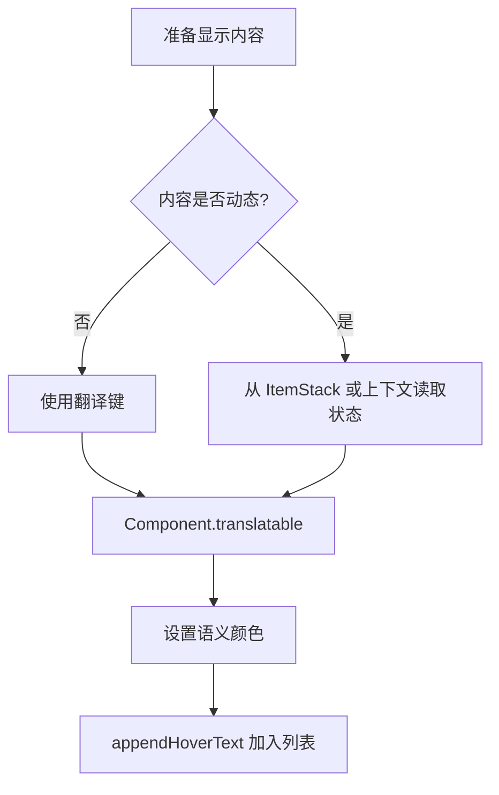
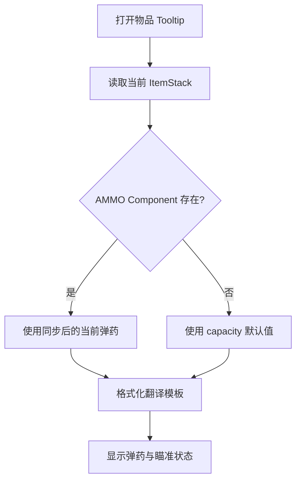
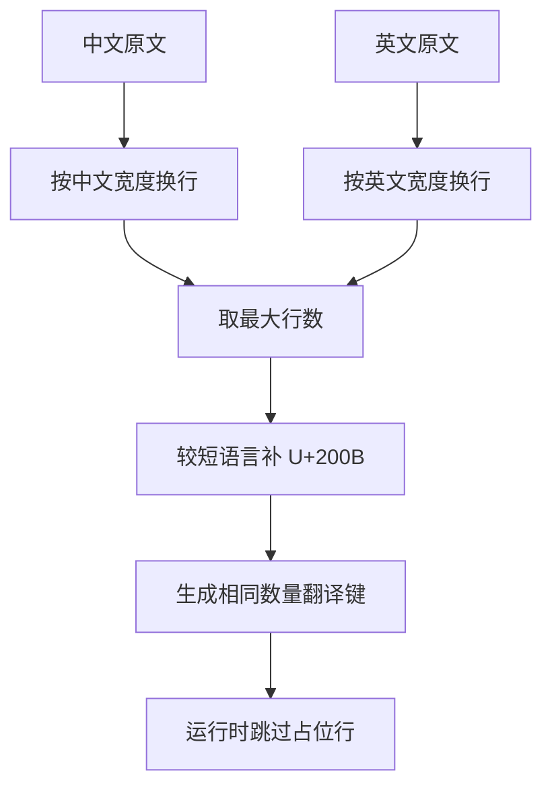

# 添加物品 Tooltip 提示文本

Tooltip（悬浮提示）是鼠标停在物品上时显示的补充信息。Zinecraft 使用 `Component.translatable` 提供双语文本，用 `appendHoverText` 组合动态内容；藏品、技能和枪械已有三种不同模式。

## 1. 选择合适的提示模式

| 内容 | 当前模式 | 适合场景 |
| --- | --- | --- |
| 普通固定说明 | 翻译键 + `appendHoverText` | 简短、不依赖物品状态 |
| 技能资料 | 多个固定翻译键 | 操作者、触发、数值、伤害和描述 |
| 枪械状态 | 翻译模板 + Data Component 参数 | 当前弹药、容量、瞄准状态 |
| 藏品长文 | 数据生成分行 + 双语行数补齐 | 原作效果、描述与适配效果 |



## 2. 添加固定提示

为需要说明的物品建立专用 `Item` 类：

```java
public final class ExampleItem extends Item {
  public ExampleItem(Properties properties) {
    super(properties);
  }

  @Override
  public void appendHoverText(
      ItemStack stack,
      TooltipContext context,
      List<Component> tooltip,
      TooltipFlag flag
  ) {
    super.appendHoverText(stack, context, tooltip, flag);
    tooltip.add(Component.translatable(
        getDescriptionId() + ".tooltip"
    ).withStyle(ChatFormatting.GRAY));
  }
}
```

对应数据生成或语言表应提供：

```json
{
  "item.zinecraft.example.tooltip": "一段简洁的物品说明"
}
```

项目通常通过 `TranslationCatalog` 生成语言文件。若翻译属于 Builder 字段，应从 Catalog 添加，不要同时手工维护生成文件。

## 3. 组织多行技能提示

`SkillItem` 使用共同前缀和固定后缀：

```java
String key = getDescriptionId() + ".tooltip";
tooltip.add(Component.translatable(key + ".operator")
    .withStyle(ChatFormatting.GOLD));
tooltip.add(Component.translatable(key + ".activation")
    .withStyle(ChatFormatting.AQUA));
tooltip.add(Component.translatable(key + ".stats")
    .withStyle(ChatFormatting.YELLOW));
tooltip.add(Component.translatable(key + ".damage")
    .withStyle(ChatFormatting.RED));
tooltip.add(Component.translatable(key + ".description")
    .withStyle(ChatFormatting.GRAY));
```

颜色承担语义：金色表示归属信息，青色表示触发方式，黄色表示数值，红色表示伤害，灰色表示说明。颜色不能替代文字标签，色觉差异用户仍应能读懂每一行。

## 4. 显示动态物品状态

枪械从 `ItemStack` 的 Data Component 读取当前弹药和瞄准状态：

```java
int ammo = stack.getOrDefault(
    WeaponStateComponents.AMMO,
    capacity
);
tooltip.add(Component.translatable(
    "item.zinecraft.firearm.ammo",
    ammo,
    capacity
).withStyle(ChatFormatting.YELLOW));
```

翻译模板为：

```text
弹药：%s / %s
```



Tooltip 可以显示同步到客户端的数据，但不能修改弹药、伤害或技能状态。玩法结果仍由服务端动作处理。

## 5. 处理藏品长文本

藏品需要让中文和英文拥有相同的翻译键数量。`CollectibleTooltips.wrapLocalizedTooltip` 分别按 Unicode 字符换行，默认每行最多 42 个字符，再用零宽空格 `U+200B` 补齐较短语言。

设中文分为 $L_{zh}$ 行，英文分为 $L_{en}$ 行，则最终行数为：

$$
L_{final}=\max(L_{zh},L_{en})
$$

- $L_{final}$：最终生成的双语提示行数；
- $L_{zh}$：中文文本换行后的行数；
- $L_{en}$：英文文本换行后的行数。

运行时 `CollectibleItem` 会跳过只包含零宽空格的占位行，所以两种语言拥有相同键集合，却不会显示多余空行。



字符数换行不能准确代表像素宽度，遇到英文长单词、格式代码或不同字体时仍需客户端目视检查。

## 6. 处理特殊情况

### 6.1 翻译键直接显示在界面上

说明语言表缺少对应键、键前缀与 `getDescriptionId()` 不一致，或生成资源未进入运行目录。先检查 `runData` 产物和最终 JAR。

### 6.2 动态数值不更新

确认数值存于会同步的 ItemStack Data Component，并由服务端修改。不要把当前值缓存到 Item 单例字段。

### 6.3 Shift 展开高级说明

客户端可以根据按键状态选择显示简略或详细文本，但核心数值不能只在客户端计算。无论是否按 Shift，都应保留可理解的基本说明。

### 6.4 Tooltip 过宽或越过屏幕

缩短句子、按语义拆行并测试不同 GUI 缩放。藏品可调整首行和续行字符数，但不能用大量空格手工对齐。

### 6.5 空文本与占位行

`CollectibleTooltips` 拒绝 `null` 和空字符串；`U+200B` 仅用于生成器内部补齐。普通提示不要添加不可见占位字符。

## 7. 验证清单

- [ ] 中文与英文环境中都显示正常文本，而不是翻译键。
- [ ] 固定行、动态行和长文本使用了合适模式。
- [ ] 动态值来自当前 ItemStack，同步后及时更新。
- [ ] 颜色语义一致，同时有文字说明。
- [ ] 不同 GUI 缩放、窄窗口与高级 Tooltip 模式均可读。
- [ ] 专用服务器不会加载纯客户端 Tooltip 辅助类。

```powershell
.\gradlew.bat test
.\gradlew.bat runData
.\gradlew.bat runClient
.\gradlew.bat build
```

主要源码：[CollectibleItem.java](../../src/main/java/com/cxxcxx/zinecraft/api/collection/CollectibleItem.java)、[CollectibleTooltips.java](../../src/main/java/com/cxxcxx/zinecraft/api/collection/CollectibleTooltips.java)、[SkillItem.java](../../src/main/java/com/cxxcxx/zinecraft/api/skill/SkillItem.java)、[FirearmItem.java](../../src/main/java/com/cxxcxx/zinecraft/api/weapon/item/FirearmItem.java)。
