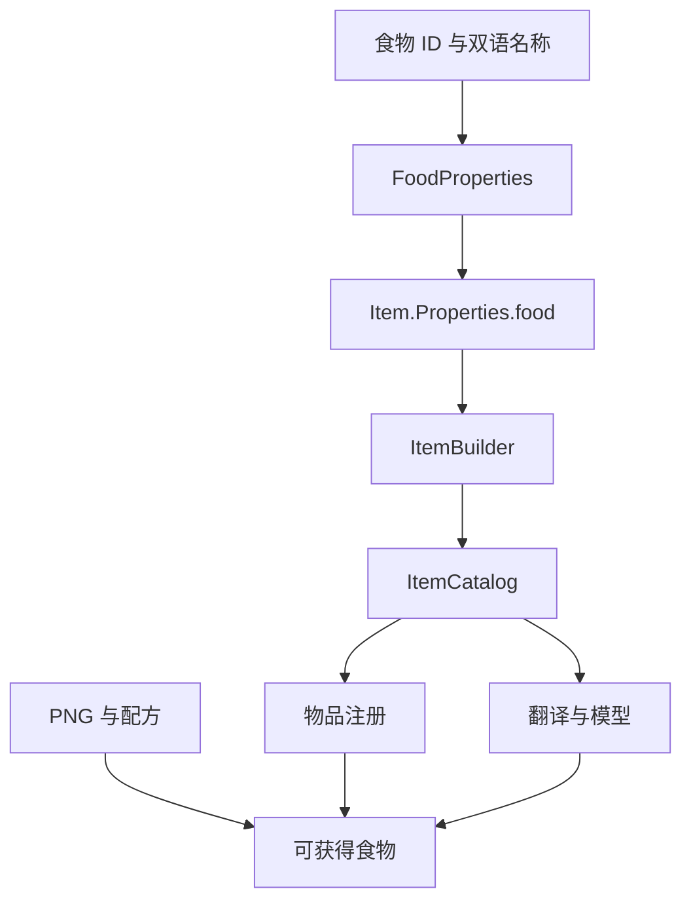
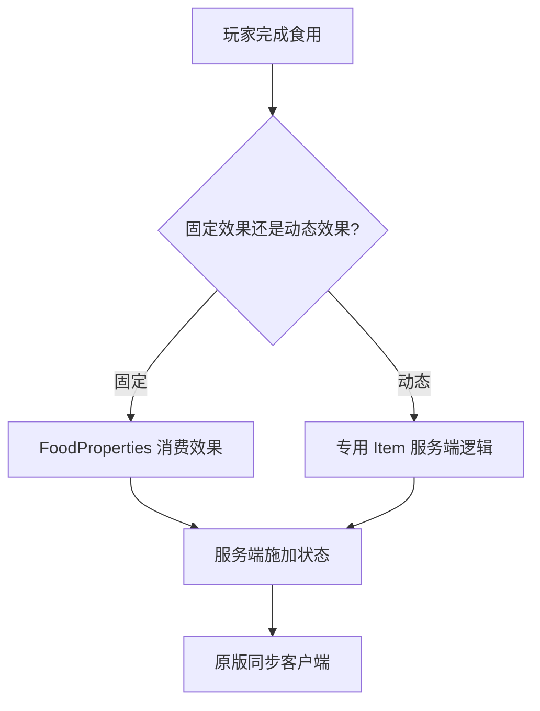

# 添加食物

当前 Zinecraft 食物是普通物品的一种：`FoodProperties` 保存营养值和饱和度修正，`ItemBuilder` 负责注册物品、翻译和模型。只有需要食用后效果、容器返还或特殊判定时，才应扩展专用 `Item` 类。

## 1. 先看注册链路



食物名称和图片若引用《明日方舟》资料，应保留官方、PRTS 或游戏数据来源；不要自行补写成原作设定。营养值属于 Minecraft 适配设计，要与游戏内实际行为一致。

## 2. 使用项目的 `food` 辅助方法

现有阿戈尔食物声明：

```java
public static final ItemBuilder<Item> AEGIR_FRESH_SHELLCRAB_SASHIMI =
    food(
        "aegir_fresh_shellcrab_sashimi",
        "阿戈尔鲜切蟹生",
        6,
        0.7F
    );
```

辅助方法实现：

```java
private static ItemBuilder<Item> food(
    String path,
    String zhCn,
    int nutrition,
    float saturation
) {
  var food = new FoodProperties.Builder()
      .nutrition(nutrition)
      .saturationModifier(saturation)
      .build();
  return new ItemBuilder<>(
      Zinecraft.ITEMS,
      path,
      zhCn,
      () -> new Item(new Item.Properties().food(food))
  ).build();
}
```

## 3. 理解营养值和饱和度修正

| 参数 | 中文含义 | 当前示例 |
| --- | --- | --- |
| `nutrition` | 恢复的饥饿值点数 | `6` |
| `saturation` | 饱和度修正系数，不是直接增加的饱和度点数 | `0.7F` |

原版最终加入的饱和度可理解为：

$$
S_{add}=2\times N\times M
$$

- $S_{add}$：食用后尝试增加的饱和度点数；
- $N$：`nutrition`，恢复的饥饿值；
- $M$：`saturationModifier`，饱和度修正系数。

例如 $N=6$、$M=0.7$ 时，理论增加 $8.4$ 点饱和度；实际值仍受玩家当前饥饿值和饱和度上限约束。

## 4. 添加英文名、纹理与配方

当前辅助方法只显式传入中文名，英文名会按 `ItemBuilder` 的默认显示名规则生成。需要准确译名时，直接构造 Builder 或为辅助方法增加 `enUs` 参数，并调用 `.enUs(...)`；不要接受明显错误的自动分词结果。

纹理路径：

```text
src/main/resources/assets/zinecraft/textures/item/<food_id>.png
```

普通扁平物品模型由数据生成器创建。配方在 `ModRecipeProvider` 中声明，食物注册不会自动推断原料与烹饪方式。

## 5. 添加食用效果

普通属性能表达营养与饱和度。需要状态效果时，应在 `FoodProperties.Builder` 上显式配置对应消费效果，并确定概率、持续时间和强度；需要按玩家、维度或装备动态判断时，使用专用 `Item` 类并让服务端执行。



效果持续时间使用 tick 时应显式换算：

$$
t_{tick}=20t_{second}
$$

- $t_{tick}$：状态持续 tick 数；
- $t_{second}$：设计中的持续秒数；
- `20`：标准服务器每秒 tick 数。

## 6. 处理特殊情况

### 6.1 满饥饿值时也能食用

只有设计明确允许时才设置始终可食用。普通餐食应遵循原版饥饿规则，避免玩家无成本重复触发附加效果。

### 6.2 食用后返还容器

碗、瓶或餐盒需要明确剩余物品逻辑，并测试背包已满时的处理。不能只在配方里声明容器。

### 6.3 生食与熟食共用素材

分别使用稳定 ID、独立营养值和纹理；烹饪配方应从生食指向熟食。不要运行时替换同一个注册物品的属性。

### 6.4 食物有毒或带概率效果

概率必须在服务端抽取。固定种子测试边界概率 `0` 与 `1`，并检查状态持续单位。

## 7. 验证清单

- [ ] ID、中文名、英文名与纹理文件一致。
- [ ] 饥饿值和饱和度在空腹、半饱与接近满值时表现正确。
- [ ] 配方、战利品、商店或 FTB 任务提供了明确获取方式。
- [ ] 食用效果、概率与持续时间由服务端执行。
- [ ] 容器返还和背包已满路径不会吞物品。
- [ ] `runData` 生成物品模型与翻译，发布 JAR 包含 PNG。

```powershell
.\gradlew.bat test
.\gradlew.bat runData
.\gradlew.bat build
Set-Location docs
npm run guides:check
```

主要源码：[ModItem.java](../../src/main/java/com/cxxcxx/zinecraft/core/registry/ModItem.java)、[ItemBuilder.java](../../src/main/java/com/cxxcxx/zinecraft/api/registry/builder/ItemBuilder.java)、[ModRecipeProvider.java](../../src/main/java/com/cxxcxx/zinecraft/core/registry/ModRecipeProvider.java)。普通物品流程见[添加普通物品](./add-item.md)。
