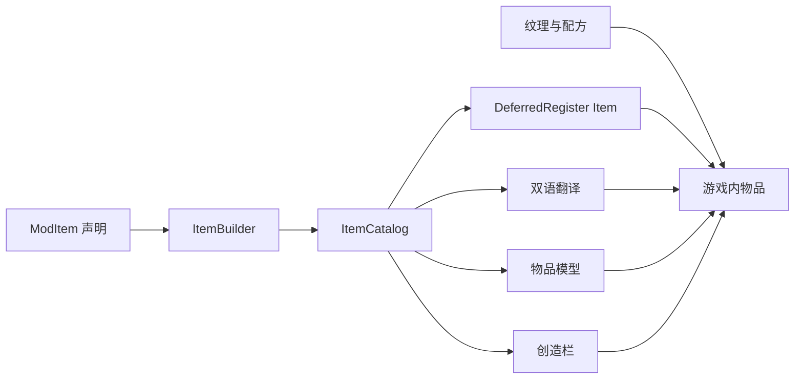
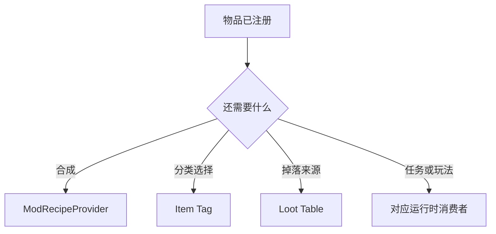

# 添加普通物品

普通材料、食物和组件通过 `ItemCatalog + ItemBuilder` 接入。武器、技能资料、藏品和音乐唱片虽然也有物品形态，但它们有额外运行时契约，应使用对应教程。

## 1. 确认它属于普通物品

| 内容 | 应使用的流程 |
| --- | --- |
| 材料、食物、合成组件 | 本教程 |
| 武器 | [技能与武器](../skill/add-skill-and-weapon.md) |
| 技能资料物品 | [技能与武器](../skill/add-skill-and-weapon.md) |
| 集成战略藏品 | [藏品](../collectible/add-collectible.md) |
| 音乐唱片 | [声音与音乐唱片](../interface/add-sound-and-music-disc.md) |
| 可放置方块对应的物品 | [方块](../block/add-block.md) |

## 2. 注册链路



主要源码：

- [ModItem.java](../../src/main/java/com/cxxcxx/zinecraft/core/registry/ModItem.java)
- [ItemBuilder.java](../../src/main/java/com/cxxcxx/zinecraft/api/registry/builder/ItemBuilder.java)
- [ItemCatalog.java](../../src/main/java/com/cxxcxx/zinecraft/api/registry/catalog/ItemCatalog.java)
- [ModRecipeProvider.java](../../src/main/java/com/cxxcxx/zinecraft/core/registry/ModRecipeProvider.java)

## 3. 添加普通材料

`ModItem` 的辅助方法会创建物品属性、模型和创造栏条目。按现有同类声明添加：

```java
public static final ItemBuilder<Item> EXAMPLE_MATERIAL =
    item("example_material", "示例材料", Rarity.UNCOMMON);
```

### 3.1 参数含义

| 参数 | 示例 | 中文含义 | 影响阶段 |
| --- | --- | --- | --- |
| `path` | `example_material` | 注册 ID，最终为 `zinecraft:example_material` | 注册、模型、纹理路径 |
| `zhCn` | `示例材料` | 简体中文显示名 | 数据生成 |
| `rarity` | `UNCOMMON` | 原版名称颜色稀有度，不是掉率 | 运行时显示 |
| `model` | `FLAT_ITEM` | 自动生成的物品模型模板 | 数据生成 |
| `inCreativeTab` | `true` | 是否加入项目普通物品页 | 创造栏构建 |

辅助方法内部已经调用 `build()`，不要再次调用。

### 3.2 直接使用 ItemBuilder

只有辅助方法不能表达工厂或模型时才直接声明：

```java
public static final ItemBuilder<Item> EXAMPLE_COMPONENT = new ItemBuilder<>(
    Zinecraft.ITEMS,
    "example_component",
    "示例组件",
    "Example Component",
    () -> new Item(new Item.Properties().rarity(Rarity.RARE)),
    ModelTemplates.FLAT_ITEM,
    true
).build();
```

`factory` 由注册阶段延迟调用。不要在静态字段初始化时调用其他未完成注册对象的 `.get()`。

## 4. 添加食物或自定义行为

食物优先参考 `ModItem.food(...)` 的现有声明，让 `FoodProperties` 留在物品属性中。只有右键逻辑、耐久、状态或数据组件确实不同于原版 `Item` 时，才新增子类并把工厂改成 `() -> new ExampleItem(properties)`。

服务端效果必须在服务端执行。客户端 tooltip、模型或粒子不能承担消耗、伤害或奖励判定。

## 5. 补齐资源

### 5.1 纹理与模型

默认平面物品纹理放在：

```text
src/main/resources/assets/zinecraft/textures/item/example_material.png
```

Catalog 会在 `runData` 时生成 `models/item/example_material.json`。如果 Builder 的 `model` 为 `null`，表示关闭自动模型，此时必须在手工资源中提供模型。

### 5.2 配方、标签与引用

普通配方集中在 `ModRecipeProvider`。标签、战利品、任务和兼容层不会根据物品注册自动推断，需要维护各自的数据文件或注册入口。



## 6. 常见失败

| 现象 | 原因 | 修正 |
| --- | --- | --- |
| 紫黑方块或无图标 | PNG 缺失、路径错误或关闭了自动模型 | 核对 ID、纹理路径和生成模型 |
| 有物品但无配方 | 注册不会自动推断配方 | 在 `ModRecipeProvider` 增加配方 |
| 创造栏找不到 | `inCreativeTab=false` 或注册类未 bootstrap | 核对 Builder 与加载顺序 |
| 重复注册异常 | ID 重复或 Builder 重复 `build()` | 保留唯一声明 |
| 旧存档物品丢失 | 发布后修改了注册 ID | 保持 ID 稳定或提供迁移 |

## 7. 验证

```powershell
.\gradlew.bat runData
.\gradlew.bat test
.\gradlew.bat build
Set-Location docs
npm run catalog
npm run guides:check
```

最后检查中英文翻译、物品模型、PNG、配方、标签、创造栏、任务或 loot 引用，以及发布 JAR 中是否包含资源。图鉴中的 `items` 类型当前覆盖 99 个普通物品，新增条目后数量应同步变化。营养值、饱和度与食用效果见[添加食物](./add-food.md)，悬浮说明见[添加物品 Tooltip](../interface/add-tooltip.md)。
