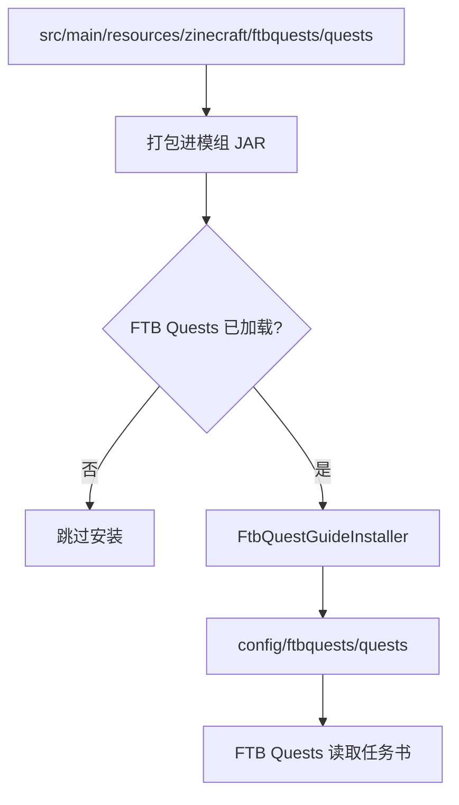
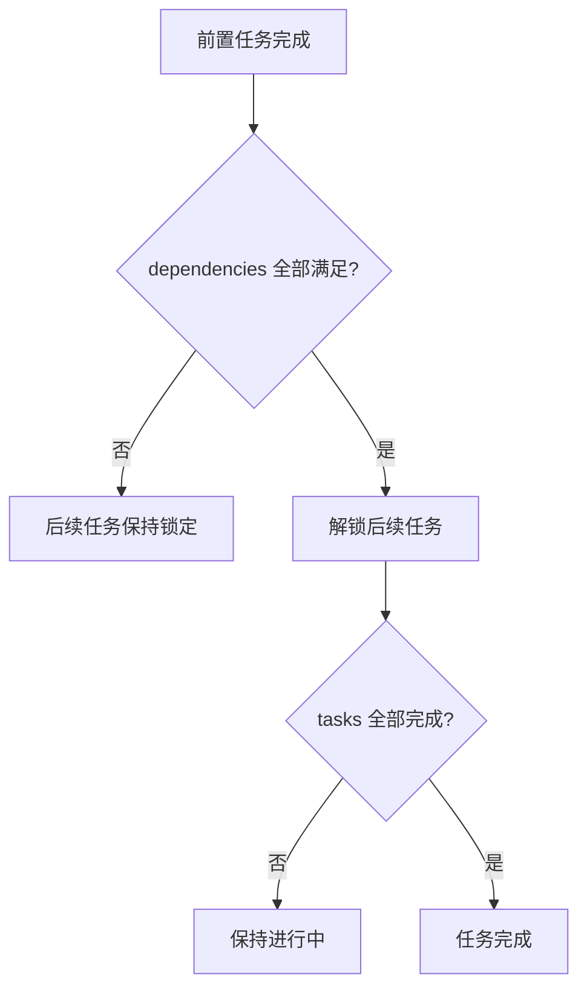
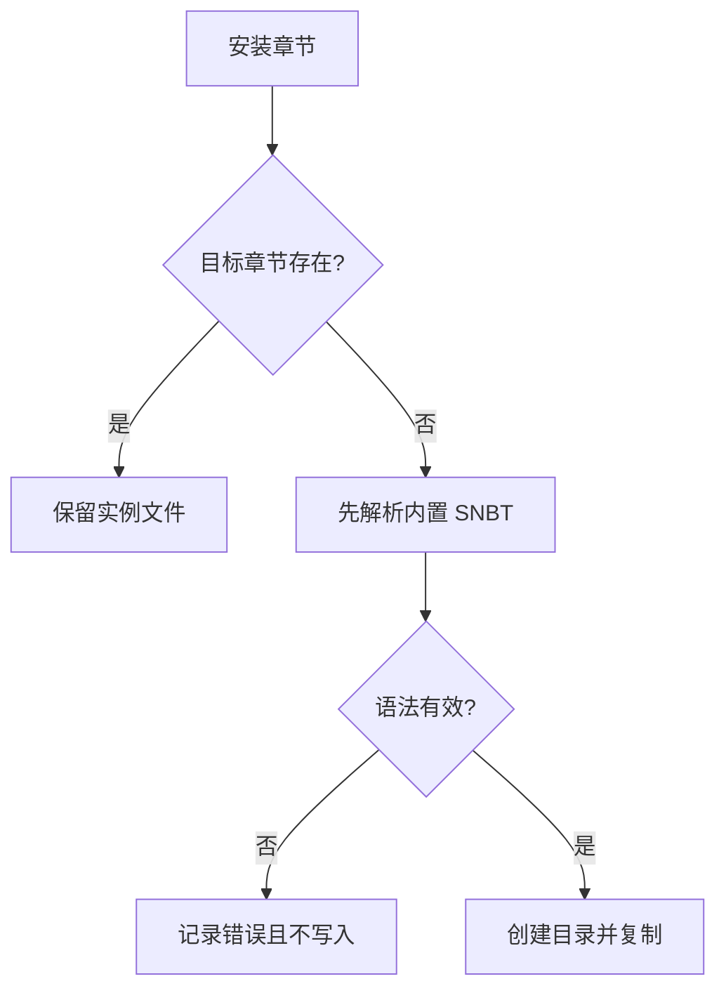
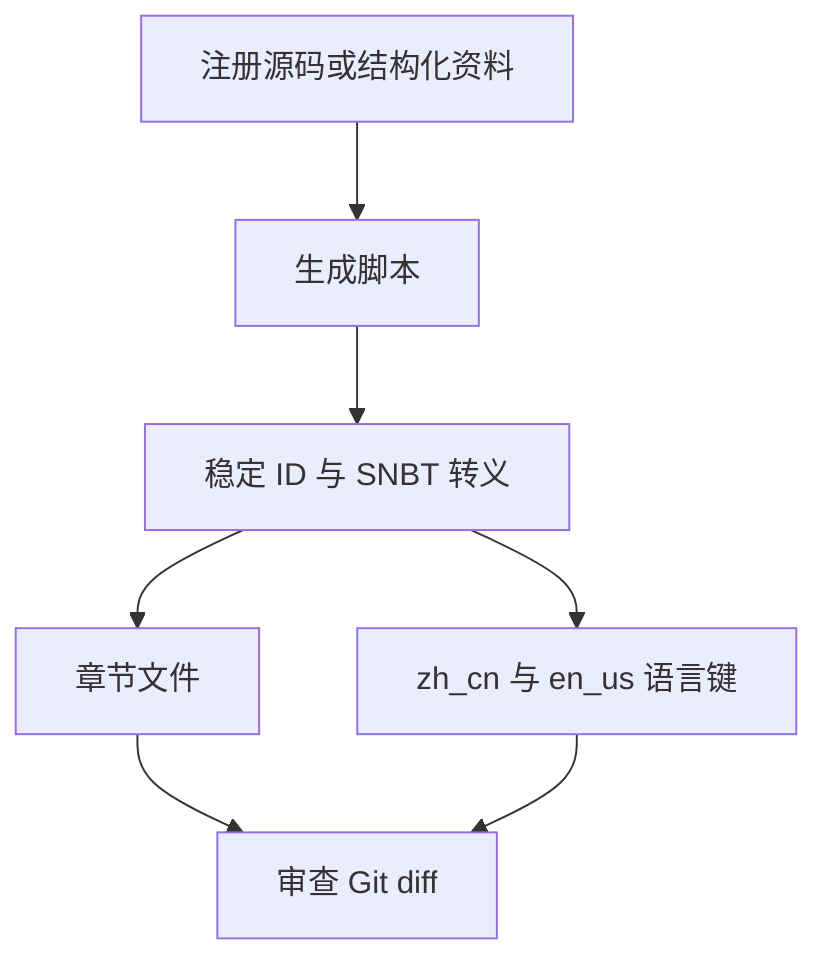

# 添加 FTB Quests 任务

Zinecraft 把任务书 SNBT 作为模组内置资源打包，游戏启动时由 `FtbQuestGuideInstaller` 安装到实例的 `config/ftbquests/quests`。章节文件保护整合包作者的本地修改，不会覆盖已存在文件；章节组和语言表采用缺失项合并。

## 1. 理解资源与实例文件



源码资源是模组发布基线，`config` 下文件是某个游戏实例的可编辑副本。修改源码章节后，已有实例不会自动覆盖更新。

## 2. 认识任务书目录

```text
src/main/resources/zinecraft/ftbquests/quests/
├─ chapter_groups.snbt
├─ chapters/
│  ├─ zinecraft_guide.snbt
│  ├─ terra_relations.snbt
│  ├─ terra_nations.snbt
│  ├─ nation_<id>.snbt
│  ├─ collectibles.snbt
│  ├─ operator_skills.snbt
│  └─ development_mods.snbt
└─ lang/
   ├─ zh_cn.snbt
   └─ en_us.snbt
```

新增章节后必须把相对路径加入 `FtbQuestGuideInstaller.CHAPTERS`。仅创建 SNBT 文件不会被安装器发现。

## 3. 创建最小章节

下面结构沿用项目现有 `zinecraft_guide.snbt`：

```snbt
{
  default_hide_dependency_lines: false
  default_quest_shape: "circle"
  filename: "example_guide"
  icon: { id: "zinecraft:orirock" }
  id: "4558414D504C4501"
  order_index: 30
  progression_mode: "flexible"
  quest_links: [ ]
  quests: [
    {
      id: "4558414D504C4511"
      icon: { id: "zinecraft:orirock" }
      tasks: [
        {
          id: "4558414D504C4521"
          item: { count: 1, id: "zinecraft:orirock" }
          type: "item"
        }
      ]
      x: 0.0d
      y: 0.0d
    }
  ]
}
```

示例 ID 只用于说明格式；提交前必须分配项目内唯一 ID。章节、任务和 task（任务条件）各自拥有 ID，不能共用。

## 4. 连接任务依赖

```snbt
{
  dependencies: ["4558414D504C4511"]
  id: "4558414D504C4512"
  icon: { id: "minecraft:compass" }
  tasks: [
    { id: "4558414D504C4522", type: "checkmark" }
  ]
  x: 0.0d
  y: 2.0d
}
```



依赖引用的是任务 ID，不是 task ID。坐标 `x`、`y` 只控制任务书画布位置，不改变解锁逻辑。

## 5. 添加本地化

语言键放在两个 SNBT 语言表中：

```snbt
{
  chapter.4558414D504C4501.title: "示例章节"
  quest.4558414D504C4511.title: "取得固源岩"
  quest.4558414D504C4511.quest_subtitle: "准备第一份材料"
  quest.4558414D504C4511.quest_desc: ["获得至少一个固源岩。"]
}
```

英文表使用相同键。安装器会把缺失键合入实例语言表，但 `merge(..., false)` 会保留实例中已经存在的值，避免覆盖整合包定制翻译。

## 6. 理解安装器的覆盖规则

| 文件类型 | 目标不存在 | 目标已存在 |
| --- | --- | --- |
| `chapter_groups.snbt` | 整体复制 | 仅追加缺失 group ID |
| `chapters/*.snbt` | 整体复制 | 完全保留，不更新 |
| `lang/*.snbt` | 整体复制 | 合并缺失键，保留已有值 |



开发时若要检查更新后的章节，应使用新的测试实例，或先备份实例任务书再在 FTB 编辑器中导入/替换。不要直接清空整套 `config/ftbquests`，其中可能包含用户与整合包作者的数据。

## 7. 使用生成脚本维护批量章节

当前仓库有两条确定性生成链路：

| 脚本 | 输入 | 输出 |
| --- | --- | --- |
| `generate_collectible_quest_chapter.py` | `ModCollectible.java` Builder 声明 | 742 项藏品章节与双语键 |
| `generate_nation_quest_chapters.py` | 脚本内国家、结构与档案表 | 国家章节与双语键 |



批量内容应修改生成源并重跑脚本，不要手工编辑成百上千个生成条目。运行后重点审查数量、ID 稳定性、转义和非生成语言键是否被保留。

## 8. 处理特殊情况

### 8.1 FTB Quests 未安装

安装器检测不到 `ftbquests` 时直接返回，Zinecraft 其他内容继续加载。不要让普通注册逻辑依赖任务书一定存在。

### 8.2 内置 SNBT 语法错误

安装器先解析资源，失败后记录错误并跳过该文件。构建成功不能证明 SNBT 可被 FTB 解析，仍需启动带 FTB Quests 的测试实例。

### 8.3 新版本章节没有出现在旧实例

这是“已存在章节不覆盖”的预期行为。比较 JAR 内置章节与实例副本，再由整合包维护者决定合并方式。

### 8.4 删除或重命名任务 ID

会影响已有玩家进度引用。已发布任务优先保留 ID；内容替换时只改标题、描述、图标或 task 配置。

## 9. 验证清单

- [ ] 章节、任务和 task ID 全局唯一且稳定。
- [ ] `dependencies` 只引用存在的任务 ID，没有循环依赖。
- [ ] 图标物品、群系、维度等资源 ID 均已注册。
- [ ] 中英文键完整，数组文本已正确 SNBT 转义。
- [ ] 新章节已加入安装器 `CHAPTERS`。
- [ ] 无 FTB Quests 时模组仍可启动。
- [ ] 新实例安装正确，已有实例文件不会被覆盖。

```powershell
python script/generate_collectible_quest_chapter.py
python script/generate_nation_quest_chapters.py
.\gradlew.bat build
```

主要源码：[FtbQuestGuideInstaller.java](../../src/main/java/com/cxxcxx/zinecraft/core/quest/FtbQuestGuideInstaller.java)、[zinecraft_guide.snbt](../../src/main/resources/zinecraft/ftbquests/quests/chapters/zinecraft_guide.snbt)、[藏品章节生成器](https://github.com/z8z6/ZineCraft/blob/neoforge/script/generate_collectible_quest_chapter.py)、[国家章节生成器](https://github.com/z8z6/ZineCraft/blob/neoforge/script/generate_nation_quest_chapters.py)。
