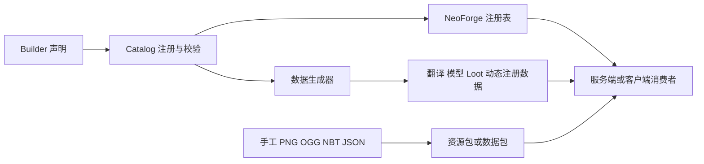
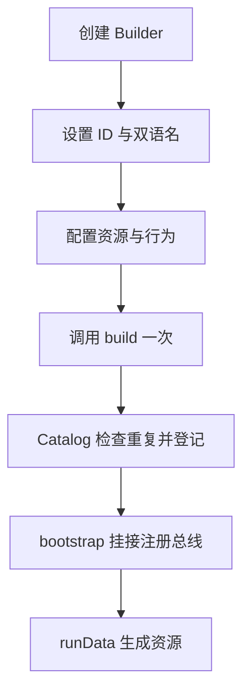

# 新增注册内容的通用流程

Zinecraft 把 NeoForge 注册、双语翻译和数据生成统一封装成 Catalog + Builder。新增内容时，你通常只需要选对注册类型，在对应 `ModXxx` 中声明 Builder，再补齐手工资源和运行时消费者；不要为每个条目重建 `DeferredRegister`。

## 1. 先选对内容类型

图鉴当前覆盖 15 种注册类型。选择标准是“它由什么运行时契约驱动”，不是“它看起来像什么”。

| 目标 | 注册入口 | 教程 |
| --- | --- | --- |
| 材料、食物、普通组件 | `ModItem` | [添加普通物品](../item/add-item.md) |
| 方块、方块物品、矿石 | `ModBlock` | [添加方块](../block/add-block.md) |
| 有 AI 的生物 | `ModEntity` | [添加生物](../entity/add-entity.md) |
| 集成战略藏品 | `ModCollectible` | [添加集成战略藏品](../collectible/add-collectible.md) |
| 技能、武器与服务端动作 | `ModSkill`、`ModWeapon` | [添加技能与武器](../skill/add-skill-and-weapon.md) |
| 战斗状态 | `ModMobEffect` | [添加战斗状态](../combat/add-mob-effect.md) |
| 群系、维度、结构或城市 | 对应世界注册类 | [世界生成教程](../world/add-biome.md) |
| 声音 cue 或音乐唱片 | `ModWeaponPresentation`、`ModSound` | [添加声音与音乐唱片](../interface/add-sound-and-music-disc.md) |

完整映射见[注册内容教程总索引](./registered-content-guide-index.md)。

## 2. 理解四层内容链



四层分别是：

1. **声明层**：稳定 ID、双语名、工厂和配置。
2. **生成层**：由 `runData` 写出的模型、语言、战利品表和动态注册数据。
3. **手工资源层**：PNG、OGG、NBT，以及不能由 Catalog 推导的 JSON。
4. **运行时层**：真正读取注册值的 AI、战斗、世界生成、渲染或播放服务。

注册成功只证明第一层成立。没有消费者的字段可能只是元数据或预留能力。

## 3. Builder 的共同生命周期

Builder 通常遵循同一顺序：



| 常见字段或方法 | 中文含义 | 注意事项 |
| --- | --- | --- |
| `path` | 命名空间内注册路径 | 使用稳定的 `lower_snake_case`；发布后改名会影响旧存档 |
| `zhCn / enUs` | 中英文显示名 | 不参与注册表寻址 |
| `factory` | 延迟创建对象的函数 | 静态初始化时不要提前 `.get()` |
| `configure` | 追加领域配置 | 只配置该 Builder 真正消费的字段 |
| `build()` | 校验并登记 | 同一个 Builder 只能调用一次 |
| `ResourceKey<T>` | 注册表地址 | 它不是已经创建的对象实例 |
| `Supplier<T>` | 延迟取值 | 解决注册顺序和静态初始化问题 |

## 4. 按证据新增一个条目

### 4.1 从图鉴找参照物

在[模组图鉴](#/catalog)按类型筛选，搜索与你目标最接近的条目。卡片提供领域教程和注册源码；优先复制相同 Builder、资源组合和运行时入口的例子。

### 4.2 沿调用链确认字段生效

用 `rg` 从声明向后追踪：

```text
ModXxx 声明
  → Builder 字段
  → Catalog 注册或数据生成
  → 运行时消费者
  → 测试或生成产物
```

如果只能找到 Builder 字段和 JSON 输出，却找不到消费者，就把它标为“仅导出元数据”或“预留”。

### 4.3 区分手工文件和生成文件

| 路径 | 维护方式 |
| --- | --- |
| `src/main/resources/assets/zinecraft/textures` | 手工维护 PNG |
| `src/main/resources/assets/zinecraft/sounds` | 手工维护 OGG |
| `src/main/resources/data/zinecraft/structure` | 手工或专用脚本维护 NBT |
| `src/generated/resources` | 修改源 Builder 后运行 `runData`，不要直接维护 |
| `docs/src/data/catalog.json` | 运行 `npm run catalog` 更新 |

## 5. 推荐实施顺序

1. 检查 `git status --short`，保留现有改动。
2. 选定稳定 ID，并确认没有同名条目。
3. 在正确的 `ModXxx` 中增加 Builder 声明。
4. 只在确有自定义行为时新增 Java 实现类。
5. 补齐 PNG、OGG、NBT、标签或手写 JSON。
6. 接入真正的服务端或客户端消费者。
7. 运行数据生成，审查生成差异。
8. 更新图鉴并检查教程覆盖。
9. 运行测试、构建和游戏内验证。

## 6. 验证命令

从仓库根目录运行：

```powershell
.\gradlew.bat test
.\gradlew.bat runData
.\gradlew.bat build
Set-Location docs
npm run catalog
npm run guides:check
npm run build -- --logLevel error
```

领域教程可能要求额外脚本或专用服务端测试，以对应领域页为准。

## 7. 完成检查

- ID、显示名和资源路径一致，Builder 只 `build()` 一次。
- 注册顺序没有在静态初始化阶段提前取值。
- 自动生成文件来自 `runData`，手工资源位于正确源目录。
- 服务端玩法不依赖客户端类，客户端表现不承担伤害或状态裁决。
- 图鉴能搜索到条目，并能跳到正确领域教程和注册源码。
- 新世界或新 Chunk 的生成行为已实际验证；已有世界不会因资源更新自动重建。
