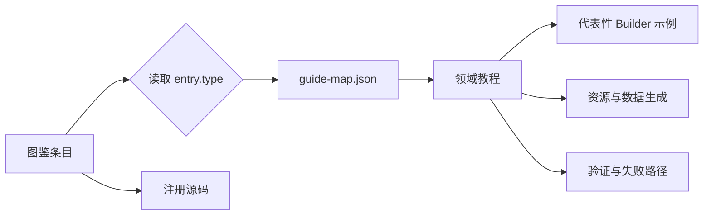

# 注册内容教程总索引

这份索引把模组图鉴中的每个注册条目连接到对应开发教程。当前目录共有 **1,688 个条目、15 种注册类型**。条目的名称、ID 和实时数量由[模组图鉴](#/catalog)展示；这里负责告诉你应该从哪一篇教程开始，以及最终要检查哪条注册链。

## 1. 先理解覆盖关系

一个教程通常覆盖一整类共享注册契约，而不是只覆盖一个物品。比如 99 个普通物品都通过 `ItemCatalog + ItemBuilder` 注册，因此共同使用“添加普通物品”教程；具有不同契约的武器、技能和藏品则进入各自教程。



图鉴卡片同时提供“开发教程”和“注册源码”两个入口。前者解释共同流程，后者带你回到该条目的真实声明。

## 2. 全部注册类型与教程

下表的数量来自当前 `docs/src/data/catalog.json`。运行 `npm run catalog` 后，图鉴数量会随注册源码和生成资源更新。

| 注册类型 | 当前数量 | 主要入口 | 对应教程 |
| --- | ---: | --- | --- |
| 普通物品 `items` | 99 | `ModItem.java` | [添加普通物品](../item/add-item.md) |
| 方块 `blocks` | 62 | `ModBlock.java` | [添加方块](../block/add-block.md) |
| 生物 `entities` | 6 | `ModEntity.java` | [添加生物](../entity/add-entity.md) |
| 集成战略藏品 `collectibles` | 742 | `ModCollectible.java` | [添加集成战略藏品](../collectible/add-collectible.md) |
| 技能 `skills` | 138 | `ModSkill.java` | [添加技能与武器](../skill/add-skill-and-weapon.md) |
| 武器 `weapons` | 3 | `ModWeapon.java` | [添加技能与武器](../skill/add-skill-and-weapon.md) |
| 战斗状态 `effects` | 6 | `ModMobEffect.java` | [添加战斗状态](../combat/add-mob-effect.md) |
| 群系 `biomes` | 62 | `ModBiome.java` | [添加群系](../world/add-biome.md) |
| 世界特征 `features` | 14 | `ModWorldFeature.java` | [添加维度与世界特征](../world/add-dimension.md) |
| 维度 `dimensions` | 1 | `ModDimension.java` | [添加维度与世界特征](../world/add-dimension.md) |
| 国家 `nations` | 20 | `ModNation.java` | [添加国家、城市与 Region](../world/add-nation-city-region.md) |
| 城市 `cities` | 143 | `ModCity.java` | [添加国家、城市与 Region](../world/add-nation-city-region.md) |
| 城市 Region `regions` | 294 | `ModCityRegion.java` | [添加国家、城市与 Region](../world/add-nation-city-region.md) |
| 结构 `structures` | 91 | `ModStructure.java` | [添加结构](../world/add-structure.md) |
| 声音与唱片 `sounds` | 7 | `ModSound.java`、`ModWeaponPresentation.java` | [添加声音与音乐唱片](../interface/add-sound-and-music-disc.md) |

## 3. 新增内容时怎样选教程

### 3.1 先按行为选类型

不要只因为一个对象能出现在物品栏，就把它当成普通物品。方块对应的 `BlockItem`、音乐唱片物品、技能载体和武器都有自己的上层契约。

| 你的目标 | 从这里开始 |
| --- | --- |
| 材料、普通组件 | [普通物品](../item/add-item.md) |
| 食物、营养值与食用效果 | [食物](../item/add-food.md) |
| 可放置方块或方块实体 | [方块](../block/add-block.md) |
| 矿石、矿脉、采掘与烧炼 | [矿石与矿脉](../block/add-ore.md) |
| 有服务端 AI 的生物 | 生物 |
| 具备来源数据和阶梯效果的藏品 | 集成战略藏品 |
| 主动能力、武器输入或时间线表现 | 技能与武器 |
| 服务端增益或减益状态 | 战斗状态 |
| 地形生态、维度、结构或城市布局 | 对应世界生成教程 |
| 普通声音事件或可播放唱片 | 声音与音乐唱片 |

### 3.2 再从图鉴找最接近的条目

在[模组图鉴](#/catalog)按类型筛选，再搜索中文名或注册 ID。卡片上的“注册源码”能直接定位声明文件。优先复制同一 Builder、同一种资源组合的现有条目，不要从空白重新拼装注册链。

### 3.3 使用跨注册类型的专项教程

下列内容不是独立的图鉴注册类型，因此不会占用 `guide-map.json` 的唯一类型映射，但仍有完整教程：

| 专题 | 教程 |
| --- | --- |
| 矿石方块、矿脉地物与烧炼 | [添加矿石与矿脉](../block/add-ore.md) |
| 食物、营养与食用效果 | [添加食物](../item/add-food.md) |
| FTB Quests 章节、任务与安装策略 | [添加 FTB Quests 任务](./add-ftb-quest.md) |
| 固定、动态和长文本悬浮提示 | [添加物品 Tooltip](../interface/add-tooltip.md) |
| 文档站主页背景、素材来源与响应式裁切 | [添加文档站主页背景](../interface/add-homepage-background.md) |

## 4. 覆盖检查怎样工作

覆盖检查读取三个事实源：

| 文件 | 作用 |
| --- | --- |
| `docs/src/data/catalog.json` | 当前真实图鉴类型与条目总数 |
| `docs/src/data/guide-map.json` | 每种注册类型唯一对应的教程 |
| `docs/guides/**/*.md` | 映射目标是否真实存在 |

在 `docs` 目录运行：

```powershell
npm run catalog
npm run guides:check
npm run build -- --logLevel error
```

`guides:check` 会逐类型打印数量和教程路径。以下情况会失败：

- 图鉴出现了没有教程映射的新类型；
- 映射指向不存在的 Markdown；
- 映射中残留图鉴已经不存在的类型；
- 映射缺少显示名称或稳定 slug。

## 5. 完成标准

完成一个注册条目至少要同时确认：

1. Builder 已登记稳定 ID，且没有重复 `build()`。
2. 手工资源与生成资源各自在正确目录。
3. 运行时确实有消费者读取该注册值。
4. 图鉴能搜索到条目，并显示正确类型和源码入口。
5. 图鉴卡片的“开发教程”能到达正确领域页。
6. `guides:check` 报告全部条目和全部类型均已覆盖。

如果字段只被导出却没有运行时消费者，要在领域教程中明确标成“仅导出元数据”或“预留”，不要把注册成功等同于功能已经生效。
