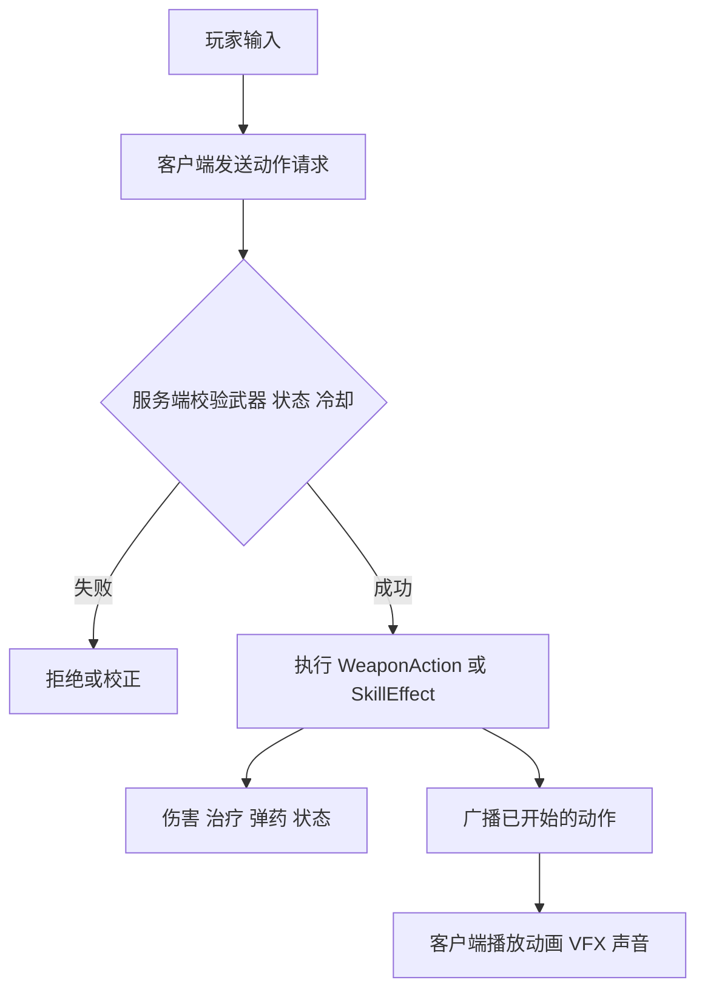
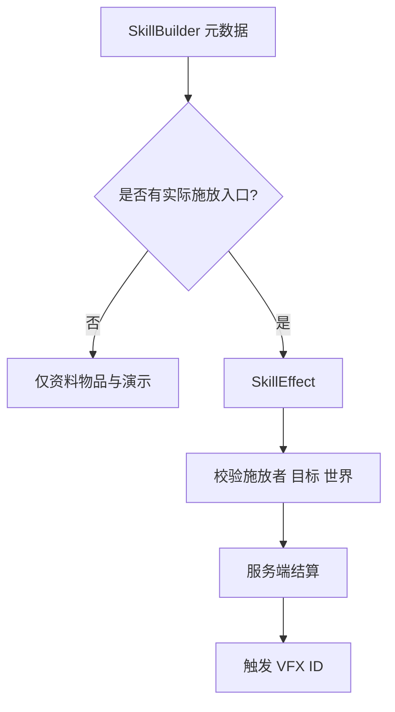
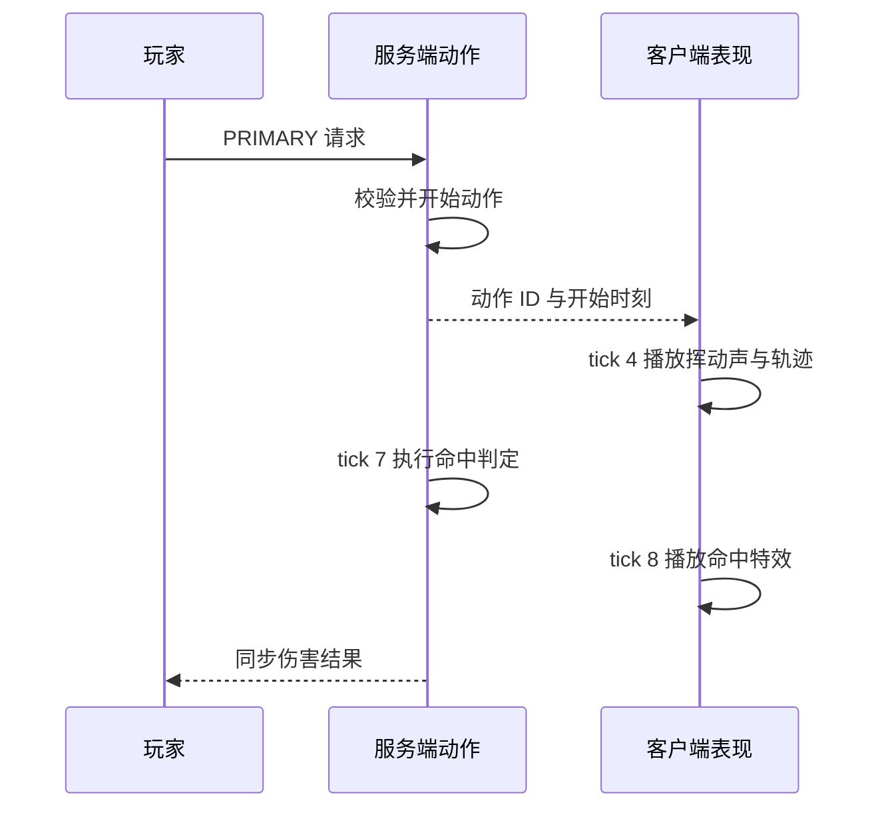
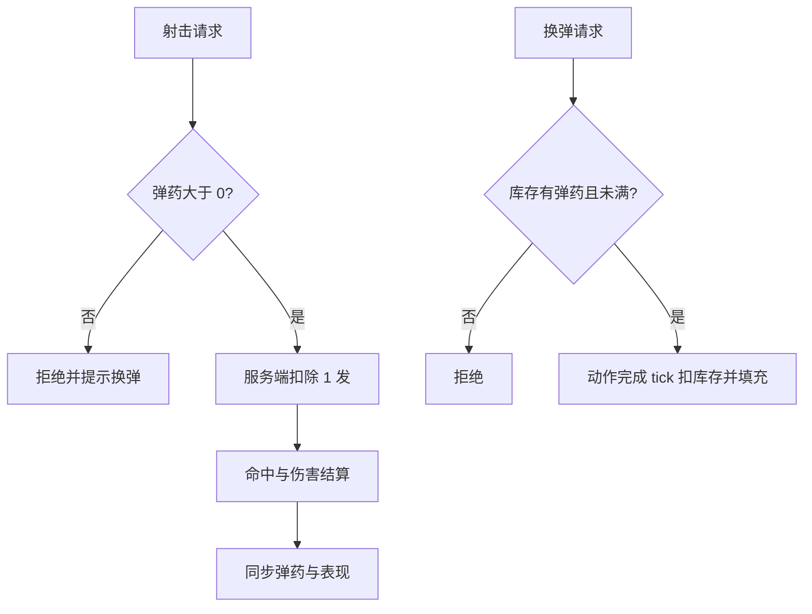

# 添加技能与武器

技能资料物品和可操作武器共用一部分战斗基础设施，但不是同一种注册内容。`SkillBuilder` 记录干员技能资料、伤害声明与演示主题；`WeaponBuilder` 把输入绑定到服务端动作，再为动作配置客户端表现。

## 1. 选择正确入口

| 目标 | 注册入口 | 运行时入口 |
| --- | --- | --- |
| 干员技能资料与技能物品 | `SkillBuilder` | 独立 `SkillEffect` 或专用服务 |
| 近战、枪械、法杖物品 | `ItemBuilder` + `WeaponBuilder` | `WeaponAction` |
| 粒子、动画、声音 | `VfxBuilder` / presentation | 客户端表现服务 |
| 伤害、治疗、弹药、状态 | 不由视觉配置决定 | 服务端动作或技能效果 |



## 2. 注册技能资料

项目中的“真银斩”展示了完整声明：

```java
public static final SkillBuilder TRUESILVER_SLASH =
    skill("skill_truesilver_slash", "真银斩")
        .enUs("Truesilver Slash")
        .operator("银灰", "SilverAsh", SkillProfession.GUARD)
        .activation(
            SkillSpRecoveryType.AUTO_RECOVERY,
            SkillTriggerType.MANUAL
        )
        .stats(75, 90, 30)
        .damage(3.0, CombatDamageType.PHYSICAL)
        .description(
            "降低自身防御，大幅提高攻击并扩大范围，同时攻击至多六个目标。",
            "Reduces DEF, greatly increases ATK and range, and attacks up to six targets."
        )
        .effect(vfx("skill/truesilver_slash"))
        .theme(SkillDemoTheme.AREA_SLASH)
        .build();
```

### 2.1 `stats` 的三个数值

`stats(initialSp, spCost, durationSeconds)` 分别表示初始技力、技力消耗和持续秒数。瞬时技能或弹药技能的持续时间传 `null`。

技能可用前所需技力为：

$$
SP_{remain} = \max(0, SP_{cost} - SP_{initial})
$$

- $SP_{remain}$：进入关卡后仍需获得的技力；
- $SP_{cost}$：发动技能所需技力；
- $SP_{initial}$：初始技力。

注意：Builder 源码明确说明这些字段当前是资料元数据，不代表运行时已经自动实现技力积累、扣除或持续计时。

### 2.2 伤害声明

`.damage(3.0, PHYSICAL)` 表示一次直接命中使用当前攻击力 300% 的物理伤害档案：

$$
D_{raw} = ATK \times r
$$

- $D_{raw}$：进入防御结算前的原始伤害；
- $ATK$：施放者当前攻击力；
- $r$：攻击倍率，此例为 `3.0`。

最终伤害仍由统一战斗公式计算。治疗、持续领域或召唤物等复杂逻辑不能只靠 `.description()` 和 `.damage()` 实现。

## 3. 为技能实现服务端效果



`SkillEffect` 应接收 `SkillCastContext`，在服务端选择目标并执行效果。客户端 Ponder 演示不能当作游戏逻辑。若复用演示主题或 VFX，也要确认实际效果不是占位实现。

## 4. 注册武器动作

动作先于武器构建：

```java
public static final WeaponActionBuilder<MeleeAttackAction> LIGHT_ATTACK =
    action("light_attack", actionId -> new MeleeAttackAction(
        actionId,
        7,
        20,
        CombatDamageProfile.flat(7.0, CombatDamageType.PHYSICAL),
        3.25,
        100.0
    ));
```

动作构造器中的时间参数以 tick 为单位，具体含义由动作类型定义。不要只根据参数位置猜测，新增动作前应阅读该类构造器与测试。

## 5. 将物品、输入与表现绑定

```java
public static final WeaponBuilder TEST_SWORD = weapon(
    "test_sword",
    "测试剑",
    "Test Sword",
    () -> new SwordItem(
        Tiers.IRON,
        new Item.Properties().attributes(
            SwordItem.createAttributes(Tiers.IRON, 3, -2.4F)
        )
    ),
    vanillaModel("iron_sword")
)
    .action(WeaponInput.PRIMARY, LIGHT_ATTACK)
    .presentation(LIGHT_ATTACK, presentation -> presentation
        .duration(20)
        .playerAnimation(PLAYER_LIGHT_ATTACK)
        .weaponAnimation(WEAPON_LIGHT_ATTACK)
        .vfx(TEST_SWORD_TRAIL, 4)
        .vfx(TEST_SWORD_IMPACT, 8)
        .sound(TEST_SWORD_SWING, 4))
    .build();
```

同一输入不能绑定两个动作；presentation 只能引用该武器已绑定的动作。`.vfx(..., 4)` 与 `.sound(..., 4)` 中的 `4` 是动作开始后的触发 tick。

## 6. 对齐服务端判定与客户端时间轴



表现可以预示命中，但不能自行造成伤害。若网络延迟导致动画晚到，应以服务端动作开始消息校准本地时间轴，而不是重新请求伤害。

## 7. 枪械与法杖的额外状态

枪械弹药和瞄准状态存于 `WeaponStateComponents`；换弹与射击必须由服务端原子更新。法杖的 `CastSkillAction` 绑定的是可执行 `SkillEffectBuilder`，不是 `SkillBuilder` 的资料文本。



切换物品、死亡或动作被打断时，要明确是取消、提交还是回滚动作；不要在客户端提前扣除最终弹药。

## 8. 处理特殊情况

### 8.1 同时按下多个输入

由服务端动作状态机决定优先级和可打断关系。输入到达顺序不应绕过冷却或重复结算。

### 8.2 动作中切换武器

校验当前手持物品仍与动作来源匹配；不匹配时取消剩余命中帧，并广播取消消息清理客户端表现。

### 8.3 目标在命中帧前离开范围

在真正命中 tick 重新做距离、视线和阵营检查。开始动作时选中的目标不是永久有效。

### 8.4 视觉或声音资源缺失

客户端应跳过未知表现 ID，但服务端动作继续保持确定性。资源缺失不能让伤害重复或动作卡死。

## 9. 验证清单

- [ ] 技能资料与来源一致，元数据没有冒充已实现运行时。
- [ ] 武器至少绑定一个动作，每个输入唯一。
- [ ] 伤害、治疗、弹药和状态全部由服务端结算。
- [ ] 动作持续时间与 animation、VFX、sound 的触发 tick 对齐。
- [ ] 中断、切换武器、空弹、无目标和高延迟均有验证。
- [ ] 客户端缺失表现资源时不会影响服务端结果。

```bash
./gradlew test
./gradlew runGameTestServer
cd docs && npm run guides:check
```

主要源码：[ModSkill.java](../../src/main/java/com/cxxcxx/zinecraft/core/skill/ModSkill.java)、[ModWeapon.java](../../src/main/java/com/cxxcxx/zinecraft/core/registry/ModWeapon.java)、[SkillBuilder.java](../../src/main/java/com/cxxcxx/zinecraft/api/registry/builder/SkillBuilder.java)、[WeaponBuilder.java](../../src/main/java/com/cxxcxx/zinecraft/api/registry/builder/WeaponBuilder.java)。
