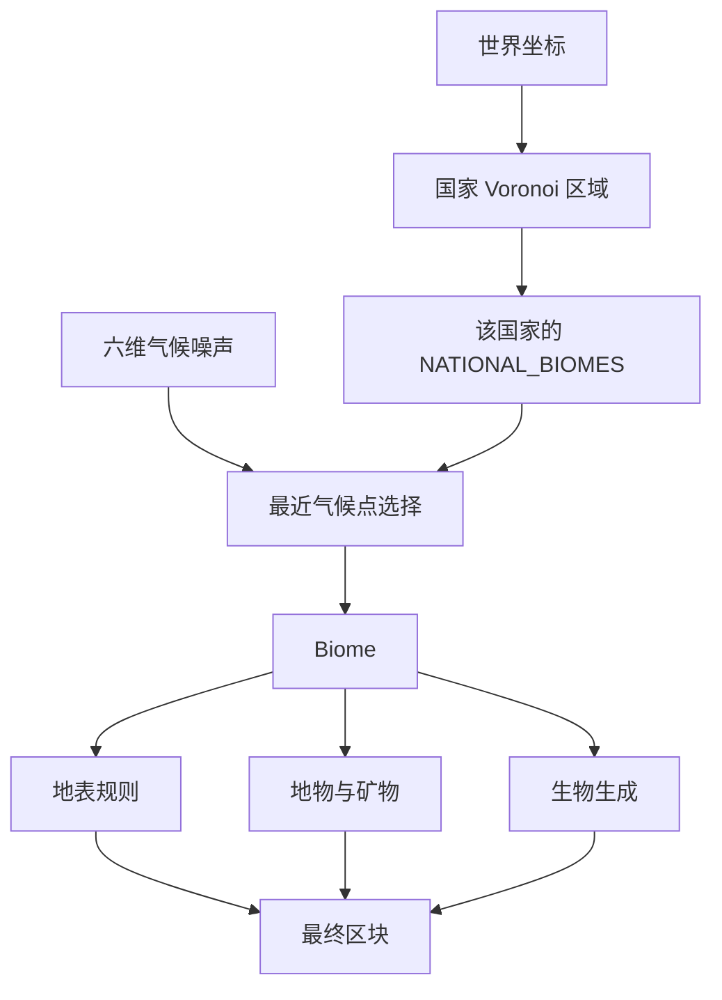
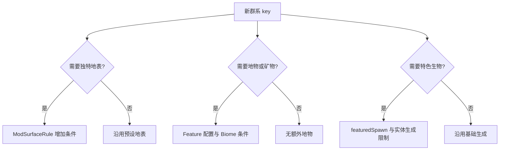

# 添加泰拉群系

泰拉群系同时参与气候选取、国家地理、地表规则、地物与生物生成。只注册 `Biome` 会让它出现在目录中，却不一定能在世界里被选中。

## 1. 理解群系在世界生成中的位置



`Biome` 是自然环境；`Nation`（国家）是地图空间区域；城市群系只是国家群系集合中的一种候选，不等于城市布局本身。

## 2. 声明气候坐标与环境

项目使用统一辅助方法：

```java
private static BiomeBuilder biome(
    String path,
    String zhCn,
    float climateTemperature,
    float humidity,
    float continentalness,
    float erosion,
    float depth,
    float weirdness,
    Consumer<? super BiomeBuilder> configure
) {
  return new BiomeBuilder(Zinecraft.BIOMES, path, zhCn)
      .climate(
          climateTemperature,
          humidity,
          continentalness,
          erosion,
          depth,
          weirdness
      )
      .configure(configure)
      .build();
}
```

### 2.1 六个气候变量

| 变量 | 中文含义 | 主要影响 |
| --- | --- | --- |
| `climateTemperature` | 气候温度坐标 | 冷暖群系的空间分布 |
| `humidity` | 湿度坐标 | 干旱与湿润环境 |
| `continentalness` | 大陆性坐标 | 海洋、海岸与内陆倾向 |
| `erosion` | 侵蚀坐标 | 地形平缓或破碎倾向 |
| `depth` | 深度坐标 | 地表、洞穴等垂直语义 |
| `weirdness` | 奇异度坐标 | 山谷、山峰等变化分支 |

它们是选取坐标，不直接等于 `.temperature()`、`.downfall()` 等群系视觉与天气参数。

候选群系可理解为选择气候空间中距离最近的一项：

$$
d_i^2 = \sum_{k=1}^{6}(q_k-c_{i,k})^2
$$

- $d_i$：当前位置与第 $i$ 个候选群系的气候距离；
- $q_k$：当前位置第 $k$ 个气候噪声值；
- $c_{i,k}$：第 $i$ 个群系第 $k$ 个气候坐标；
- `6`：温度、湿度、大陆性、侵蚀、深度、奇异度六个维度。

实际选择还受到国家区域与 `TerraBiomeSource` 实现约束，不能把公式当作跨国家的全局搜索。

## 3. 配置群系环境

真实条目示例：

```java
public static final BiomeBuilder KAZIMIERZ_KNIGHTLAND = biome(
    "kazimierz_knightland",
    "卡西米尔骑士领",
    0.0F, -0.35F, 0.35F, 0.55F, 0.0F, -0.2F,
    builder -> {
      builder.temperature(0.75F);
      builder.downfall(0.35F);
      builder.grassColor(9416530);
      builder.foliageColor(7312197);
      builder.plains();
      builder.featuredSpawn(
          MobCategory.CREATURE,
          EntityType.HORSE,
          18, 2, 5
      );
      builder.featuredSpawn(
          MobCategory.CREATURE,
          ModEntity.CLAMPBEAST.get(),
          6, 1, 2
      );
    }
);
```

`plains()`、`forest()`、`desert()`、`badlands()`、`mountain()`、`ocean()` 和 `cavern()` 是环境预设。先选最接近的预设，再覆盖颜色、降水和特色生成，不要逐项复制另一群系的全部配置。

## 4. 归属国家或辅助集合

普通国家群系必须加入 `NATIONAL_BIOMES`：

```java
Map.entry(
    ModNation.KAZIMIERZ,
    List.of(
        KAZIMIERZ_KNIGHTLAND,
        KAZIMIERZ_FORESTED_HILLS,
        KAZIMIERZ_CITY
    )
)
```

项目会校验：每个国家有专属群系、群系 ID 以国家 ID 开头、不可重复归属，且所有已注册的非辅助群系都必须映射。河流和世界边缘海洋应加入 `MAP_SUPPORT_BIOMES`，不要伪装成国家群系。

## 5. 接入地表、地物与生成



地表规则决定最上层方块，地物负责树、矿物和大型装饰，两者职责不同。添加实体时还要满足其 `SpawnPlacement`；群系条目只是让生成器开始尝试。

## 6. 处理特殊情况

### 6.1 群系注册了但找不到

依次检查是否进入 `NATIONAL_BIOMES` 或 `MAP_SUPPORT_BIOMES`、国家是否参与维度生成、气候坐标是否与其他候选完全重合，以及旧世界区块是否已经生成。

### 6.2 群系只在城市中使用

仍把城市群系放入对应国家列表，并让城市密度或群系源按项目规则选取。不要直接在结构放置代码里替换整个区块群系。

### 6.3 洞穴或深海群系

同步检查 `depth`、环境预设、高度相关地表规则和生成生物类别。只把视觉雾色调暗不会形成真正的地下或水下分布。

### 6.4 修改已有群系

世界生成变更只影响新生成区块。验证时使用新世界或未探索区域，并记录可能影响存档边界的变化。

## 7. 验证清单

- [ ] ID 以所属国家 ID 开头，辅助群系除外。
- [ ] 六维气候坐标与群系环境参数均已配置。
- [ ] 条目唯一进入国家映射或辅助群系集合。
- [ ] 地表、地物、颜色、降水和生物生成符合设计。
- [ ] 新世界中能找到，国家边界附近过渡可接受。
- [ ] `ModDimension.validateMap()` 不报告缺失、重复或未知群系。

```bash
./gradlew test
./gradlew runData
./gradlew runClient
cd docs && npm run guides:check
```

主要源码：[ModBiome.java](../../src/main/java/com/cxxcxx/zinecraft/core/registry/ModBiome.java)、[BiomeBuilder.java](../../src/main/java/com/cxxcxx/zinecraft/api/registry/builder/BiomeBuilder.java)、[TerraBiomeSource.java](../../src/main/java/com/cxxcxx/zinecraft/api/world/dimension/TerraBiomeSource.java)。
