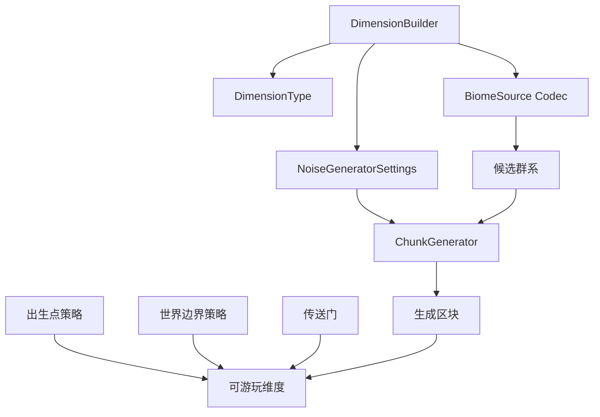
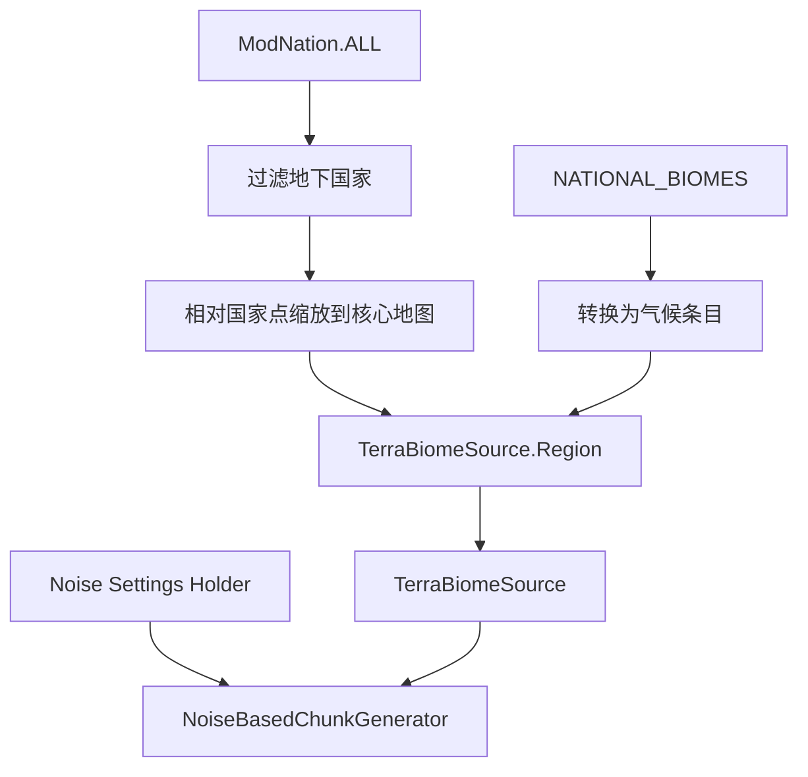
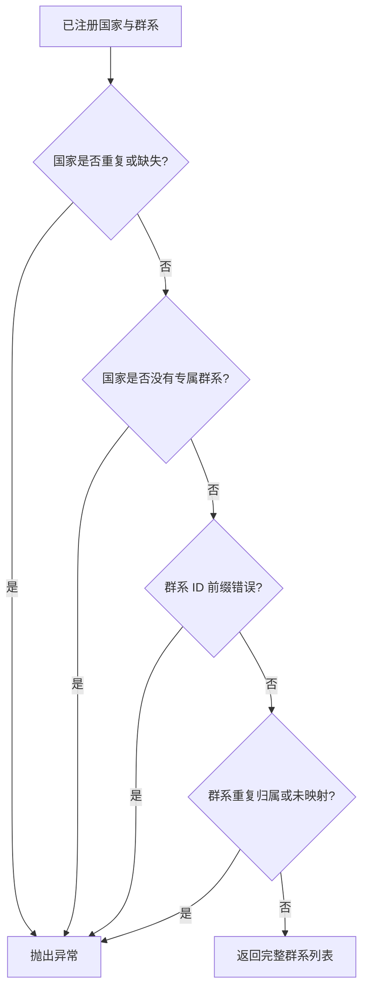

# 添加世界维度

维度是动态注册表、群系源、区块生成器、噪声设置和运行时策略的组合。当前项目只登记一个完整维度 `zinecraft:terra`；新增维度时应复制它的契约结构，而不是复制所有数值。

## 1. 明确维度边界



Builder 负责注册维度定义；出生点、边界和传送门是独立运行时策略，不会因为维度注册成功而自动存在。

## 2. 注册群系源 Codec

自定义群系源必须先提供可序列化 Codec：

```java
public static final MapCodec<TerraBiomeSource> TERRA_BIOME_SOURCE =
    Zinecraft.DIMENSIONS.biomeSource(
        "terra",
        TerraBiomeSource.ACCESS.getCODEC()
    );
```

Codec 负责存档与数据包重载时重建群系源。字段变化应考虑旧存档兼容性；只让构造器能运行并不足够。

## 3. 声明垂直范围与噪声设置

泰拉当前范围：

```java
public static final int TERRA_MIN_Y = -64;
public static final int TERRA_MAX_Y = 767;
public static final int TERRA_HEIGHT = TERRA_MAX_Y - TERRA_MIN_Y + 1;
```

高度必须满足：

$$
H = Y_{max} - Y_{min} + 1
$$

- $H$：维度总高度；
- $Y_{max}$：允许的最高方块坐标；
- $Y_{min}$：允许的最低方块坐标。

泰拉因此得到 `832` 格高度。还要满足 Minecraft 对区段高度和噪声设置的约束，不能任意填值。

## 4. 构建维度

项目中的实际声明为：

```java
public static final DimensionBuilder TERRA =
    Zinecraft.DIMENSIONS.dimension("terra")
        .heightRange(TERRA_MIN_Y, TERRA_HEIGHT)
        .noiseSettings(
            TERRA_NOISE_SETTINGS,
            context -> OverworldNoiseSettingsFactory.create(
                context,
                TERRA_MIN_Y,
                TERRA_HEIGHT,
                ModDensityFunction.TERRA_FINAL_DENSITY.key()
            )
        )
        .biomes(validateMap().stream()
            .map(builder -> new DimensionBiome(
                builder.key(),
                builder.climate()
            ))
            .toList())
        .generator(ModDimension::createTerraGenerator)
        .build();
```

顺序体现依赖关系：先确定高度与噪声，再提交完整群系列表，最后用 bootstrap context 创建区块生成器。

## 5. 创建区块生成器

泰拉先把国家相对坐标缩放到核心地图，再为每个国家组装其群系气候点，最后创建 `NoiseBasedChunkGenerator`。



相对横坐标转换为世界坐标可写作：

$$
x_{world} = \operatorname{round}(x_{relative} \times W_{half})
$$

- $x_{world}$：国家控制点的世界横坐标；
- $x_{relative}$：布局中的归一化横坐标；
- $W_{half}$：泰拉核心矩形的半宽。

纵向的 $z$ 坐标使用同样方法和核心矩形半高。

## 6. 校验完整地图

`validateMap()` 在启动期检查：



新增国家或群系后不要绕过这项检查；它防止“能启动但世界某处没有合法群系候选”的隐蔽问题。

## 7. 接入运行时策略

| 能力 | 当前实现入口 |
| --- | --- |
| 世界边界 | `TerraWorldBoundary` |
| 新玩家出生点 | `TerraPlayerSpawn` |
| 生物生成约束 | `TerraMobSpawnPolicy` |
| 星门传送 | `StarGateTeleporter` 等结构服务 |

每项策略都要用维度资源键判断目标世界。不要只比较显示名，也不要假设所有自定义维度都采用泰拉的 100000 格地图与中心出生点。

## 8. 处理特殊情况

### 8.1 存档加载时报 Codec 错误

检查群系源所有字段是否可编码、注册 ID 是否稳定、数据包是否引用了旧字段。不要删除存档来掩盖兼容问题。

### 8.2 进入维度后卡在虚空

依次检查 Noise Settings Holder、最终密度函数、垂直范围、出生点高度查找，以及出生区块是否同步生成完成。

### 8.3 群系存在但永远不出现

运行完整地图校验，再检查国家归属、气候坐标和群系源候选过滤。不要先调大地物权重；地物不会决定群系选择。

### 8.4 修改地图尺寸或高度

这是存档兼容性敏感变更。同步审查国家坐标缩放、边界、外海环、密度函数、结构定位与出生点，并用新旧存档分别验证。

## 9. 验证清单

- [ ] 群系源 Codec 可编码、解码并在数据包重载后重建。
- [ ] `heightRange` 与 Noise Settings 的最小高度和总高度一致。
- [ ] 所有国家与群系通过 `validateMap()`。
- [ ] 新世界能生成地形、找到群系并安全出生。
- [ ] 边界、传送、死亡返回和多人重连行为明确。
- [ ] 修改生成参数后在新区域测试，没有用旧区块误判。

```bash
./gradlew test
./gradlew runData
./gradlew runGameTestServer
./gradlew runClient
cd docs && npm run guides:check
```

主要源码：[ModDimension.java](../../src/main/java/com/cxxcxx/zinecraft/core/registry/ModDimension.java)、[DimensionBuilder.java](../../src/main/java/com/cxxcxx/zinecraft/api/registry/builder/DimensionBuilder.java)、[TerraBiomeSource.java](../../src/main/java/com/cxxcxx/zinecraft/api/world/dimension/TerraBiomeSource.java)。
