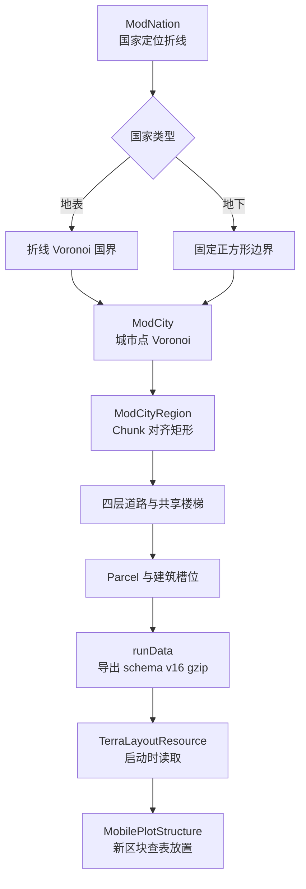
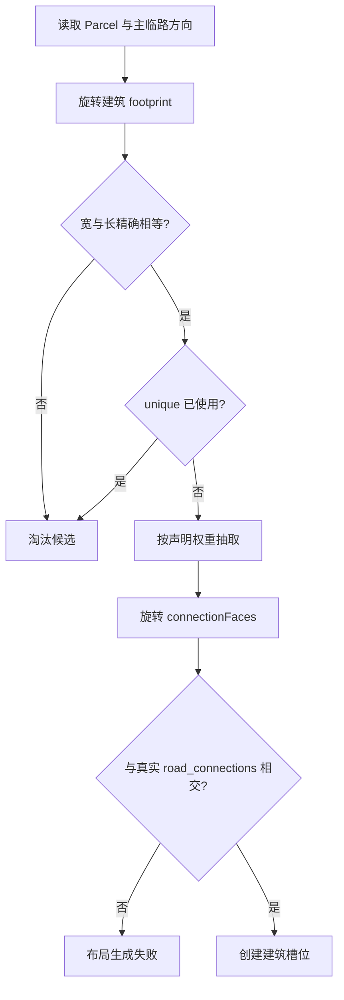
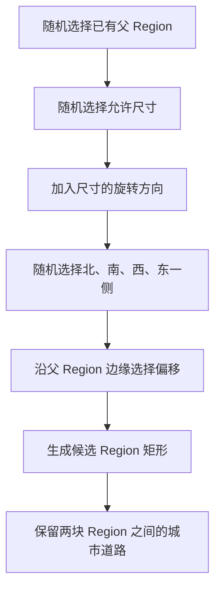
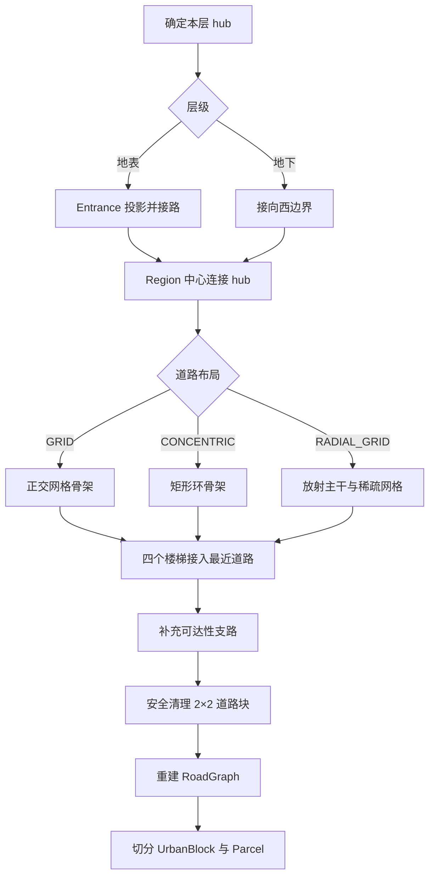
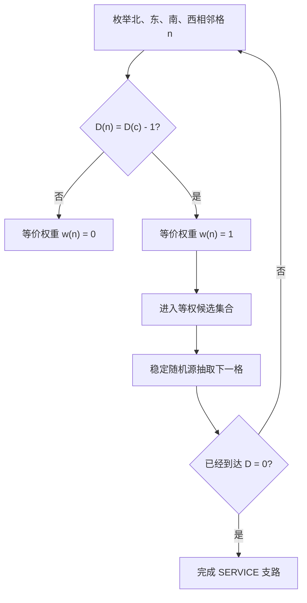
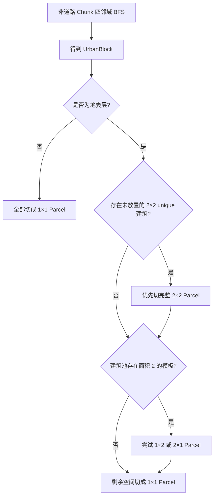
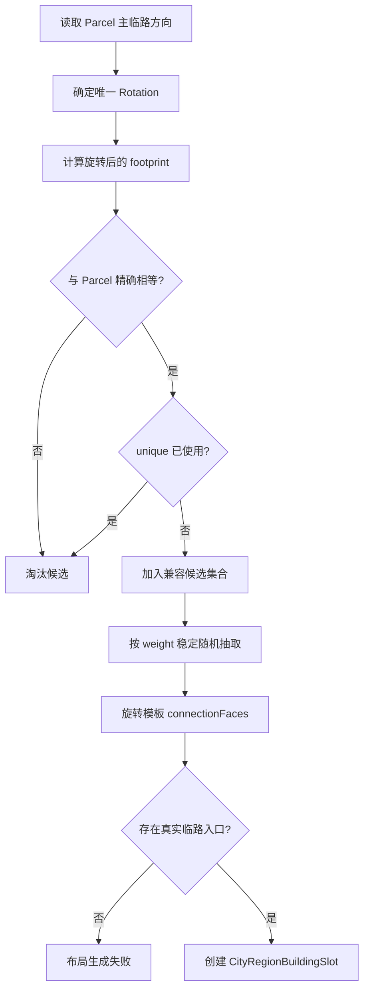
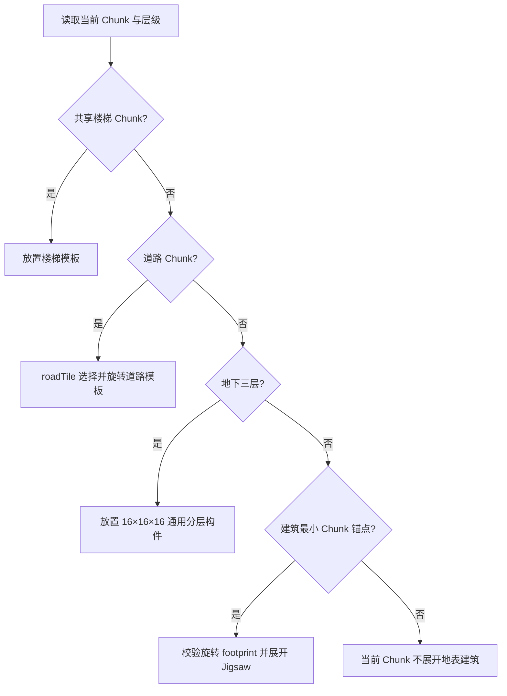
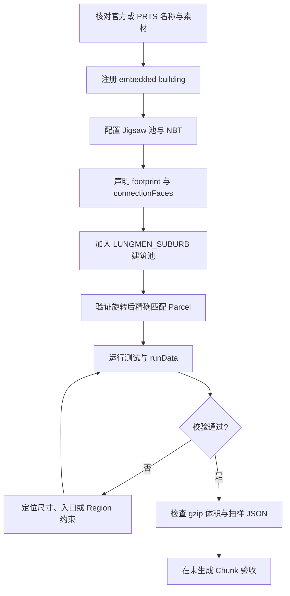
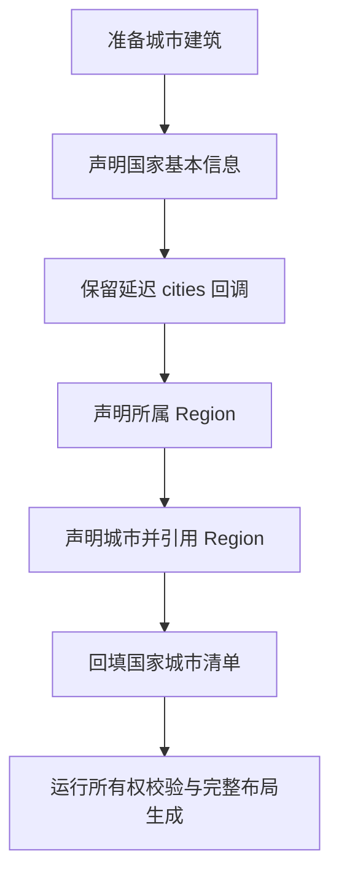

# 添加国家、城市与 Region（移动地块区域）

Zinecraft 不会在区块生成时临场拼一座城市。它先在数据生成阶段计算完整布局，再把结果压缩成资源；游戏运行时只查询当前 Chunk（区块，即水平 `16×16` 方块的世界生成单元）应该放道路、楼梯还是建筑。

读完这篇教程，你会知道：

- 国家定位折线怎样变成国界；
- 城市相对坐标怎样变成城市边界；
- Region（移动地块区域）类型怎样长成与 Chunk 对齐的矩形实例；
- 一个 Region 的四层道路、楼梯、Parcel（建筑用地）和建筑怎样生成；
- 哪些 Builder 字段已经参与计算，哪些仍只是元数据或预留 API；
- 修改注册后怎样生成、检查并在新区块验收结果。

名称、国家归属等设定事实必须来自项目指定的官方、PRTS 或游戏数据资料。本文讨论的坐标、边界和布局参数都是 Zinecraft 的玩法数据，不代表《明日方舟》官方世界坐标。

## 1. 先建立完整生成流程



这条链路有一个很重要的边界：

- **离线负责求解。** Voronoi、候选搜索、道路连通、Parcel 切分和建筑匹配都在 `runData` 中完成。
- **运行时负责消费。** 世界生成只查询压缩布局，不重新执行上述算法。

这样可以得到可复现的全图布局，也能控制进服后的计算量。代价是上游数据影响范围较大：移动一个国家定位点，可能改变邻国边界；移动一座城市，可能改变同国其他城市；修改 Region 参数或随机调用顺序，也可能让后续地块整体漂移。

## 2. 三个层级不要混在一起

本文保留源码中的英文类型名，方便搜索和对照实现。第一次阅读时，可以先把常用词记成下面这些直观含义。

### 2.1 核心术语速查

| 英文术语 | 中文说明 | 在本项目中的精确定义 |
| --- | --- | --- |
| `Chunk` | 区块 | Minecraft 水平方向 `16×16` 方块的世界生成单元。本文的道路宽度、Region 尺寸和建筑占地通常都以 Chunk 计；Chunk 在竖直方向不是 16 格高的立方体。 |
| `Region` | 移动地块区域 | 城市中的一个矩形移动地块实例。每个实例占用若干 Chunk，并固定包含动力、支持、生活、地表四层。`TerraCityRegionBuilder` 声明的是 Region 类型，生成器才把类型实例化为具体坐标。 |
| `Parcel` / `BuildingParcel` | 建筑用地 | 道路确定后，从非道路 Chunk 中切出的矩形用地。地表每个 Parcel 必须精确匹配一个建筑占地；下三层当前通常退化为 `1×1` Chunk。 |
| `UrbanBlock` | 街区连通块 | 对所有非道路 Chunk 做四邻域搜索得到的连通分量。它记录真实格数和外接矩形；外接矩形不等于分量内每个位置都一定可建。 |
| `RoadGraph` | 道路图 | Region 某一层的道路数据，由道路节点和 `RoadEdge` 组成。校验器会把它光栅化为道路 Chunk，并检查整体连通。 |
| `RoadEdge` | 道路边 | `RoadGraph` 中一段轴对齐的连续道路矩形。当前三种道路等级都固定为 1 Chunk 宽。 |
| `RoadClass` | 道路等级 | `PRIMARY`、`SECONDARY`、`SERVICE` 三档道路优先级。当前等级影响排序和入口信息，不表示不同路宽。 |
| `Entrance` / `RegionEntrance` | Region 出入口 | 城市级道路与某个 Region 边界相接的位置。只有地表层拥有外部 Entrance；地下三层经楼梯连接到地表。 |
| `road_connections` | 临路连接面 | Parcel 与道路真实共享边的完整列表。每项记录世界方向、道路 ID 和道路等级；列表第一项兼作主入口。 |
| `footprint` | 建筑占地 | 建筑模板在默认朝向下占用的 Chunk 宽和长。旋转后的 footprint 必须与 Parcel 尺寸精确相等，不是“能够放进去”即可。 |
| `PlotSize` | Region 候选尺寸 | 一个 Region 矩形允许使用的 Chunk 宽和长。生成器会同时尝试声明方向及其旋转方向。 |
| `CityGrid` | 城市 Chunk 栅格 | 把城市多边形转换成 `OUTSIDE`、`EMPTY`、`PLOT`、`ROAD` 等 Chunk 状态的计算模型；只有完整落在城市内的 Chunk 才可用。 |
| `hub` | 本层道路枢纽 | `RegionLayoutGenerator` 为每一层选择的道路汇聚参考点。各层 hub 位于不同象限并带稳定随机扰动，因此不会简单复制道路。 |
| `GRID` / `CONCENTRIC` / `RADIAL_GRID` | 网格 / 同心环 / 放射网格布局 | 当前真正实现的三种 Region 道路生成策略。枚举中的 `SPINE`、`CAMPUS`、`HYBRID` 尚不可使用。 |
| `site` / `Voronoi site` | Voronoi 站点 | 用来比较距离的参照物。地表国家使用折线站点，城市使用点站点。 |
| `cell` / `Voronoi cell` | Voronoi 单元 | 裁剪范围内离某个站点不比其他站点远的区域；国家单元形成国界，城市单元形成城市边界。它与 `CityGrid` 中的 Chunk 网格单元不是一回事。 |
| `seed` | 随机种子 | 初始化伪随机序列的整数。相同输入和 seed 会复现结果，但修改 ID、实例顺序或随机调用次数仍会使后续布局变化。 |
| `BFS` | 广度优先搜索 | 从一组起点逐层访问四邻域 Chunk 的算法。项目用它检查道路连通、提取 UrbanBlock，并计算到最近道路的距离场。 |
| `Builder` | 声明构建器 | 用链式方法收集并校验注册参数的 Java 对象，例如 `NationBuilder`。Builder 中存在字段不代表生成算法已经读取它。 |
| `Catalog` | 注册目录 | 保存、索引并交叉校验 Builder 的目录对象，例如 `NationCatalog`；它负责重复 ID、归属和未注册引用等检查。 |
| `Jigsaw` | 拼图结构系统 | Minecraft 用模板池和连接点展开结构的机制。Region 地表建筑由已经注册的 Jigsaw 建筑候选生成。 |
| `NBT` | Minecraft 二进制标签数据 | 保存结构模板方块、实体和连接信息的格式。数据生成可以引用 NBT，但不会替开发者自动搭建建筑内容。 |
| `schema` | 数据格式版本 | 压缩布局资源的字段契约。当前运行时只接受 v16；不兼容的字段变化必须同步更新导出器、读取器与版本。 |
| `gzip` | Gzip 压缩文件 | `runData` 输出布局 JSON 时使用的压缩封装，文件扩展名为 `.json.gz`。它是生成产物，不应手工维护。 |
| `runData` | 数据生成任务 | NeoForge/Gradle 的离线数据生成流程；本项目会在其中计算并恢复 Terra 布局压缩资源。 |
| `runtime` | 游戏运行时 | 模组已经加载并生成世界的阶段。本文也直接称“运行时”；此阶段读取布局并放置结构，不重新求解全图。 |

### 2.2 国家、城市与 Region 的数据层级

| 层级 | 你声明什么 | 生成器得到什么 |
| --- | --- | --- |
| 国家 `NationBuilder` | 稳定 ID、定位折线、城市清单；地下国家另有固定尺寸 | 泰拉核心矩形内的国家边界 |
| 城市 `TerraCityBuilder` | 国家内相对位置、Region 类型和地块约束 | 国家边界内的城市边界、城市道路与 Region 实例 |
| Region `TerraCityRegionBuilder` | 类型权重、数量、离散尺寸、地表道路类型和建筑池 | 一个或多个矩形移动地块，以及每个实例的四层内部布局 |

`TerraCityRegionBuilder` 声明的是一种 Region **类型**，不是固定坐标。除非调用 `unique()`，同一类型可以在一座城市中出现多次。

主要入口是：

- [ModNation.java](../../src/main/java/com/cxxcxx/zinecraft/core/registry/ModNation.java)
- [ModCity.java](../../src/main/java/com/cxxcxx/zinecraft/core/registry/ModCity.java)
- [ModCityRegion.java](../../src/main/java/com/cxxcxx/zinecraft/core/registry/ModCityRegion.java)
- [TerraLayoutCalculator.java](../../src/main/java/com/cxxcxx/zinecraft/core/nation/TerraLayoutCalculator.java)

## 3. 声明国家

以炎为例，注册内容是真实存在的：

```java
public static final NationBuilder YAN = Zinecraft.NATIONS.nation("yan", "炎")
    .position(0.5991, -0.5472)
    .position(0.8335, -0.5756)
    .position(0.9080, -0.3661)
    .position(0.7456, -0.2418)
    .cities(() -> List.of(
        ModCity.BAIZAO, ModCity.LUNGMEN, ModCity.JIANGQI,
        ModCity.HSI, ModCity.OCHRE, ModCity.SPRING_CITY
        // 其余城市略
    ))
    .build();
```

### 3.1 `position(x, z)` 不是国界顶点

每个国家点先从归一化坐标换算为方块坐标：

$$
\begin{aligned}
x_{\mathrm{world}} &= x_{\mathrm{relative}} H_x,\\
z_{\mathrm{world}} &= z_{\mathrm{relative}} H_z.
\end{aligned}
$$

| 符号 | 中文含义 | 单位与范围 |
| --- | --- | --- |
| $x_{\mathrm{relative}}$ | 国家定位点的归一化 X 坐标 | 无单位，严格位于 $(-1,1)$ |
| $z_{\mathrm{relative}}$ | 国家定位点的归一化 Z 坐标 | 无单位，严格位于 $(-1,1)$ |
| $H_x$ | 泰拉核心矩形 X 方向半边长 | $40{,}000$ 方块 |
| $H_z$ | 泰拉核心矩形 Z 方向半边长 | $25{,}000$ 方块 |
| $x_{\mathrm{world}}$ | 换算后的世界 X 坐标 | 方块 |
| $z_{\mathrm{world}}$ | 换算后的世界 Z 坐标 | 方块 |

例如炎的第一个点 `(0.5991, -0.5472)` 会换算为：

$$
\begin{aligned}
x_{\mathrm{world}} &= 0.5991 \times 40{,}000 = 23{,}964,\\
z_{\mathrm{world}} &= -0.5472 \times 25{,}000 = -13{,}680.
\end{aligned}
$$

多个点会按声明顺序连成一条折线。生成器比较的是“世界位置到哪一条国家折线最近”，而不是把这些点首尾相连当作手写边界。

### 3.2 地表国家为什么使用折线 Voronoi

Voronoi 可以直观理解为：空间中的每一点都归给离它最近的站点。国家的站点是一条折线 $L$，点 $p$ 到折线的距离取各线段距离的最小值：

$$
d(p,L)^2 = \min_k d\!\left(p,[a_k,b_k]\right)^2.
$$

| 符号 | 中文含义 | 单位 |
| --- | --- | --- |
| $p$ | 泰拉核心矩形内待归属的世界点 | 方块坐标 |
| $L$ | 某个国家的完整定位折线 | 方块坐标序列 |
| $k$ | 折线中线段的序号 | 无单位整数 |
| $a_k$、$b_k$ | 第 $k$ 条线段的起点和终点 | 方块坐标 |
| $d(p,[a_k,b_k])$ | 点 $p$ 到第 $k$ 条线段的最短欧氏距离 | 方块 |
| $d(p,L)$ | 点 $p$ 到整条国家折线的最短距离 | 方块 |

[PolylineVoronoiDiagram.java](../../src/main/java/com/cxxcxx/zinecraft/api/world/layout/PolylineVoronoiDiagram.java) 会把折线顶点和线段送入 Voronoi 计算，裁剪到 `80,000 × 50,000` 的泰拉核心矩形，再合并同一国家拥有的 primitive faces。最终多边形才是国家边界。


这解释了两个常见现象：

1. 增加一个折点会拉动附近国界，但不会要求你手写整圈边界。
2. 两国是否相邻由最终多边形是否共享边界决定，不由注册顺序决定。

### 3.3 地下国家走另一条路径

杜林当前使用固定正方形：

```java
public static final NationBuilder DURIN = Zinecraft.NATIONS.nation("durin", "杜林")
    .position(-0.6417, 0.3505)
    .underground()
    .size(2_000)
    .cities(() -> List.of(ModCity.NEW_ZERUERTZA, ModCity.ORTZIMUGA))
    .build();
```

地下国家不参与地表 Voronoi。生成器取定位折线的弧长中点作为中心，再以 `size / 2` 为半边长生成轴对齐正方形：

$$
\Omega_u =
\left[c_{u,x}-\frac{s_u}{2},c_{u,x}+\frac{s_u}{2}\right]
\times
\left[c_{u,z}-\frac{s_u}{2},c_{u,z}+\frac{s_u}{2}\right].
$$

| 符号 | 中文含义 | 单位与约束 |
| --- | --- | --- |
| $\Omega_u$ | 地下国家的水平规划区域 | 方块坐标区域 |
| $c_{u,x}$、$c_{u,z}$ | 地下国家定位折线弧长中点的世界坐标 | 方块 |
| $s_u$ | `size(...)` 声明的地下国家正方形边长 | 正偶数，单位为方块 |

整个正方形必须留在泰拉核心矩形内，否则 `TerraLayoutCalculator` 会直接失败。

```nation-boundary-d3
nation-boundary
```

### 3.4 国家注册的硬约束

[NationCatalog.java](../../src/main/java/com/cxxcxx/zinecraft/api/registry/catalog/NationCatalog.java) 会检查：

- 至少声明一个归一化定位点；
- 每个坐标有限，且 X/Z 严格位于 `(-1, 1)`；
- 折线不能有连续重复顶点；
- 国家 ID 不能重复；
- 地下国家尺寸必须是正偶数；
- 地表国家不能声明固定尺寸。

`cities(...)` 使用 `Supplier` 是为了延迟读取城市字段，避免静态注册顺序把国家、城市和 Region 绑成初始化环。

## 4. 声明城市

龙门的实际声明通过 [ModCity.java](../../src/main/java/com/cxxcxx/zinecraft/core/registry/ModCity.java) 中的辅助方法完成：

```java
public static final TerraCityBuilder LUNGMEN = city(
    "lungmen",
    0.406,
    -0.109,
    345,
    "龙门",
    ModCityRegion.LUNGMEN_CORE,
    ModCityRegion.LUNGMEN_SUBURB
);
```

辅助方法最终调用：

```java
Zinecraft.CITIES.city(zhCn)
    .id(id)
    .enUs(TranslationCatalog.toDisplayName(id))
    .position(relativeX, relativeZ)
    .rotation(rotationDegrees)
    .regions(regions)
    .build();
```

城市 ID 必须是稳定的英文 `snake_case`。修改 ID 会改变城市随机种子，也会改变导出资源中的引用；不要把它当显示文本随意调整。

### 4.1 城市相对坐标怎样映射进国家

城市坐标不是泰拉世界坐标。它先由 [ConvexPolygonMapper.java](../../src/main/java/com/cxxcxx/zinecraft/api/world/layout/ConvexPolygonMapper.java) 沿国家中心射线映射进国家多边形：

$$
\begin{aligned}
f &= \max(|u|,|v|),\\
q &= (u/f,v/f),\\
\lambda &= \operatorname{rayDistance}(c_n,q,\Omega_n),\\
s_i &= c_n + f\lambda q.
\end{aligned}
$$

当 $f=0$ 时，映射结果直接是国家中心，不计算 $q$。

| 符号 | 中文含义 | 单位与范围 |
| --- | --- | --- |
| $u$、$v$ | `position(relativeX, relativeZ)` 的城市相对坐标 | 无单位，严格位于 $(-1,1)$ |
| $f$ | 城市离国家中心的归一化比例，采用 $L_\infty$ 范数 | 无单位，$[0,1)$ |
| $q$ | 从国家中心出发的射线方向 | 无单位二维向量 |
| $c_n$ | 国家多边形中心 | 方块坐标 |
| $\Omega_n$ | 当前国家的边界多边形 | 方块坐标区域 |
| $\lambda$ | 射线从中心到国家边界的最近正向距离 | 方块 |
| $s_i$ | 映射后的第 $i$ 座城市 Voronoi 点站点 | 方块坐标 |

假设国家边界暂时近似为 `[-1000,1000] × [-500,500]`，中心为 `(0,0)`，城市输入是 `(u,v)=(0.5,-0.25)`：

$$
\begin{aligned}
f &= 0.5,\\
q &= (1,-0.5),\\
\lambda &= 1000,\\
s_i &= (0,0)+0.5\times1000\times(1,-0.5)=(500,-250).
\end{aligned}
$$

这里 $\lambda=1000$，因为射线先在 `x=1000` 处碰到边界。这个映射保留了“沿某方向走到边界距离多少比例”的语义，不会把不规则国家简单压进外接矩形。

### 4.2 城市边界仍然由 Voronoi 决定

同一国家的每座城市映射成一个点站点。对城市 $i$，点站点 Voronoi 单元定义为：

$$
V_i = \Omega_n \cap
\left\{p \mid \lVert p-s_i\rVert \le \lVert p-s_j\rVert,\ \forall j\ne i\right\}.
$$

| 符号 | 中文含义 | 单位 |
| --- | --- | --- |
| $V_i$ | 第 $i$ 座城市最终获得的边界区域 | 方块坐标区域 |
| $\Omega_n$ | 所属国家的边界多边形 | 方块坐标区域 |
| $p$ | 国家边界内待归属的世界点 | 方块坐标 |
| $i$、$j$ | 同一国家内两座不同城市的索引，且 $j\ne i$ | 无单位整数 |
| $s_i$ | 第 $i$ 座城市的点站点 | 方块坐标 |
| $s_j$ | 同国其他城市的点站点 | 方块坐标 |
| $\lVert p-s_i\rVert$ | 点 $p$ 到城市 $i$ 站点的欧氏距离 | 方块 |

只有一座城市时，它会取得整个国家边界。有多座城市时，移动其中一个站点会改变它与邻城的等距分界。最终共享边界由 [PolygonAdjacencyCalculator.java](../../src/main/java/com/cxxcxx/zinecraft/api/world/layout/PolygonAdjacencyCalculator.java) 转换为 `neighboringCityIds`。

```city-boundary-d3
city-boundary
```

### 4.3 `rotation(...)` 当前不会旋转布局

这是容易误读的地方。`TerraLayoutCalculator` 调用城市映射器时传入的是固定 `0.0`，而不是 `TerraCityBuilder.rotationDegrees()`。当前 `rotation(...)`：

- 会规范化到 `0～359` 度；
- 会导出为 `rotation_degrees` 元数据；
- **不会**旋转城市站点；
- **不会**旋转 Region 地块；
- **不会**决定建筑朝向。

建筑旋转来自 Parcel 的主临路方向。不要用城市 `rotation(...)` 修正实际几何。

## 5. 声明 Region 类型

龙门目前有两种 Region：

```java
public static final TerraCityRegionBuilder LUNGMEN_CORE =
    region(ModNation.YAN, "龙门核心区", RegionLayoutType.CONCENTRIC, ModStructure.YAN_SHOP)
        .unique();

public static final TerraCityRegionBuilder LUNGMEN_SUBURB =
    region(ModNation.YAN, "龙门郊区", RegionLayoutType.RADIAL_GRID, ModStructure.YAN_SHOP);
```

项目辅助方法会统一补充默认策略：

- 名称以“核心区”结尾时，`weight=100`，并允许 `40×32`、`32×32`、`32×24` Chunk；
- 名称以“郊区”结尾时，`weight=30`，沿用 Builder 默认尺寸 `16×12`、`12×8`、`10×8` Chunk；
- 自动加入国家普通商店和中型商店；
- 额外传入的建筑以 unique 候选加入；
- 核心区显式调用 `unique()`，因此最多出现一个实例。

如果现有辅助方法能表达需求，优先复用它。需要偏离默认值时，再展开完整 Builder：

```java
Zinecraft.CITY_REGIONS.region(ModNation.YAN, "某城区")
    .weight(50)
    .regionLayout(RegionLayoutType.GRID)
    .plotSizes(new PlotSize(16, 12), new PlotSize(12, 8))
    .countRange(1, 4)
    .roadConfig(RegionLayout.RoadConfig.DEFAULT)
    .building(ModStructure.YAN_SHOP, 1, false)
    .build();
```

### 5.1 Region 配置怎样影响结果

| 配置 | 默认值 | 单位/约束 | 作用阶段 | 当前状态 |
| --- | ---: | --- | --- | --- |
| `weight` | `1` | 正整数 | 可选类型顺序、目标半径 | **参与计算** |
| `regionLayout` | 无 | 必须显式声明；仅 `GRID`、`CONCENTRIC`、`RADIAL_GRID` 已实现 | 地表道路生成 | **参与计算** |
| `plotSizes` | `16×12`、`12×8`、`10×8` | Chunk；每项面积至少 80 Chunk | 城市 Region 候选 | **参与计算** |
| `countRange` | `1～Integer.MAX_VALUE` | 最小值至少 1，最大值不小于最小值 | 必选与可选实例数 | **参与计算** |
| `unique` | `false` | 启用后有效最大数量不超过 1 | 类型数量限制 | **参与计算** |
| `buildings` | 无 | 至少一个已注册城市建筑 | 地表 Parcel 建筑分配 | **参与计算** |
| `buildingLayout` | `GridLayout.INSTANCE` | `Layout` | 导出与读取核对 | **仅导出元数据** |
| `RoadConfig.gridSpacingChunks` | `3,4,5,6` | 每项至少 2 Chunk | GRID、RADIAL_GRID 道路间距 | **参与计算** |
| `RoadConfig.extraEdgeRatio` | `0.35` | `[0,1]` | 尚未接入生成器 | **预留** |
| `RoadConfig.maxCandidateAttempts` | `64` | 正整数 | 尚未接入生成器 | **预留** |

三类 Region 内道路宽度目前都必须等于 `1` Chunk。`RoadConfig` 构造器会拒绝其他宽度。`SPINE`、`CAMPUS`、`HYBRID` 虽然存在于枚举中，但 Builder 和生成器都会拒绝；它们不是可试用布局。

### 5.2 建筑池必须与 Parcel 契约一致

Region 中的建筑来自已注册的城市 Jigsaw 建筑。布局阶段按下面的流程筛选：



选择建筑 $i$ 的概率为：

$$
P_i = \frac{w_i}{\sum_{j\in\mathcal B} w_j}.
$$

| 符号 | 中文含义 | 单位与约束 |
| --- | --- | --- |
| $P_i$ | 兼容候选中选中建筑 $i$ 的概率 | 无单位，$[0,1]$ |
| $i$、$j$ | 兼容建筑候选的索引 | 无单位整数 |
| $w_i$ | 建筑 $i$ 的正整数权重 | 无单位 |
| $\mathcal B$ | 已通过尺寸、unique 与入口过滤的建筑候选集合 | 建筑集合 |
| $w_j$ | 集合 $\mathcal B$ 中建筑 $j$ 的权重 | 无单位 |

只改 NBT 门的位置、不更新 `connectionFaces(...)`，会让数据生成报“建筑模板没有朝向道路的真实入口”。独立建筑制作流程见 [添加结构](add-structure.md)。

## 6. 理解城市中的 Region 生长

[MobileCityLayoutGenerator.java](../../src/main/java/com/cxxcxx/zinecraft/core/nation/MobileCityLayoutGenerator.java) 不会把 Region 均匀撒进城市。它在 Chunk 栅格上从核心向外生长，并且每接受一个 Region 就同步占用连接道路。

### 6.1 只使用完整落在城市内的 Chunk

[CityGrid.java](../../src/main/java/com/cxxcxx/zinecraft/core/nation/CityGrid.java) 检查每个候选 Chunk 的四角和中心。五个点都在城市多边形内时，这个 Chunk 才进入可用集合 $G$。

这样会主动放弃斜边附近的不完整 Chunk，避免矩形 Region 或道路越出城市 Voronoi 边界。

城市核心不是城市 Voronoi 站点，而是可用 Chunk 中离边界最远的 Chunk 中心：

$$
c^* = \underset{c\in G}{\operatorname{arg\,max}}\;
d\!\left(\operatorname{center}(c),\partial\Omega_c\right).
$$

| 符号 | 中文含义 | 单位 |
| --- | --- | --- |
| $G$ | 完整落在城市边界内的可用 Chunk 集合 | Chunk 集合 |
| $c$ | 集合 $G$ 中的一个 Chunk | Chunk |
| $\operatorname{center}(c)$ | Chunk $c$ 的方块中心点 | 方块坐标 |
| $\Omega_c$ | 当前城市的 Voronoi 边界区域 | 方块坐标区域 |
| $\partial\Omega_c$ | 城市多边形边界 | 方块坐标折线 |
| $d(\cdot,\partial\Omega_c)$ | 点到城市各边线段的最短距离 | 方块 |
| $c^*$ | 净空最大的城市核心 Chunk | Chunk |

首个 Region 必须覆盖 $c^*$，因此大型核心区会尽量落在城市最厚实的位置，而不是卡在狭角。

### 6.2 必选 Region 先放

设城市允许的 Region 类型集合为 $T$。生成前必须满足：

$$
M = \sum_{t\in T} m_t
\le N_{\min}.
$$

| 符号 | 中文含义 | 单位与约束 |
| --- | --- | --- |
| $T$ | 城市声明的 Region 类型集合 | 类型集合 |
| $t$ | 集合中的一种 Region 类型 | 类型 |
| $m_t$ | 类型 $t$ 的 `minCount` | 非负实例数；当前 Builder 要求至少 1 |
| $M$ | 全部类型的必选实例总数 | Region 实例数 |
| $N_{\min}$ | 城市 `minPlotCount` | Region 实例数 |

生成器按 `weight` 降序、Region ID 升序展开每种类型的 `minCount`。任一必选实例找不到合法候选时，立即返回 `MANDATORY_PLOTS_CANNOT_FIT`，不会跳过它继续生成。

达到类型下限后，生成器才进入可选循环。每轮根据类型权重和剩余名额生成一个不放回尝试顺序；`unique()` 类型因为有效上限为 1，不会再次进入候选集合。

### 6.3 候选从已有地块边缘长出来

首个 Region 会枚举所有能够覆盖核心 Chunk 的合法左上角。后续 Region 则执行：



默认 `candidateCount=K` 时，采样器最多收集 `8K` 个去重候选，最多尝试 `128K` 次。若采样失败且城市仍未达到 `minPlotCount`，生成器会退回完整边缘枚举，优先保证城市下限。

候选依次通过以下过滤：

| 拒绝原因 | 实际判断 |
| --- | --- |
| `OUTSIDE_CITY` | Region 或连接道路含有不可用 Chunk |
| `OVERLAPS_PLOT` | Region 与既有 Region 相交，或道路穿过非父 Region |
| `OVERLAPS_ROAD` | Region 覆盖既有城市道路 |
| `INVALID_ROAD_GAP` | Region 侵入既有 Region 的道路保留带 |
| `NO_CONNECTION` | 非首个 Region 没有合法父 Region |
| `COVERAGE_LIMIT` | 接纳后的 Region 覆盖率超过城市上限 |
| `TYPE_MAX_COUNT` | 该类型已达到有效最大数量 |

覆盖率只把 Region 面积放进分子，不包括城市道路：

$$
\rho = \frac{\sum_{g\in\mathcal U} A_g}{A_G}.
$$

| 符号 | 中文含义 | 单位与范围 |
| --- | --- | --- |
| $\rho$ | 当前城市的 Region 覆盖率 | 无单位，$[0,1]$ |
| $\mathcal U$ | 已接纳的 Region 实例集合 | Region 集合 |
| $g$ | 一个已接纳 Region | Region |
| $A_g$ | Region $g$ 的矩形面积 | Chunk |
| $A_G$ | 城市可用 Chunk 总数 | Chunk |

### 6.4 合法候选还要评分

候选先用稳定随机源打乱，再截取最多 `candidateCount` 个。生成器对这批候选计算：

$$
\begin{aligned}
\sigma &= 4C + 2B + 1.5A + 2Q,\\
C &= 1-\min\!\left(1,\frac{|d-r^*|}{R}\right),\\
r^* &= 0.65R(1-\widehat w),\\
B &= \min\!\left(1,\frac{b}{16R}\right),\\
A &= \frac{\ell}{\max(W_c,L_c)},\\
Q &= \frac{A_{\mathrm{plots}}}{A_{\mathrm{bbox}}}.
\end{aligned}
$$

| 符号 | 中文含义 | 单位与范围 |
| --- | --- | --- |
| $\sigma$ | 候选总分，越大越优先 | 无单位 |
| $C$ | 候选中心与类型目标半径的匹配度 | 无单位，$[0,1]$ |
| $B$ | 候选中心的边界净空分 | 无单位，$[0,1]$ |
| $A$ | 候选与父 Region 的道路界面分 | 无单位，$[0,1]$ |
| $Q$ | 接纳后所有 Region 的紧凑度 | 无单位，$(0,1]$ |
| $d$ | 候选中心到城市核心的距离 | Chunk |
| $r^*$ | 当前 Region 类型的目标半径 | Chunk |
| $R$ | 城市 Chunk 外接范围对角线长度，最小取 1 | Chunk |
| $\widehat w$ | Region 权重在本城最小值与最大值间的归一化结果 | 无单位，$[0,1]$；权重相同时取 0.5 |
| $b$ | 候选中心到城市边界的最短距离 | 方块 |
| $\ell$ | 候选与父 Region 平行相接的界面长度 | Chunk |
| $W_c$、$L_c$ | 候选 Region 的宽和长 | Chunk |
| $A_{\mathrm{plots}}$ | 接纳后全部 Region 的面积和 | Chunk |
| $A_{\mathrm{bbox}}$ | 接纳后全部 Region 外接矩形面积 | Chunk |

权重不会直接加到总分里，而是改变目标半径。最高权重类型的 $\widehat w=1$，所以 $r^*=0$，更偏向城市核心；最低权重类型的 $\widehat w=0$，所以 $r^*=0.65R$，更偏向外围。

代入一个候选：

```text
R = 50 Chunk
d = 6 Chunk
最高权重，因此 r* = 0
b = 80 方块
界面长度 ℓ = 12 Chunk
候选尺寸 W×L = 16×12 Chunk
紧凑度 Q = 0.72
```

可得：

$$
\begin{aligned}
C &= 1-\frac{6}{50}=0.88,\\
B &= \frac{80}{16\times50}=0.10,\\
A &= \frac{12}{16}=0.75,\\
\sigma &= 4\times0.88+2\times0.10+1.5\times0.75+2\times0.72\\
  &= 6.285.
\end{aligned}
$$

接纳后，Region 矩形标记为 `PLOT`，连接带标记为 `ROAD`，并记录一条 `UrbanRoad`。循环在达到 `maxPlotCount`、没有可选类型或没有合法候选时结束。`maxPlotCount` 只是上限；最终必须达到 `minPlotCount`，否则报 `MINIMUM_PLOT_COUNT_CANNOT_FIT`。

下面的 D3 动画只负责本章的城市内部 Region 生长。国家边界与城市边界已经分别放在第 3、4 章，不与 Region 候选混在同一时间轴。

```region-growth-d3
region-growth
```

动画中的几何坐标是便于阅读的缩小示例，不是 `runData` 的真实导出结果。算法契约保持不变：Chunk 必须完整落在城市内，Region 候选通过硬门槛后才比较 $\sigma$。

## 7. 生成一个 Region 的四层布局

[RegionLayoutGenerator.java](../../src/main/java/com/cxxcxx/zinecraft/core/nation/RegionLayoutGenerator.java) 为每个 Region 实例固定生成四层：

| 层 | 相对高度 | 非道路内容 |
| --- | ---: | --- |
| `power` | `+0` | 动力层通用构件 |
| `support` | `+16` | 支持层通用构件 |
| `life` | `+32` | 生活层通用构件 |
| `surface` | `+48` | Region 建筑池中的地表建筑 |

地表使用 Region 注册的 `regionLayout`。下三层分别使用独立稳定随机源，从 `GRID`、`CONCENTRIC`、`RADIAL_GRID` 中抽取布局。它们可以偶然抽中同一类型，但不会复用同一张道路图。

### 7.1 四层共享楼梯，不共享道路

生成器先确定 Region 中心，再在四个象限各放一个楼梯：

$$
\begin{aligned}
o_x &= \max\!\left(2,\left\lfloor W_r/6\right\rfloor\right),\\
o_z &= \max\!\left(2,\left\lfloor L_r/6\right\rfloor\right),\\
\mathcal S &= \{(c_{r,x}-o_x,c_{r,z}-o_z),(c_{r,x}+o_x,c_{r,z}-o_z),\\
  &\qquad(c_{r,x}-o_x,c_{r,z}+o_z),(c_{r,x}+o_x,c_{r,z}+o_z)\}.
\end{aligned}
$$

| 符号 | 中文含义 | 单位 |
| --- | --- | --- |
| $W_r$、$L_r$ | Region 的 Chunk 宽和长 | Chunk |
| $o_x$、$o_z$ | 楼梯相对中心的 X/Z 偏移 | Chunk |
| $c_{r,x}$、$c_{r,z}$ | Region 本地中心的 Chunk 坐标 | Chunk 坐标 |
| $\mathcal S$ | 四层共同使用的楼梯 Chunk 集合 | Chunk 集合 |

楼梯坐标会限制到 Region 内圈。如果限制后不能得到四个互不相同的 Chunk，生成直接失败。每一层都把这四个点接入自己的道路，因此竖向交通对齐，而水平道路仍可保持不同节奏。

### 7.2 单层道路按固定顺序收敛



三种道路类型的当前行为：

| 类型 | 当前算法 |
| --- | --- |
| `GRID` | 按 `gridSpacingChunks` 生成横纵网格，跳过紧邻已有平行道路的候选线 |
| `CONCENTRIC` | 生成正交矩形环和接向中心的连接线，部分南侧环段会稳定随机留缺口 |
| `RADIAL_GRID` | 先补足从 hub 指向边界的主干，再叠加生成概率较低的稀疏网格 |

Region Entrance 来自城市级 `UrbanRoad` 的中心点。生成器把它投到 Region 最近边界；距离相同时按北、南、西、东的顺序选择。只有地表层拥有 Entrance，地下层通过楼梯到达地表。

```layer-road-d3
layer-road
```

### 7.3 距离场保证每个 Parcel 临路

道路光栅记为集合 $\mathcal R$。从全部道路格同时做四邻域 BFS，可以得到任意 Chunk 到最近道路的曼哈顿距离：

$$
D(c)=\min_{r\in\mathcal R}\left(|c_x-r_x|+|c_z-r_z|\right).
$$

| 符号 | 中文含义 | 单位 |
| --- | --- | --- |
| $D(c)$ | Chunk $c$ 到最近道路的四邻域距离 | Chunk 步数 |
| $c_x$、$c_z$ | 待检查 Chunk 的 X/Z 坐标 | Chunk 坐标 |
| $\mathcal R$ | 本层全部道路 Chunk 集合 | Chunk 集合 |
| $r$ | 集合中的一个道路 Chunk | Chunk |
| $r_x$、$r_z$ | 道路 Chunk 的 X/Z 坐标 | Chunk 坐标 |

接入楼梯或远端地块时，路径每一步都选择 `D(next)=D(current)-1` 的相邻格，直到碰到既有道路。之后生成器反复从最大距离格补 `SERVICE` 支路，直到 `max D(c) ≤ 1`。

这个终止条件很实用：每个非道路 Chunk 至少有一面邻接道路，后续 Parcel 才能获得真实入口。

下面的 D3 动画把源码中的两段决策拆开演示：先从全部道路 Chunk 同时扩展 BFS 距离场，再从最远 Chunk 逐格评估北、东、南、西四个接路方向。

```road-bfs-d3
road-bfs
```

这里的“评分”不是一条人为设计的加权公式。为了让动画能逐项显示，下面用 $w(n)\in\{0,1\}$ 等价表达源码的“过滤后等权随机”；Java 实现本身没有保存 `weight` 字段：



所有权重为 1 的候选等概率抽取，概率为：

$$
P(n)=\frac{w(n)}{\sum_{u\in N_4(c)}w(u)}.
$$

| 符号 | 中文含义 | 单位 |
| --- | --- | --- |
| $c$ | 当前正在接路的 Chunk | Chunk |
| $n$ | 当前格的一个候选相邻 Chunk | Chunk |
| $N_4(c)$ | 当前格北、东、南、西四邻域的集合 | Chunk 集合 |
| $D(c)$ | 当前格到最近既有道路的距离 | Chunk 步数 |
| $D(n)$ | 候选相邻格到最近既有道路的距离 | Chunk 步数 |
| $w(n)$ | 候选格参与随机抽取的权重；仅取 0 或 1 | 无量纲 |
| $P(n)$ | 候选格在本步被选中的概率 | 概率 |
| $u$ | 四邻域集合中用于求和的任一候选格 | Chunk |

`RoadClass` 的 `PRIMARY=3`、`SECONDARY=2`、`SERVICE=1` 是另一套“道路重叠优先级”：多个 `RoadEdge`（道路边）覆盖同一 Chunk 时保留数值更高的等级。可达性补路固定为 `SERVICE`，所以这三个数不会参与上面的 BFS 方向抽取。

如果页面脚本不可用，可以按静态规则阅读动画：绿色格是距离 0 的既有道路；其余格写入到最近道路的 $D$ 值；从最大 $D$ 开始，每一步只走向 $D-1$，直到回到绿色道路。

### 7.4 2×2 道路块只能安全删除

多条正交道路叠加后可能形成实心 `2×2` 道路块。删除一个道路格前必须同时满足：

- 它不是 Entrance 或共享楼梯；
- 删除后剩余道路仍通过四邻域连通；
- 删除后每个非道路格仍至少邻接道路。

生成器每次只删一个格，然后重新扫描。视觉简化不能破坏可达性。

```road-cleanup-d3
road-cleanup
```

### 7.5 从道路得到 Parcel 和建筑

道路稳定后，生成器对非道路 Chunk 做四邻域 BFS。每个连通分量成为一个 `UrbanBlock`，再按稳定坐标顺序切成 Parcel：



“临路”是严格的矩形面接触。以 Parcel 北面为例：

```text
Parcel 与道路的 X 区间有正长度重叠
AND road.maxChunkZExclusive == parcel.minChunkZ
```

每个 Parcel 会记录所有真实接壤面 `road_connections`，并按道路等级、方向和道路 ID 稳定排序。列表第一项同时提供兼容字段 `road_facing` 与 `adjacent_road_id`；不要只维护兼容字段而漏掉完整入口列表。

```parcel-partition-d3
parcel-partition
```

建筑分配不是“挑一个能塞进 Parcel 的模板”。实际执行顺序如下：



```building-selection-d3
building-selection
```

模板默认正面是南方（`SOUTH`），朝向映射固定为：

| Parcel 主临路方向 | 模板旋转 |
| --- | --- |
| `SOUTH`（南） | `NONE`（不旋转） |
| `WEST`（西） | `CLOCKWISE_90`（顺时针 90°） |
| `NORTH`（北） | `CLOCKWISE_180`（顺时针 180°） |
| `EAST`（东） | `COUNTERCLOCKWISE_90`（逆时针 90°） |

建筑权重只在尺寸、unique 和入口约束都通过之后生效。若兼容集合为 $\mathcal B$，候选建筑 $i$ 的抽取概率为：

$$
P(i)=\frac{w_i}{\sum_{j\in\mathcal B}w_j}.
$$

| 符号 | 中文含义 | 单位 |
| --- | --- | --- |
| $\mathcal B$ | 当前 Parcel 的全部兼容建筑集合 | 建筑集合 |
| $i$ | 正在计算概率的候选建筑 | 建筑 |
| $j$ | 兼容集合中用于求和的任一建筑 | 建筑 |
| $w_i$、$w_j$ | Region 注册时为建筑声明的正整数权重 | 无量纲 |
| $P(i)$ | 候选建筑 $i$ 被抽中的概率 | 概率 |

### 7.6 道路构件由一套分类器决定

[RegionLayout.roadTile(...)](../../src/main/java/com/cxxcxx/zinecraft/api/world/city/RegionLayout.java) 按北、东、南、西检查连接。地表 Entrance 朝外的一面也算连接。

| 连接形态 | 运行时模板 |
| --- | --- |
| 没有连接 | `isolated` |
| 一个方向 | `end` |
| 两个相反方向 | `straight` |
| 两个相邻方向 | `corner` |
| 三个方向 | `tee` |
| 四个方向 | `cross` |

分类结果同时返回模板旋转。导出器和 `MobilePlotStructure` 都使用同一个 `roadTile(...)`，不会各自维护第二套拐角判断。

```road-tile-d3
road-tile
```

### 7.7 校验器是生成契约的一部分

[RegionLayoutValidator.java](../../src/main/java/com/cxxcxx/zinecraft/core/nation/RegionLayoutValidator.java) 把以下条件当作硬错误：

- 恰好存在 `power`、`support`、`life`、`surface` 四层；
- 四层 Chunk 范围一致，楼梯列表完全相同；
- 每层至少四个互不重叠的楼梯，并且楼梯属于本层道路；
- 地表 Entrance 属于地表道路；
- 每层道路整体连通；
- Parcel 位于 Region 内，不与道路重叠；
- 每个 `road_connection` 引用存在、等级一致且真实接壤的 RoadEdge；
- 每层每个 Chunk 恰好属于道路或一个 Parcel；
- 地表每个 Parcel 恰好对应一个建筑，建筑不重叠并覆盖全部非道路 Chunk。

[RegionLayoutValidatorTest.java](../../src/test/java/com/cxxcxx/zinecraft/core/nation/RegionLayoutValidatorTest.java) 还覆盖了四层楼梯对齐、多入口面、非法接触面、单 Chunk 路宽和十字/端点道路分类。

## 8. 核对城市 Builder 的真实状态

| 配置 | 默认值 | 单位/约束 | 作用阶段 | 当前状态 |
| --- | ---: | --- | --- | --- |
| `id` | 无 | 英文 `snake_case`，全局唯一 | 注册、随机种子、资源引用 | **参与计算** |
| `position` | `(0,0)` | 两轴严格位于 `(-1,1)` | 国家内城市站点映射 | **参与计算** |
| `rotation` | `0` | 规范化到 `0～359` 度 | JSON 元数据 | **仅导出元数据** |
| `regions` | 无 | 至少一个；必须与城市同国 | Region 类型集合 | **参与计算** |
| `plotCountRange` | `10～100` | 最小值至少 1，最大值不小于最小值 | 城市 Region 总数 | **参与计算** |
| `maxPlotCoverage` | `0.45` | 比例，位于 `(0,1]` | 候选过滤与最终校验 | **参与计算** |
| `roadWidthChunks` | `1` | 正整数 Chunk | Region 间道路和保留带 | **参与计算** |
| `candidateCount` | `16` | 正整数 | 每轮评分候选上限 | **参与计算** |
| `regionLayout` | `GridLayout.INSTANCE` | `Layout` | 当前移动地块生成器未读取 | **预留** |
| `slotCount` | `SLOTS_5` | `LayoutSlotCount` | 当前移动地块生成器未读取 | **预留** |

城市注册和所有权检查还会保证：

- 城市 ID 唯一，英文名非空；
- 一座城市只能由一个国家声明；
- 城市不能重复引用同一个 Region；
- Region 必须已经注册，并与城市属于同一国家；
- 一个 Region 不能被多座城市共用；
- 每个注册城市和 Region 最终都必须被完整归属。

## 9. 生成 schema v16 布局

修改注册后，从仓库根目录运行：

```powershell
.\gradlew.bat test -x generateTerraLayoutData --no-configuration-cache --console=plain
.\gradlew.bat runData --no-configuration-cache --console=plain
.\gradlew.bat build --no-configuration-cache --console=plain
```

`runData` 会通过 [TerraLayoutDataExporter.java](../../src/main/java/com/cxxcxx/zinecraft/core/datagen/TerraLayoutDataExporter.java) 计算完整布局，并写出：

```text
src/generated/resources/data/zinecraft/terra_layout/index.json.gz
src/generated/resources/data/zinecraft/terra_layout/nations/<nation_id>.json.gz
```

不要直接编辑这些 gzip。它们是生成产物；应修改 Builder 或算法，再重新运行数据生成。

当前资源必须满足 `schema_version == 16`。每个 Region 的权威分层数据位于 `region_layout.mobile_layers`。每层拥有自己的：

- `layout_type`
- `road_graph`
- `urban_blocks`
- `parcels`
- `open_spaces`
- `road_coverage`
- `building_coverage`
- `stair_chunks`

顶层地表兼容视图由 `surface` 层派生，不在 gzip 中重复保存。`road_junctions` 只显式记录 `corner`、`tee`、`cross`；直路、端点和孤立道路可由 RoadGraph 推导。

### 9.1 稳定随机不等于布局永远不变

城市初始随机种子来自稳定城市 ID：

```text
citySeed = unsigned(city.id().hashCode())
```

每个 Region 再混入城市 ID、Region 类型 ID 和实例序号；每层继续混入层序号。因此：

- 相同代码、注册顺序和 ID 会复现相同布局；
- 只改显示名、保持 ID 不变，通常不会直接改变城市种子；
- 修改 ID、Region 数量或顺序、候选参数，或者插入额外随机调用，都可能改变后续布局。

评审布局变化时，要把生成资源 diff 当作世界数据迁移来审查，而不是普通文本噪声。

## 10. 理解运行时怎样放置

[TerraLayoutResource.java](../../src/main/java/com/cxxcxx/zinecraft/core/nation/TerraLayoutResource.java) 在启动时读取 index 和国家文件，并严格拒绝非 v16 数据。

[MobilePlotStructurePlacement.java](../../src/main/java/com/cxxcxx/zinecraft/api/world/structure/MobilePlotStructurePlacement.java) 只检查当前 Chunk 是否属于任意 Region。命中后，[MobilePlotStructure.java](../../src/main/java/com/cxxcxx/zinecraft/api/world/structure/MobilePlotStructure.java) 以地形基准高度加一作为 `baseY`：

$$
Y_k = Y_{\mathrm{base}} + 16k.
$$

| 符号 | 中文含义 | 单位与取值 |
| --- | --- | --- |
| $Y_k$ | 第 $k$ 层的世界放置高度 | 方块 Y 坐标 |
| $Y_{\mathrm{base}}$ | `terrainProfile.groundY + 1` | 方块 Y 坐标 |
| $k$ | 层序号 | `power=0`、`support=1`、`life=2`、`surface=3` |
| $16$ | 每层固定高度 | 方块 |

每个 Chunk、每层按以下优先级处理：



楼梯优先于道路，因为楼梯在布局上占用的是已接路的道路 Chunk。

```runtime-placement-d3
runtime-placement
```

已有世界中已经生成的区块不会自动重建。布局验收必须使用新世界，或固定种子下从未生成过的泰拉 Chunk。

## 11. 一个完整的修改流程

以“为龙门增加一种新的合法郊区建筑”为例：



如果要新增国家或城市，依赖顺序如下：



## 12. 常见失败怎样定位

| 现象 | 常见原因 | 先检查 |
| --- | --- | --- |
| `INVALID_CONFIGURATION` | 城市上下限、道路宽度或 Region 数量关系非法 | `plotCountRange`、各类型 `minCount`、`roadWidthChunks` |
| `MANDATORY_PLOTS_CANNOT_FIT` | 某个必选 Region 太大或城市可用 Chunk 太少 | 城市边界、核心区尺寸、覆盖率上限 |
| `MINIMUM_PLOT_COUNT_CANNOT_FIT` | 可选循环耗尽仍未达到城市下限 | `candidateCount`、尺寸集合、城市边界和道路间距 |
| “Region 没有与 Parcel 尺寸匹配的建筑” | 建筑 footprint 与 Parcel 精确尺寸不一致 | footprint、旋转、建筑池尺寸覆盖 |
| “建筑模板没有朝向道路的真实入口” | `connectionFaces` 旋转后不包含 Parcel 临路面 | NBT 门位置与 `connectionFaces(...)` |
| “四层楼梯必须垂直对齐” | 分层模型或导入数据破坏共享楼梯列表 | `mobile_layers[*].stair_chunks` |
| “Region RoadGraph 未整体连通” | 道路算法改动产生孤岛 | 强制主路、楼梯接路、2×2 清理 |
| 代码改了但游戏里没变化 | 验收区块已经生成，或 gzip 没有重新导出 | `runData` 输出与新区块 |

不要通过手改 gzip 绕过校验。校验失败通常说明 Builder、生成器、导出器、读取器或运行时契约之间出现了真实不一致。

## 13. 验收清单

- 国家 ID、城市 ID 稳定且唯一；名称和归属有资料依据。
- 国家定位折线位于泰拉核心矩形内，没有连续重复点。
- 城市与所有 Region 属于同一国家，且没有重复或遗漏归属。
- 每种必选 Region 都能放下，城市达到 `minPlotCount` 且不超过覆盖率。
- 高权重核心区总体靠内；郊区位置仍同时满足边界、道路界面和紧凑度。
- 每个 Region 恰有四层；下三层道路独立，地表使用注册布局。
- 四层楼梯坐标完全一致、至少四个，并分别属于本层道路。
- 每层道路整体连通；每个 Parcel 至少有一个真实临路面。
- 建筑 footprint、旋转、Parcel 尺寸与 `road_connections` 一致。
- gzip 的 schema 为 v16，体积和关键数组数量没有异常增长。
- 最终结构在固定种子的未生成泰拉 Chunk 中通过实机检查。

## 14. 源码索引

- 边界算法：[VoronoiDiagram.java](../../src/main/java/com/cxxcxx/zinecraft/api/world/layout/VoronoiDiagram.java)、[PolylineVoronoiDiagram.java](../../src/main/java/com/cxxcxx/zinecraft/api/world/layout/PolylineVoronoiDiagram.java)、[ConvexPolygonMapper.java](../../src/main/java/com/cxxcxx/zinecraft/api/world/layout/ConvexPolygonMapper.java)
- 城市生长：[CityGrid.java](../../src/main/java/com/cxxcxx/zinecraft/core/nation/CityGrid.java)、[CityCoreFinder.java](../../src/main/java/com/cxxcxx/zinecraft/core/nation/CityCoreFinder.java)、[MobileCityLayoutGenerator.java](../../src/main/java/com/cxxcxx/zinecraft/core/nation/MobileCityLayoutGenerator.java)
- Region 内部：[RegionLayout.java](../../src/main/java/com/cxxcxx/zinecraft/api/world/city/RegionLayout.java)、[RegionLayoutGenerator.java](../../src/main/java/com/cxxcxx/zinecraft/core/nation/RegionLayoutGenerator.java)、[RegionLayoutValidator.java](../../src/main/java/com/cxxcxx/zinecraft/core/nation/RegionLayoutValidator.java)
- 导出与加载：[TerraLayoutDataExporter.java](../../src/main/java/com/cxxcxx/zinecraft/core/datagen/TerraLayoutDataExporter.java)、[TerraLayoutResource.java](../../src/main/java/com/cxxcxx/zinecraft/core/nation/TerraLayoutResource.java)
- 世界放置：[MobilePlotStructurePlacement.java](../../src/main/java/com/cxxcxx/zinecraft/api/world/structure/MobilePlotStructurePlacement.java)、[MobilePlotStructure.java](../../src/main/java/com/cxxcxx/zinecraft/api/world/structure/MobilePlotStructure.java)
