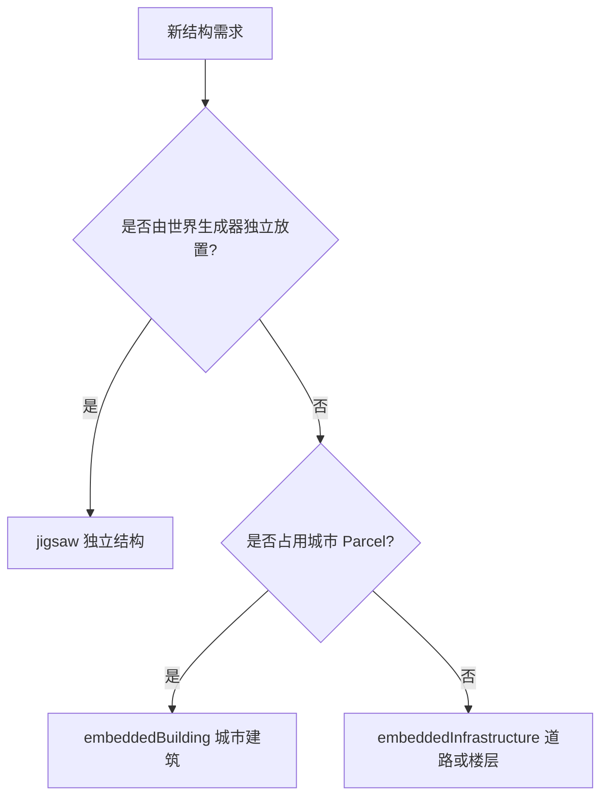
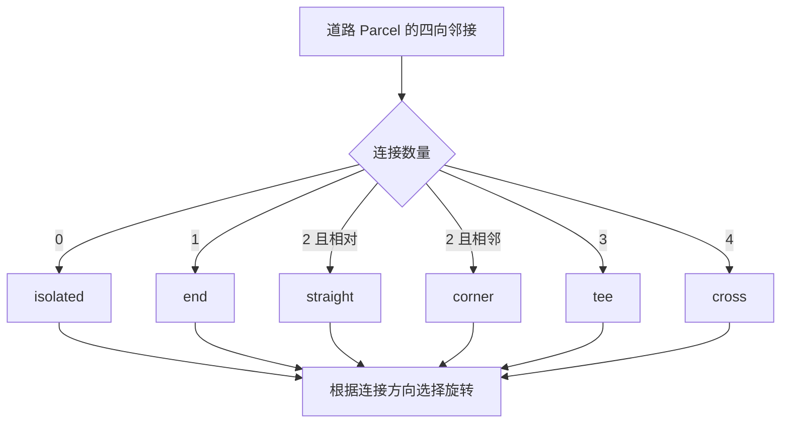
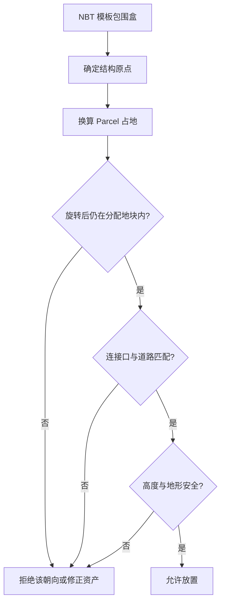

# 添加 Jigsaw 结构与城市建筑

项目把结构分为三类：独立世界结构、嵌入城市的建筑，以及道路和楼层等基础设施。三者都使用 `JigsawBuilder`，但放置入口、占地约束和数据文件不同。

## 1. 先选择结构类型



`Parcel`（地块）是城市网格中可分配给建筑或道路的单元；`Chunk`（区块）是 Minecraft 的 16×16 水平存储与生成单元。一个城市地块可以覆盖多个区块，两者不能混用。

## 2. 独立 Jigsaw 结构

星门采用完整独立声明：

```java
public static final JigsawBuilder STARGATE =
    Zinecraft.STRUCTURES.jigsaw("stargate", "萨米星门")
        .enUs("Sami Stargate")
        .footprint(2, 2)
        .biome(ModBiome.SAMI_FROZEN_FOREST.key())
        .layout(1, 32)
        .height(Types.WORLD_SURFACE_WG, 0)
        .generation(
            Decoration.SURFACE_STRUCTURES,
            TerrainAdjustment.BEARD_THIN
        )
        .pool(
            "start",
            Projection.RIGID,
            pool -> pool.template("stargate", 1)
        )
        .build();
```

### 2.1 关键字段

| 配置 | 中文含义 |
| --- | --- |
| `footprint(2, 2)` | 占地宽与深，单位按该 Builder 的结构地块约定 |
| `biome(key)` | 允许生成的群系 |
| `layout(size, distance)` | Jigsaw 展开规模与放置间距配置 |
| `height(type, offset)` | 高度图类型与垂直偏移 |
| `generation(step, adjustment)` | 世界生成阶段与地形适配方式 |
| `pool(id, projection, ...)` | 模板池 ID、投影方式和候选模板 |
| `template(path, weight)` | NBT 模板路径与相对权重 |

模板选择概率近似为：

$$
P_i = \frac{w_i}{\sum_{j=1}^{n} w_j}
$$

- $P_i$：第 $i$ 个模板被选中的概率；
- $w_i$：第 $i$ 个模板的正整数权重；
- $n$：同一模板池中的候选模板数。

## 3. 城市嵌入建筑

普通商店使用简化入口：

```java
public static final JigsawBuilder LATERANO_SHOP =
    Zinecraft.STRUCTURES.embeddedBuilding(
        "laterano_shop",
        "拉特兰商铺",
        1,
        1,
        32
    );
```

这里两个 `1` 分别表示建筑占用的地块宽与深，`32` 是结构高度约束。中型商店使用 `1 × 2` 地块和 `48` 高度。实际选择和朝向由城市布局教程中的建筑候选算法处理。

嵌入结构只登记“可以被城市放置的资产”，不会自己在野外生成。

## 4. 道路与楼层基础设施

```java
public static final JigsawBuilder MOBILE_PLOT_POWER_LAYER =
    Zinecraft.STRUCTURES
        .embeddedInfrastructure(
            "mobile_plot_power_layer",
            "移动地块动力层",
            32
        )
        .connectionFaces(
            Direction.NORTH,
            Direction.EAST,
            Direction.SOUTH,
            Direction.WEST
        );
```

`connectionFaces` 描述允许连接的朝向。道路还按邻接形态拆为 `isolated`、`end`、`straight`、`corner`、`tee` 与 `cross`。不要用旋转一个不对称模板冒充所有形态，除非连接口和碰撞空间确实等价。



## 5. 准备数据文件

典型资源树：

```text
data/zinecraft/
├─ structures/<path>.nbt
├─ worldgen/template_pool/<pool>.json
├─ worldgen/structure/<structure>.json
└─ worldgen/structure_set/<structure_set>.json
```

项目 Builder 与数据生成器可能生成其中部分 JSON，但结构 NBT 必须真实存在。NBT 中的 Jigsaw 方块需要正确填写：

- `name`：当前连接口的标识；
- `target`：希望匹配的目标标识；
- `pool`：后续模板池；
- `final_state`：拼接完成后替换成的方块；
- 朝向：连接方向必须面对可接入空间。

## 6. 生成或导入 NBT

项目提供脚本，例如：

```text
script/generate_jigsaw_example.py
script/generate_stargate_structure.py
script/generate_mobile_plot_power_layer.py
script/generate_nation_shop_blockouts.py
```

运行脚本前先查看 `--help` 或源码中的输出路径。生成操作可能覆盖同名 NBT；先确认目标文件与 Git diff，不要在未检查范围时批量重写现有建筑。

## 7. 校验占地、原点与朝向



旋转后的水平包围盒必须重新计算。宽深不相等的建筑旋转 90° 后，占地宽深会交换。

设未旋转占地为 $W \times D$：

$$
(W', D') =
\begin{cases}
(W, D), & r \in \{0^\circ, 180^\circ\} \\
(D, W), & r \in \{90^\circ, 270^\circ\}
\end{cases}
$$

- $W$：原始地块宽度；
- $D$：原始地块深度；
- $W'$：旋转后的地块宽度；
- $D'$：旋转后的地块深度；
- $r$：结构旋转角度。

## 8. 处理特殊情况

### 8.1 Jigsaw 展开到一半停止

检查 `target` 与候选模板的 `name` 是否一致、pool 路径是否带正确命名空间、连接口是否相向，以及深度限制是否已到达。

### 8.2 结构埋入地面或悬空

确认高度图选择、垂直偏移、NBT 原点和 `TerrainAdjustment`。水下结构应使用海床高度图，而不是地表高度图。

### 8.3 城市建筑注册了但不出现

确认它已进入对应 Region 的建筑候选或 `shopFor` 映射、占地能在当前 Parcel 组合中容纳、权重不为零，并查看候选拒绝原因。嵌入建筑不会通过独立结构集生成。

### 8.4 旋转后越界或入口朝墙

检查非方形占地旋转、NBT 原点和连接面。算法应拒绝不合法朝向，并继续尝试其他候选，不能强行覆盖相邻 Parcel。

## 9. 验证清单

- [ ] 结构类型选择正确：独立、建筑或基础设施。
- [ ] 所有 NBT 与模板池路径存在且命名空间正确。
- [ ] 包围盒、原点、地块占用和四个旋转方向均已检查。
- [ ] Jigsaw 连接口能拼接，达到最大深度时正常终止。
- [ ] 独立结构只在目标群系和生成阶段出现。
- [ ] 城市结构能被候选算法选择，并能解释拒绝原因。
- [ ] 数据生成与脚本运行后没有覆盖无关资产。

```bash
./gradlew runData
./gradlew runGameTestServer
./gradlew runClient
cd docs && npm run guides:check
```

主要源码：[ModStructure.java](../../src/main/java/com/cxxcxx/zinecraft/core/registry/ModStructure.java)、[JigsawBuilder.java](../../src/main/java/com/cxxcxx/zinecraft/api/registry/builder/JigsawBuilder.java)、[MobilePlotStructure.java](../../src/main/java/com/cxxcxx/zinecraft/api/world/structure/MobilePlotStructure.java)。城市选址与朝向算法见[国家、城市与 Region 教程](./add-nation-city-region.md)。
